# Anomaly Detection

翻译成中文就是，异常探测。异常探测就是要让机器知道"I don't know"，这件事。

## Problem Formulation

异常探测问题通常形式化成下述表示形式：

- 给出一个训练数据集 $\{x^1, x^2,..., x^N\}$ 
- 我们想找出一个函数去探测输入 $x$ 是否和训练数据相似

也就是说异常探测的任务就是找一个function，这个function做的事情就是，我们给它一个和训练数据相似的输入，它就返回一个结果告诉我们输入是正常的，反之，当我们输入一个和训练数据差别非常大的样本，它就返回一个结果告诉我们输入是异常的。

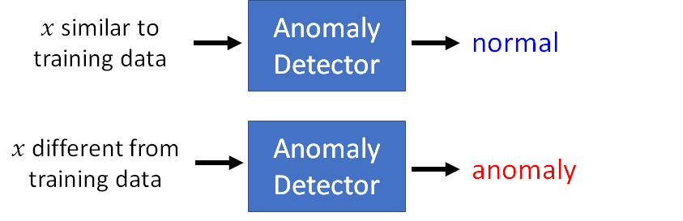

通常我们看到anomaly 这个词都是负面的，但是这里说的异常探测并不是负面意思，只是在说某个数据和训练数据集中的数据差别很大而已。Anomaly 有时也会用outlier, novelty, exceptions 替换，使用novelty的时候就是找一个新颖的东西，所以，总的来说我们就是要找出和训练集样本不一样的东西。

至于怎么定义similarity，这就是Anomaly Detection需要探讨的问题，不同的方法我们要用不同的方式定义相似性。

## What is Anomaly? 

这里我要强调一下什么叫做异常，机器到底要看到什么才应该认定为Anomaly，这其实是取决你提供给机器什么样的训练数据。举个栗子：

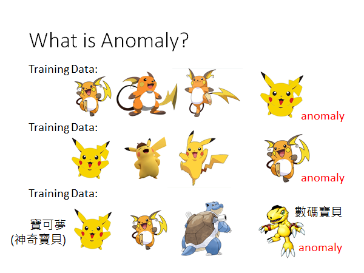

如果你提供了很多的雷丘作为训练数据，皮卡丘就是异常的。如果你提供了很多的皮卡丘作为训练数据，雷丘就是异常的。如果你提供很多的宝可梦作为训练数据，数码宝贝就是异常的。

## Applications

异常探测有很多应用，比如可以应用到欺诈检测（Fraud Detection）

### Fraud Detection

Fraud Detection 应用于银行或保险等行业，Fraud 包括但不限于伪造支票，信用卡欺诈等行为。欺诈探测的目的是预测欺诈行为，防止欺诈交易的发生。

这种任务的训练资料就是正常的刷卡机行为，收集很多的交易记录，这些交易记录是为正常的交易行为，现在新来一笔交易记录，我们就把它输入到模型中，判断这笔交易是否有异常，甚至可以做到预测和这笔交易有关的对象接下来是否有发生欺诈交易的可能，从而预防欺诈的发生。（直觉上可以简单的想象：如果正常的交易金额比较小，频率比较低，若短时间内有非常多的高额消费，这可能是异常行为）

这种应用是有一些比赛的，下面是kaggle上的链接：

>Ref: https://www.kaggle.com/ntnu-testimon/paysim1/home
>
>Ref: https://www.kaggle.com/mlg-ulb/creditcardfraud/home
>
>[实践篇：一个关于Fraud Detection的例子（一）](https://zhuanlan.zhihu.com/p/42267652)

### Network Intrusion Detection

异常检测还可以应用到网络系统的入侵检测，训练数据是正常的网络连接。现在来了一个新的连接，你希望用Anomaly Detection 让机器自动决定这个新的连接是否为攻击行为。

> Ref: http://kdd.ics.uci.edu/databases/kddcup99/kddcup99.html
>
> KDD99老经典了😂

### Cancer Detection

异常检测还可以应用到医疗（癌细胞的侦测），训练数据是正常细胞。现在给出一个新的细胞，让机器判断这个细胞是否为癌细胞。

> Ref: https://www.kaggle.com/uciml/breast-cancer-wisconsin-data/home

## Binary Classification

接下来就是具体怎么作Anomaly Detection 了，直觉的想法就是：现在我们可以收集正负两种训练数据：

- 正常数据：$\{x^1,x^2,⋯,x^N\}$ 

- 异常数据：$\{\widetilde{x}^1, \widetilde{x}^2, ⋯, \widetilde{x}^N\}$ 

然后train一个二分类器就完事了。

这个问题其实并没有那么简单，因为不太容易把异常检测看作一个binary classification的问题。为什么这样说呢？

举个栗子，我们现在将Pokémon 视为正常数据，将其他所有事物视为异常数据，我们要让机器判断输入是不是一个Pokémon ：

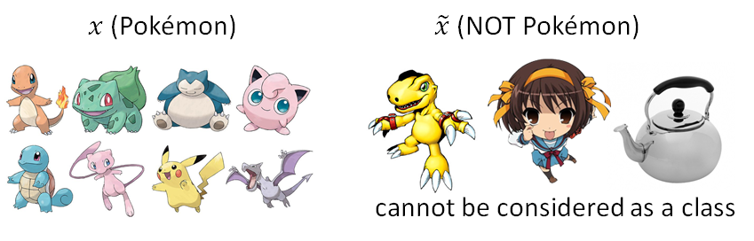

那问题来了，首先不是Pokémon 的事物太多了，数码宝贝不是，凉宫春日不是，水壶不是，所以我们很难将除正常数据以外的所以事物都归结为一类，很难收集所有的异常数据，很难将异常数据的特征都让机器记住。

再者，很多时候你很难收集到异常数据，比如欺诈检测，在所有的交易中，异常交易的比例非常至少。

## Categories

现在我们把异常检测任务分为两类：

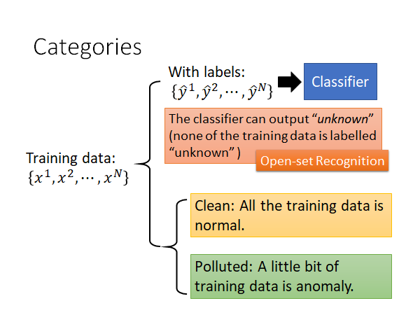

一类，是不只有训练数据 $\{x^1,x^2,⋯,x^N\}$ ，同时这些数据还具有label $\{\hat{y}^1,\hat{y}^2,⋯,\hat{y}^N\}$ 。 用这样的数据集可以train出一个classifier，让机器通过学习这些样本，以预测出新来的样本的label，但是我们希望分类器有能力知道新给样本不属于原本的训练数据的任何类别，它会给新样本贴上“unknown”的标签。训练classifier 可以用generative model、logistic regression、deep learning等方法，你可以从中挑一个自己喜欢的算法train 出一个classifier 。

上述的这种类型的任务，train出的classifier 具有看到不知道的数据会标上这是未知物的能力，这算是异常检测的其中一种，又叫做Open-set Recognition。我们希望做分类的时候模型是open 的，它可以辨识它没看过的东西，没看过的东西它就贴一个“unknown”的标签。

另一类，所有训练数据都是没有label 的，这时你只能根据现有资料的特征去判断，新给的样本跟原先的样本集是否相像。这种类型的数据又分成两种情况：

- Clean：手上的样本是干净的（所有的训练样本都是正常的样本）
- Polluted：手上的样本已经被污染（训练样本已经被混杂了一些异常的样本，更常见）

情况二是更常见的，对于刚才的诈欺检测的例子而言，银行收集了大量的交易记录，它把所有的交易记录都当做是正常的，然后告诉机器这是正常交易记录，然后希望机器可以借此检测出异常的交易。但所谓的正常的交易记录可能混杂了异常的交易，只是银行在收集资料的时候不知道这件事。所以我们更多遇到的是：手上有训练样本，但我没有办法保证所有的训练样本都是正常的，可能有非常少量的训练样本是异常的。

## Case 1: With Classifier

我们来看看情况一，就是训练样本有label的情况，也就是说我们可以train出一个初始的model。举的栗子是检测输入是不是辛普森家族的人物。

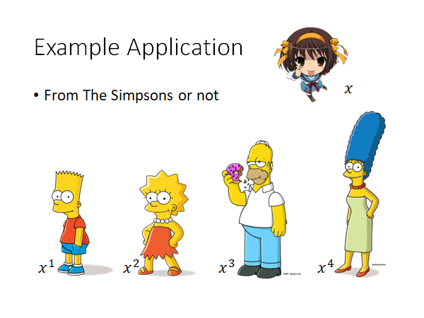

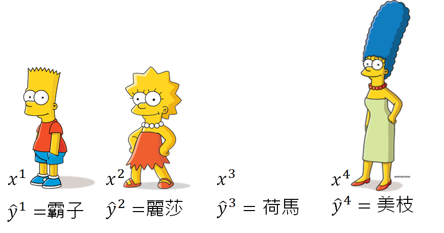

我们现在收集的辛普森家庭的人物都具有标注（霸子，丽莎，荷马，美枝），有了这些训练资料以后就可以训练出一个辛普森家庭成员的分类器。如下图所示，我们就可以给分类器看一张照片，它就可以判断这个照片中的人物是辛普森家庭里面的哪个人物。

这个数据集来自kaggle上一个非常喜欢辛普森家庭的人，它collect并且label了数千张数据，以下是参考链接

>Source of model: https://www.kaggle.com/alexattia/the-simpsons-characters-dataset/

然后，这个人训练出一个分类器，然后用这个分类器做了测试，结果有百分之九十六的正确率。如下图所示：

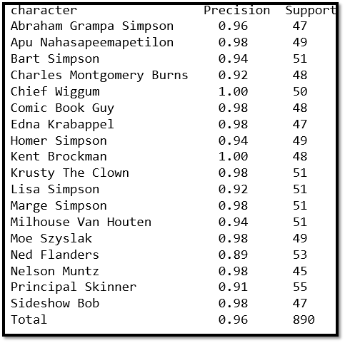

现在我们想做的事情是基于这个分类器来进行异常检测，判断输入的人物是否来自辛普森家庭。

### Confidence score

我们原本是使用分类器来进行分类，现在希望分类器不仅可以来自分类，还会输出一个数值，这个数值代表信心分数（Confidence score ），然后根据这个信心分数做异常检测。

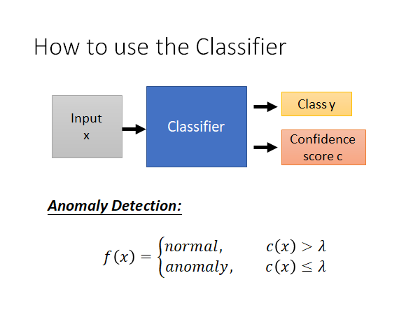

如上图所示，我们可以定义一个阈值 $\lambda$ ，若信心分数大于 $\lambda$ 就说明是来自于辛普森家庭。若信心分数小于 $\lambda$ 就说明不是来自于辛普森家庭.

那问题就来了，如何计算这个confidence score呢？我们希望这个信心分数应该有这样的能力，当我们将图片输入辛普森家庭的分类器中，若分类器非常的肯定这个图片到底是谁，输出的信心分数就会非常的高，反之则低。

需要再提一嘴的是，当我们将图片输入分类器时，分类器的输出是一个几率分布（distribution），是这张图片属于各个类别的可能性的得分，如下图所示：

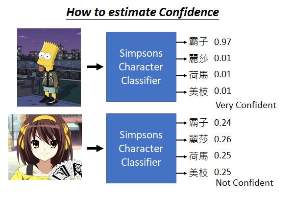

从上图直观的观察来看，当分类器非常确定一个输入的类别的时候，它会给出很集中的得分，反之则是分散的。

刚才讲的都是定性的分析，现在需要将定性分析的结果化为信心分数。一个非常直觉的方法就是将分类器输出的分布中最高数值作为信心分数，所以上面那张图输出的信心分数为0.97（霸子），下面那张图输出的信心分数为0.26（凉宫春日）。（这个方法就是后面我们做实验用的方法）如下图所示：

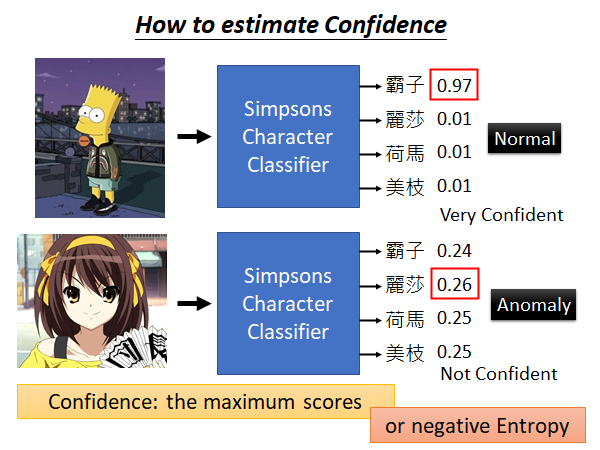

根据信心分数来进行异常检测不是唯一的方法，因为分类器输出的是distribution，那么就可以计算交叉熵（cross entropy）。交叉熵越大就代表输出越平均，代表机器没有办法去肯定输出的图片是哪个类别，表示输出的信心分数是比较低。总之我们有不同的方法根据分类器决定它的信心分数.

那我们实际来做一下，就用分布中最高数值作为信心分数的方法，结果如下图所示：

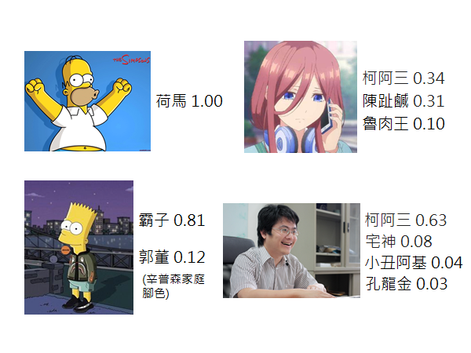

现在我输入一张训练资料没有的图片（荷马），分类器输出荷马的信心分数是1.00；输入霸子的图片，分类器输出霸子的信心分数为0.81，输出郭董的信心分数为0.12；输入三玖的图片和李老师的图片结果就是相对很分散的。我们可以发现，如果输入的是辛普森家庭的人物，分类器输出比较高信心分数。如果输入不是辛普森家庭的人物，分类器输出的信心分数是比较低。但是输入凉宫春日的图片，分类器输出柯阿三的信心分数为0.99，所以这种方法还是有有一些瑕疵的。

接下来我们来看看不同的数据集使用这种方法的统计结果：

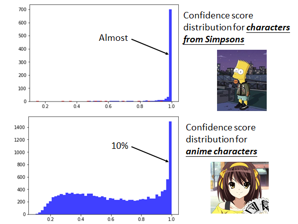

我们可以看到真正的来自辛普森家庭的人物的信心分数都集中在1.0附近，你仔细看上面的图标中有一些红色的数据（分类错误）比较分散的分布在坐标轴上，所以说分类错误的数据会得到比较低的信心分数，这个方法还是有一点瑕疵的。

而非辛普森家庭的动漫人物的分布比较分散，90%的数据都是信心分数比较低的，分散在坐标轴上，但是还是有10%的数据信心分数分布在1.0附近。这10%样本不是辛普森家庭的人物，但给了比较高的分数，也说明这个方法是有瑕疵的。

总的来说，如果你要做异常检测的问题，在你手上有一个分类器或者说能train出一个分类器的情况下，这应该是你第一个要尝试的baseline。虽然很简单，但实际上不见得结果表现会很差。

### Outlook: Network for Confidence Estimation

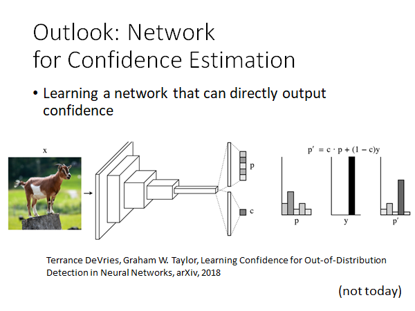

> Terrance DeVries, Graham W. Taylor, Learning Confidence for Out-of-Distribution Detection in Neural Networks, arXiv, 2018

你训练一个neuron network时，可以直接让neuron network输出信心分数，这个问题我先不细节，在这里我先引用一个文献（2018年的paper）是有这样的技术的。

### More Detail

接下来我们要讲一下关于上述在有分类模型的情况下根据信心分数进行异常检测的具体细节，包括threshold（阈值）如何定，如何判断异常判断结果的好坏等问题。

首先我们先来复习一下**model framework**：

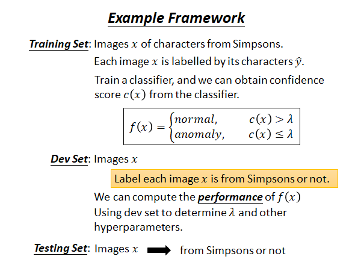

我们有大量的训练资料，且训练资料具有标注（辛普森家庭的人物），因此我们可以训练一个分类器。不管你用什么算法，目标是可以从分类器中得到对应图片的信心分数。然后就根据信心分数建立异常检测的系统，若信心分数高于某个threshold（阀值）时就认为是正常，若低于某个threshold 时就认为是异常。

Dev Set(development set): 

> 用于训练过程中，指导调整超参数的样本集，使用起来类似于测试集；
>
> 以前机器学习数据量少，超参数少的时候可能是没有这个样本集的，只有训练集（train set）和测试集（test set）。这时测试集作为验证集使用；
>
> 现在数据量多了，可以单独分出一部分样本作为dev set，用于超参数调优，模型经过训练集训练，和验证集调优，然后交给测试集测试性能；
>
> 作者：猛虎神威凯蒂猫
> Ref：https://www.zhihu.com/question/53052465/answer/281962767
> 来源：知乎

在现在这个异常探测任务中，我们需要的development set 需要包含大量的images，这些images需要被标注上是否是来自辛普森家庭的人物。另外，需要强调的是在训练时所有的样本数据都是来自辛普森家庭的人物，标签是辛普森家庭的哪个人物。但是，我们在做Dev Set 时需要模拟测试数据集，也就是说这里面还需要包含非辛普森家庭的人物的图片。

有了Dev Set 以后，我们就可以把我们异常探测系统应用在Dev Set ，然后计算异常探测系统在Dev Set上的得分是多少。等下会说明这个得分如何计算。你能够在Dev Set 衡量一个异常探测系统的表现以后，你就可以拿来调整threshold，以找出让最好的threshold 。

决定hyperparameters（超参）以后，就有了一个异常探测的系统，你就可以让它上线。输入一张图片，系统就会决定是不是辛普森家庭的人物。整个Anomaly Detection System 构建就结束了。但是我们还遗留了一个问题：

**如何计算一个异常侦测系统的性能好坏？**

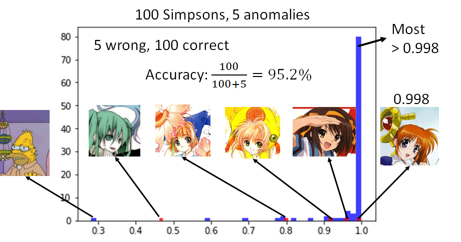

上图是100张辛普森家庭人物的图片（蓝色）和5张不是辛普森家庭人物的图片（红色）输入到Anomaly Detection 中得到的Confidence Score。你会发现上图左侧有一个辛普森家庭的图片的信心分数竟然是非常低的，在这里异常探测系统犯了一个错误，认为它不是辛普森家庭的人物。我们可以看到，五张非辛普森家庭人物的图片的信心得分其实还挺高的，尤其是魔法少女（0.998）。在实践的时候，很多人都发现这些异常图片会得到很高的分数，其实这不是特别大的阻碍，因为真正是辛普森家庭的人物的信心分数会非常集中到1.0，只要异常图片没有正常图片的信心分数那\~么\~高\~，就还是可以得到比较好的异常探测效果的。

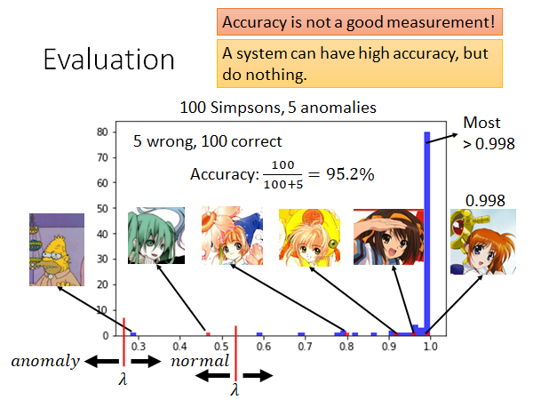

我们怎么来评估一个异常检测系统的好坏呢？我们知道异常检测其实是一个二元分类（binary classification）的问题。在二元分类中我们都是用正确率来衡量一个系统的好坏，但是在异常检测中正确率并不是一个好的评估系统的指标。你可能会发现一个系统很可能有很高的正确率，但其实这个系统什么事都没有做。为什么这样呢？因为在异常检测的问题中正常的数据和异常的数据之间的比例是非常悬殊的。在这个例子里面，我们使用了正常的图片有一百张，异常的图片有五张。这会造成只用准确率衡量系统的好坏会得到非常奇怪的结果的。

举个栗子，如上图所示，我们将threshold $λ$ 设为**0.3和0.5**。 $λ$ 以上认为是正常的， $λ$ 以下认为是异常的。这时你会发现这个系统的正确率**都是**95.2%，所以异常侦测问题中不会用正确率来直接当做评估指标。

首先我们要知道在异常检测中有两种错误：一种错误是异常的数据被判断为正常的数据，另外一种是正常的数据被判为异常的数据。假设我们将 $λ$ 设为0.5（0.5以上认为是正常的数据，0.5以下认为是异常的数据），这时就可以计算机器在这两种错误上分别范了多少错误。如下图所示：

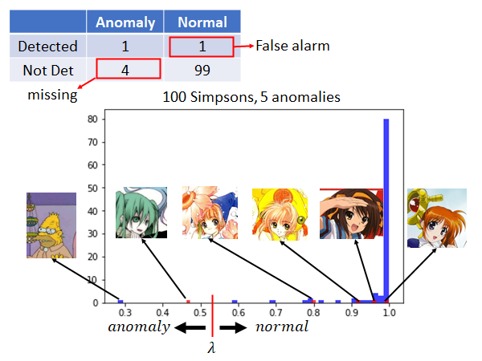

我们可以看到机器判断出现了两类错误，miss了4个anomaly data，false alarm了1个normal data 。

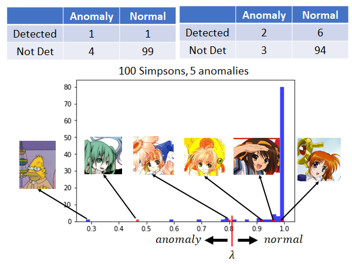

若我们将threshold 切在比0.8稍高的部分，如上图所示，这时会发现在五张异常的图片中，其中有两张认为是异常的图片，其余三种被判断为正常的图片；在一百张正确的图片中，其中有六张图片被认为是异常的图片，其余九十四张图片被判断为正常的图片。

那一个系统比较好呢？其实你是很难回答这个问题。有人可能会很直觉的认为：当阀值为0.5时有五个错误，阀值为0.8时有九个错误，所以认为左边的系统好，右边的系统差。但其实一个系统是好还是坏，取决你觉得false alarm比较严重还是missing比较严重。

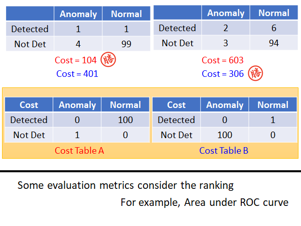

所以你在做异常探测时，可能需要有Cost Table 告诉你每一种错误有多大的Cost 。如上图所示我们将两个Cost Table 分别计算一下threshold $λ$ 为0.5和0.8的两个系统的cost ，发现取不同的的cost 衡量标准，就会有不同的判定结果。

为什么要这样呢，举一个形象一点的栗子，如果说你今天要做癌症检测的异常检测，与误判比起来，我们显然更加不能容忍missing，如果一个其实有癌症的人被系统miss 了，耽误了最佳治疗时间，就是生命的代价。

其实还有很多衡量异常检测系统的指标，这里就不细讲这些，有一个常用的指标为Area under ROC curve。若使用这种衡量的方式，你就不需要决定threshold ，而是看你将测试集的结果做一个排序（高分至低分），根据这个排序来决定这个系统好还是不好。

### Possible Issue

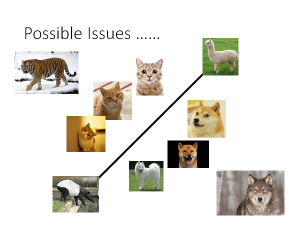

如果我们直接用一个分类器来检测输入的数据是不是异常的，当然这并不是一种很弱的方法，但是有时候无法给你一个perfect 的结果，我们用上图来说明用classifier 做异常侦测时有可能会遇到的问题。假设现在做一个猫和狗的分类器，将属于猫🐱的一类放在一边，属于狗🐕的一类放在一边。若输入一笔资料即没有猫的特征也没有狗的特征（草泥马，马莱貘），机器不知道该放在哪一边，就可能放在这个boundary上，得到的信息分数就比较低，你就知道这些资料是异常的。

你有可能会遇到这样的状况：有些资料会比猫更像猫（老虎），比狗还像狗（狼）。机器在判断猫和狗时是抓一些猫的特征跟狗的特征，也许老虎在猫的特征上会更强烈，狼在狗的特征上会更强烈。对于机器来说虽然有些资料在训练时没有看过（异常），但是它有非常强的特征会给分类器很大的信心看到某一种类别。

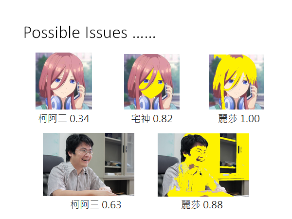

再比如，刚才做辛普森家庭人物的异常检测的时候，黄色的魔法少女和小樱都给了比较高的信心分数，所以我们猜测分类器是看到黄色就给很高的分数，我们就把三玖的脸和头发涂黄，果然分数暴增，在老师的脸上涂黄，效果也是显著的。🤣所以这些都是异常检测的问题。

### To Learn More

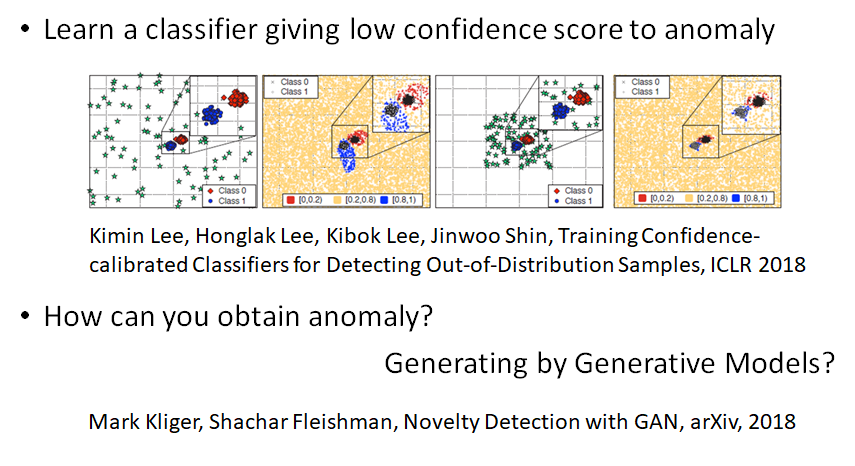

当然有些方法可以解这个问题，这里列一些文献给大家进行参考。

> Kimin Lee, Honglak Lee, Kibok Lee, Jinwoo Shin, Training Confidence-calibrated Classifiers for Detecting Out-of-Distribution Samples, ICLR 2018

其中的一个解决方法是：假设我们可以收集到一些异常的样本，我们可以教机器看到正常样本时不要只学会分类这件事情，要学会一边做分类一边看到正常的资料信心分数就高，看到异常的资料就要给出低的信心分数。

> Mark Kliger, Shachar Fleishman, Novelty Detection with GAN, arXiv, 2018

但是会遇到的问题是：很多时候不容易收集到异常的数据。有人就想出了一个神奇的解决方法就是：既然收集不到异常的数据，那我们就通过Generative Model 来生成异常的数据。这样你可能遇到的问题是：生成的数据太像正常的资料，那这样就不是我们所需要的。所以还要做一些特别的constraint ，让生成的资料有点像正常的资料，但是又跟正常的资料又没有很像。接下来就可以使用上面的方法来训练你的classifier 。

## Case 2：Without Labels

在第二种情况下，我们没有classifier ，也就是说我们收集到的数据没有label 。

### Twitch Play Pokémon

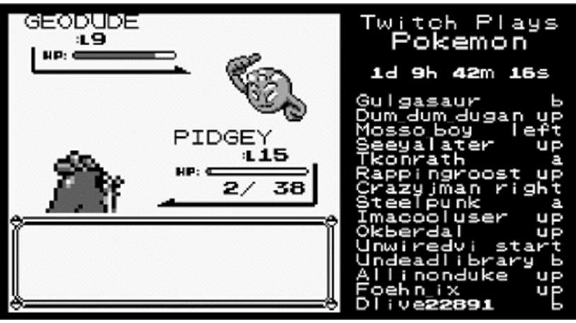

这是一个真实的Twitch Plays Pokémon例子，这个的例子是这样的：有人开了一个宝可梦的游戏，全世界的人都可以连接一起玩这个宝可梦的游戏。右边的框是每一个人都在输入指令同时操控这个游戏，这个游戏最多纪录大概有八万人同时玩这个游戏。当大家都在同时操作同一个角色时，玩起来其实是相当崩溃的。（Paperclip2019年做的解密活动中的一部分似乎是在模仿这个游戏模式）

这个游戏是多年前进行的，不过现在twitch 上居然还有升级版的，直播地址：

>  https://www.twitch.tv/twitchplayspokemon

以下是我录制的一小段gif：

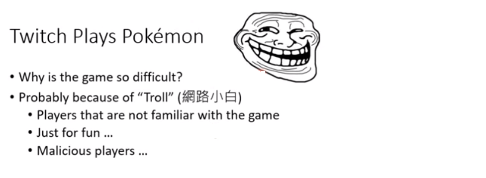

人们玩的时候就非常的崩溃，发现根本玩不下去，那么崩溃的原因是什么呢？可能是因为有Troll（网络小白？）。这些人可能根本就不会玩，所以大家都没有办法继续玩下去；或者可能觉得很有趣就乱按按键；或者是不知名的恶意，不想让大家结束这个游戏（脚本小子）。人们相信有一些Troll 潜藏在人们当中，他们想要阻挠游戏的进行。

假定多数玩家是想要通关的，那我们就可以用异常检测的技术，收集所有玩家的行为（训练数据），我们可以从多数玩家的行为知道正常玩家的行为是咋样的，然后侦测出异常的玩家（Troll）。

### Problem Formulation 

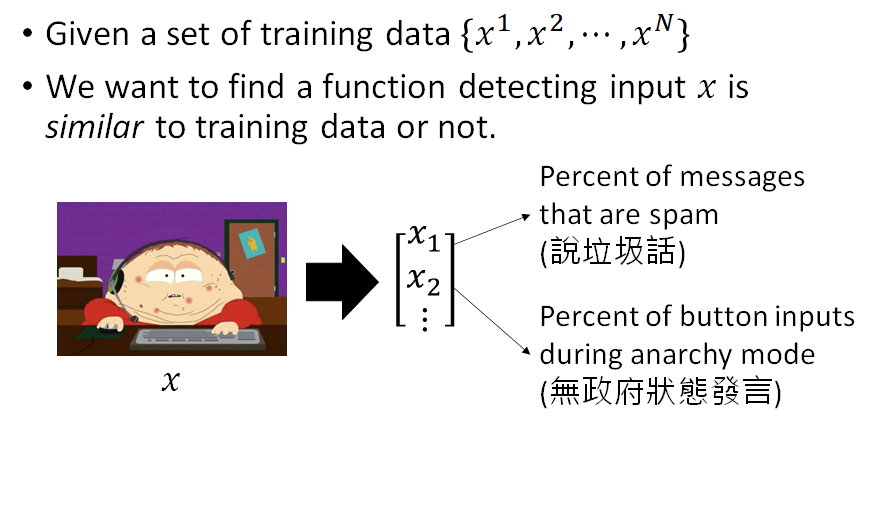

我们需要一些训练的样本： $\{x^1,x^2,...,x^N\}$ ，每一个 $x^i$ 代表一个玩家，如果我们使用machine learning 的方法来求解这个问题，首先这个玩家要能够表示为feature vector 。举个例子：向量的第一维可以是玩家说垃圾话的频率，第二维是统计玩家无政府状态发言，可以想象有可能是这样的，一个玩家越是喜欢在无政府状态下发言，就越有可能是搞破坏的。

这个数据集是真实存在的：

> https://github.com/ahaque/twitch-troll-detection (Albert Haque)

我们现在只有大量的训练数据，但是没有label。我们刚才可以根据分类器的conference来判断是不是异常的资料，我们在没有classifier的情况下可以建立一个模型，这个模型是告诉我们P(x)的几率有多大（根据训练数据，找一个几率模型，这个模型可以告诉我们某一种行为发生的概率有多大）。当我们有了模型P ，我们就可以将玩家的特征向量输入模型，得到一个几率（就是现实情况中发生这名玩家的动作的概率），如果这个几率大于threshold ，就认为是正常玩家，反之则判定为异常玩家。综上所述我们的问题的解决方案就被形式化为下图：

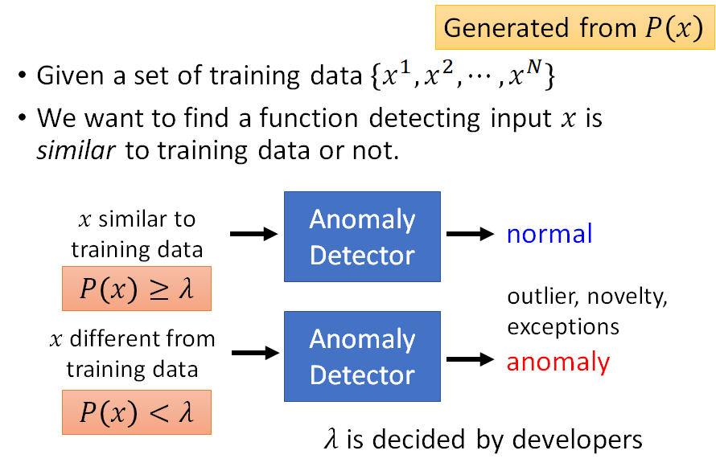

这个模型可以通过生成模型的方式来找，比如说Gaussian Distribution Model ，我们假定玩家数据是在特征空间中符合高斯分布，那我们可以通过现有数据计算出这个分布模型的 $μ$ 和 $∑$ ，就得到这个模型了，然后我们就可以按上述进行数据输入，做判定了。

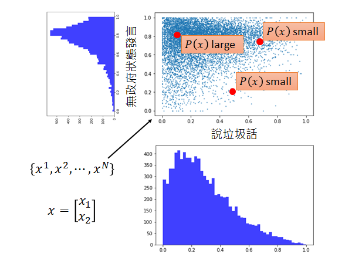

如上图所示，这是一个真实的资料，假设每一个玩家可以用二维的向量来描述（一个是说垃圾话的几率，一个是无政府状态发言的几率）。我们可以观察到，喜欢在无政府状态发言的玩家占多数，喜欢说辣鸡话的玩家占少数，综上，我们直观的理解是正常玩家应该是喜欢在无政府状态发言，而比较少说辣鸡话的。所以我们的模型 $P(x)$ 的结果应该符合这样的描述，如上图右上角。

ps：民主状态：统计一段时间内的玩家指令数，选取数量最多的一个执行；无政府状态：一段时间内所有的指令中随机pick 一个执行。

那为什么会出现这种情况呢，我们来简单分析一下。事实上很多人强烈支持无政府状态，强烈反对民主状态，所以这个游戏多数是在无政府状态下进行。假设一个玩家不考虑自己是要在什么状态下发言，大多数人有八成的几率是在无政府下进行发言，有人觉得多数Troll 是在民主状态下发言，因为进入了民主状态，只要Troll 多发言就能够让他的行为被选中的概率放大，所以小白会特别喜欢在民主状态下发言。

从这个图上可以很直觉的看出（右上角的三个点）一个玩家落在说垃圾的话几率低，通常在无政府状态下发言，这个玩家有可能是一个正常的玩家， $P(x)$ 大。假设有玩家落在有五成左右的几率说垃圾话，二成的几率在无政府状态下发言；或者落在有七成左右的几率说垃圾话，七成的几率在无政府状态下发言，显然这个玩家比较有可能是一个不正常的玩家， $P(x)$ 小。

我们直觉上明白这件事情，但是我们仍然希望用一个数值化的方法告诉我们玩家落在哪里会更加的异常。

### Maximum Likelihood

这里所指数值化的方法我们需要用到Likelihood 的概念（ps：如果你学过李老师的ML的**[这一节课](https://youtu.be/fZAZUYEeIMg)**你应该已经知道这个概念）：

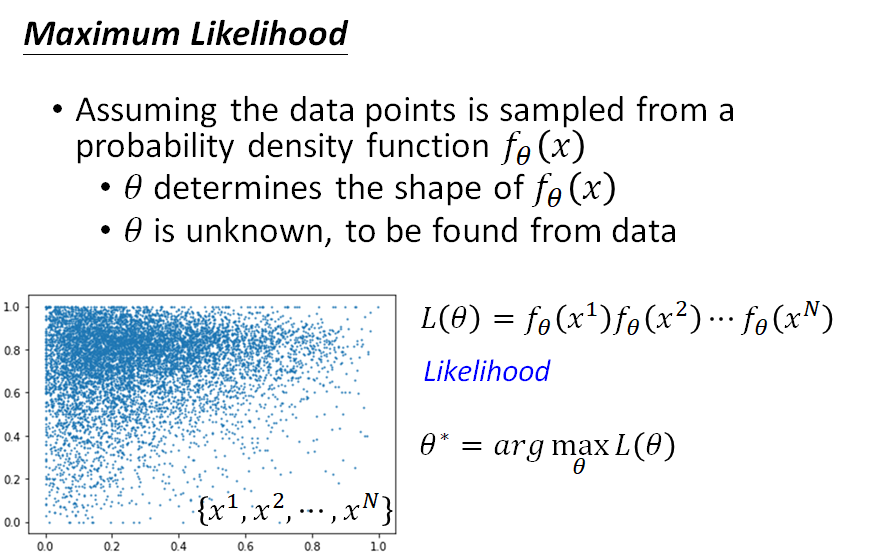

- 假设我们的数据是从一个probability density function（概率密度函数） $f_{\theta}(x)$  中sample出来的
  - θ 是概率密度函数的参数，是未知的，是我们要从数据中学习出来的
  - θ 将决定我们概率密度函数的形状

- 现在我们要做的事就是找出这个概率密度函数究竟长什么样子

在找这个概率密度函数的过程中，我们需要一个衡量方法，来衡量当前找到的这概率密度函数的好坏，我们就是用Likelihood ，这个似然函数的概念和损失函数有点像，Maximum Likelihood 的想法和Minimize Loss 的想法是一样的。

Likelihood 的意思是：计算概率密度函数 $f_{\theta}$ 产生如图所示的所有数据概率有多大。

若严格说的话， $f_{\theta}(x)$ 输出并不是概率，它的输出是probability density ；输出的范围也并不是(0,1)，有可能大于1。如果你概率论学的比较好，那你应该能很好理解这个概率密度，不行的话这里我们就简单的将其理解成概率。 $x^i$ 在以 $\theta$ 为参数的probability density function sample出来的概率是 $f_{\theta}(x^i)$ ，所以所有的样本从这个 $f_{\theta}(x)$ 中sample出来的概率就是各个样本的概率连乘。

连乘得到的结果就是likelihood 如上图所示 $L(\theta)$ 。likelihood 的可能性显然是由 $\theta$ 控制的，选择不同的 $\theta$ 就有不同的probability density function，就可以算法不同的likelihood 。

而我们现在并不知道这个 θ 是多少，我们要算一个 $θ^*$ 算出来的likelihood是最大的。

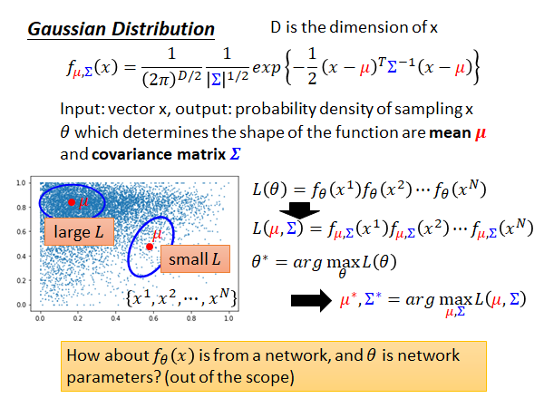

那上述的概率密度函数长什么样子呢，我们要确定这个概率密度函数的架构。我们可以假设这个概率密度函数是Gaussian Distribution （高斯分布），高斯分布的函数式就是上图最上面的公式。

在Gaussian Distribution 的函数式中，参数 $\theta$ 应该是 $\{mean:\mu, convariance matrix:\Sigma\}$。假设如上图所示的数据是由左上角的 $\{\mu,\Sigma\}$ 来生成的，数据点应该在左上角的蓝色圈圈中sample 出来，它的likelihood 是比较大；如果是右下角 $\{\mu,\Sigma\}$ ，它远离高密度区域，这个函数sample 出的数据因该多数在右下角蓝色圈圈中，但这与实际不符，显然这样计算出来的likelihood 是比较低的。

ps：不要问为什么用高斯分布，如果我用其他的分布你也会问同样的问题。再者就是因为它该死的好用，现实中很多数据的分布都比较好的符合高斯分布。你永远可以根据你的数据选择合适的分布模型。另外这里再考虑一下，如果 $f_{\theta}(x)$ 是一个很复杂的网络， $\theta$ 是网络中的大量参数，这时候你就会有更多的自由选择一个model 来模拟生成数据点，这样就不会被限制住，在看起来就不像Gaussian 产生的数据却硬要说是Gaussian 产生的数据。因为我们这门课还没有讲到其它进阶的模型，所以现在用Gaussian Distribution 来当做我们资料是由Gaussian Distribution 所产生的。

Guassian Distribution 中的参数是很好解的，$\mu^*$ 等于所有training data 做平均， $\Sigma^*$ 等于将x减去 $\mu^*$ 乘以 $x$ 减去 $\mu^*$ 的转置，然后做平均。得到的结果如下图：

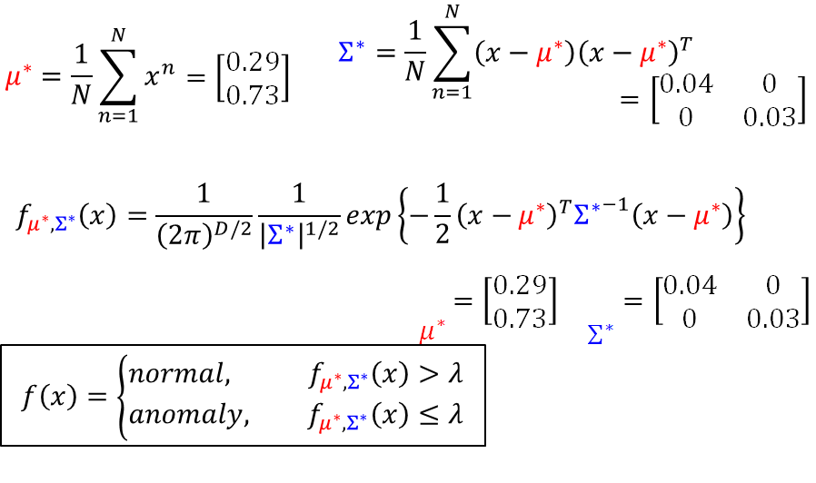

好了，现在我们根据training data 找出了 $\{\mu^*,\Sigma^*\}$ ，接下来就可以做异常检测了。如上图所示，将 $\{\mu,\Sigma\}$ 代入probability density function ，若大于某一个threshold （阈值）就说明是正常的，若小于这个threshold 就说明是异常的。

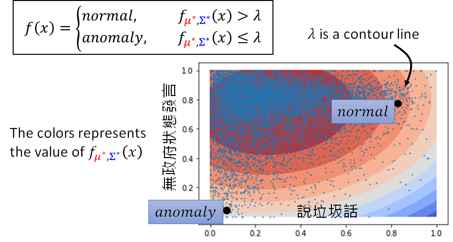

每一笔资料都可以代入probability density function 算出一个数值，结果如图所示。若落在颜色深的红色区域，就说明算出来的数值越大，越是一般的玩家，颜色浅的蓝色区域，就说明这个玩家的行为越异常。如图所示的两个点：右上角的一个玩家落在很喜欢说垃圾话，多数喜欢在无政府状态下发言的区域，就说明是一个正常的玩家。左下角的一个玩家落在很少说垃圾话，特别喜欢在民主时发言，就说明是一个异常的玩家。

到这里我们对Twitch Play Pokémon 的异常玩家探测就结束了，我们来稍微总结一下，我们用了两种特征表示玩家，假定了玩家的在这两个特征维度上分布符合Gaussian Distribution ，然后根据数据学除了一个比较好的fit 这些数据的高斯分布模型，然后用阈值分类的方法完成了异常检测。

上述方法中，我们只是用了两个特征，那如果加上更多的特征或许效果会更好：

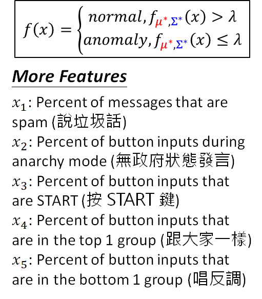

再加入一些特征，比如如果有人不停按start 键，那它可能就是一个异常玩家，还有和其他人一不一样，比较一样的可能就会是正常玩家，再有不停唱反调的人可能也是异常玩家。加上这些特征，实践一下得到的结果：

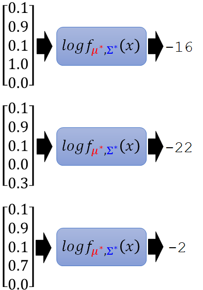

这里取log 的原因是原本的函数算出来的输出太小了。我们可以看到第一个和第三个玩家除了第四个特征都一样，但是第一个玩家和大家的选择完全一样，第三个玩家和大家的选择在大多数情况下是相同的，这是第一个得到的分数反而低，是因为机器会觉得如果你和所有人完全一样这件事就是很异常的。

## Outlook: Auto-encoder

上述是用Generative Model （生成模型） 来进行异常检测，我们也可以使用Auto-encoder 来做这个任务。

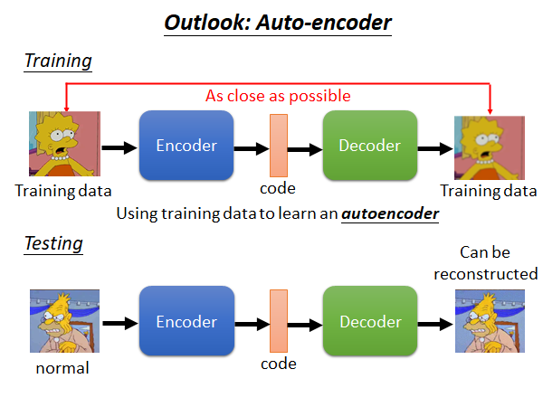

我们把所有的训练资料训练一个Encoder ，Encoder 所做的事情是将输入的图片（比如辛普森）变为code（一个向量），Decoder 所做事情是将code 解回原来的图片。训练时Encoder 和Decoder 是同时训练，训练目标是希望输入和输出越接近越好。

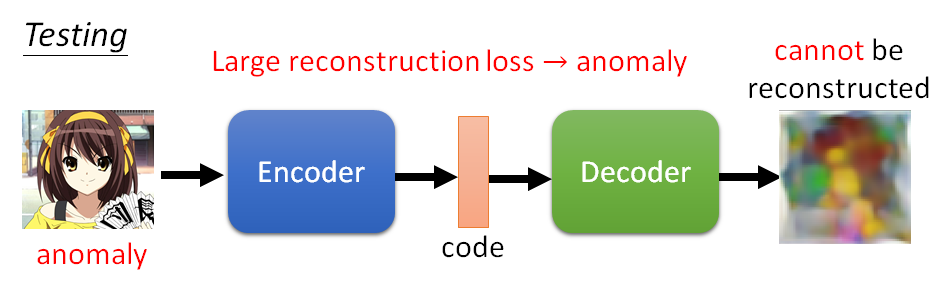

在测试的时候，我们就把一张图片放入这个Auto-Encoder model，得到一个输出图片。因为这个网络训练时使用的是辛普森家庭的图片，所以它对辛普森家庭的图片的还原应该是比较好的，而异常的图片的还原应该会是模糊的，基于此我们可以做Auto-Encoder based Anomaly Detection。

## More ...

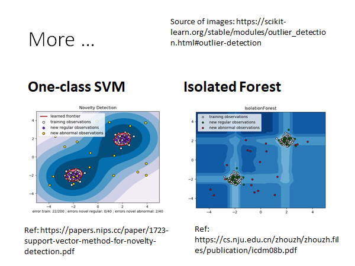

Machine Learning 中也有其它做异常检测的方法，比如SVM的One-class SVM ，只需要正常的资料就可以训练SVM ，然后就可以区分正常的还是异常的数据。在Random Forset 的Isolated Forest ，它所做的事情跟One-class SVM 所做的事情很像（给出正常的训练进行训练，模型会告诉你异常的资料是什么样子）。

> One-class SVM Ref: https://papers.nips.cc/paper/1723-support-vector-method-for-novelty-detection.pdf
>
> Isolated Forest Ref: https://cs.nju.edu.cn/zhouzh/zhouzh.files/publication/icdm08b.pdf

