# Attack and Defense

这里的攻击和防御是指针对人工智能或者说机器学习的模型的攻击与防御。

## Motivation

做攻击与防御的动机是什么？

- 我们想把机器学习技术应用到实际生活中
- 目前的机器学习模型在多数情况下对噪声的干扰抗性不足
- 我希望机器学习的模型不仅能够对抗一般的噪声干扰，同时还能对抗来自人类的恶意攻击的噪声
- 特别是对于用来做垃圾邮件分类、恶意软件检测、网络入侵检测等任务的模型，我们更加需要让这样的模型健壮起来。

## Attack

其实，目前多数的模型都是比较容易被攻击，而往往防御攻击是比较困的。

### What do we want to do?

我们到底要做的是怎么样的攻击呢，这里举一个栗子：

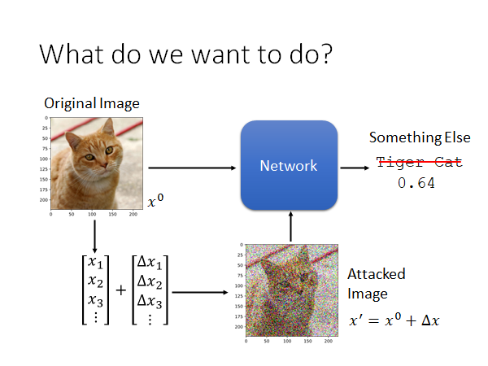

这里有一个图片辨识的模型，你给它一张猫🐱片，他就告诉你这张图片是一只猫，如上图所示。现在我们要做的事是这样，我们在图片 $x$ 上加上攻击者特制的噪声 $Δx$ ，使得机器认不出这张图片，或者机器会把这张图片认成另一种攻击者指定的类别。类似这样的做法就叫做对模型的**对抗样本攻击(Adversarial Attack)**。

### Loss Function for Attack

我们通常在train这样的model的时候会minimize一个损失函数，我们希望模型的输出能和真正的标签尽可能相同：

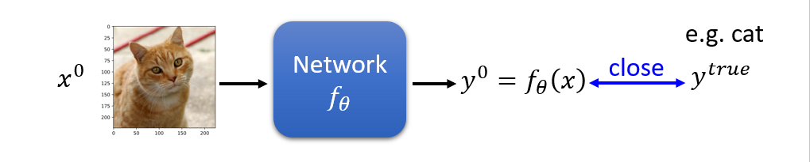

现在我们要对模型进行攻击，攻击分成两种：有目标的攻击和无目标的攻击。

### Non-targeted Attack

无目标的攻击的概念是这样的：我们要找一个 $x'$ 使其输入到模型后产生的输出能和 $y^{true}$ 越远越好（可以使用各种衡量方法，比如交叉熵cross entropy）。

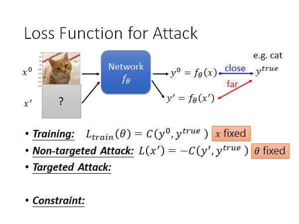

这个过程也是需要训练的，不过和原来训练模型的方式不同，我们现在要fixed住模型的参数 $θ$ ，去调整 $x$ ，使得模型输出 $y'$ 和正确值 $y^{true}$ 越远越好，所以损失函数可以定义为：
$$
L(x') = -C(y', y^{true})
$$

### Targeted-Attack

有目标攻击的概念是这样的：我们要找一个 $x'$ 使其输入到模型后产生的输出能和攻击者指定的错误输出 $y^{false}$ 越近越好（可以使用各种衡量方法，比如交叉熵cross entropy）。

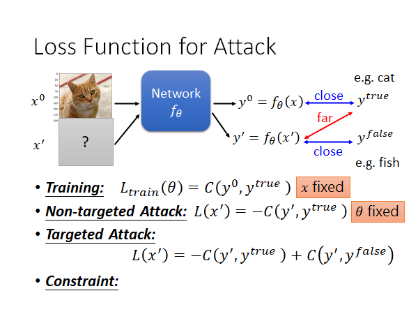

同上，有目标的攻击也是需要训练的，一样的要fixed住模型的参数 $θ$ ，去调整 $x$ ，使得模型输出 $y'$ 和正确值 $y^{true}$ 越远越好，同时 $y'$ 能和指定的错误输出 $y^{false}$ 越近越好，所以损失函数可以定义为：
$$
L(x') = -C(y', y^{true}) + C(y' + y^{false})
$$

但是如果 $x’$ 和原来的图片差太多那就没什么意义了，人一眼就可以看出这张图被修改过，甚至都看不出它原来的样子了。所以，我们需要一个限制条件，让 $x^0$ 和 $x'$ 尽可能相同，让人认为恶意样本和原始样本看起来相同，骗过人类😁。我们的想法是如果这两者之间的差距小到一个阈值，人就不会发现，所以Constraint可以形式化的写成：
$$
d(x^0,x') \le ε
$$

### Constraint

这个约束的distance应该怎么做呢？这里举两个栗子：

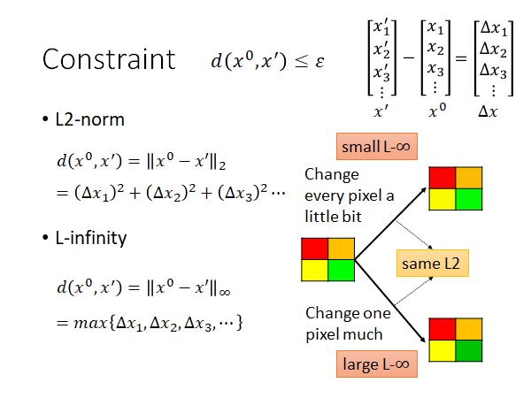

#### L2-norm

二范数如上图所示，挺好算的，就是取两者之差的平方和。

#### L-infinity

$L_\infty$ 范数可以理解为取所有差值中最大的一个。

对于不同的模型攻击时使用的distance应该是不同的，要选择合适的方法去做（根据人类的感知，来判断某个计算distance的方法是否合适）。

上图中四个颜色的方块，分别使用了两种不同的方法进行了修改，给每一个pixel一点点修改，给一个pixel比较大的修改。彩色的四个方块，所以其实 $x$ 有12个分量，调整后的两个图片的二范数distance计算出来的值其实时一样的，但是就人类的感官来看，似乎右下角的图片能看出来绿色更深了。我们再用无穷范数算一下，发现右下角的distance是大的，右上角则较小。所以说，似乎二范数计算distance不能很好的反应人类在图片上的感知。

### How to Attack

攻击的过程如上面所说的，就和训练神经网络的是相似的，只不过是fix住参数，根据梯度下降改变输入，找到一个 $x^*$ 满足我们的目的而已。这个过程可以用以下方程描述：
$$
x^* = arg\min_{d(x^0,x') \le ε} L(x')
$$
这里有个限制，似乎会感到困惑，因为一般的模型训练中是没有限制的。没关系这个很好处理的，如下所示：

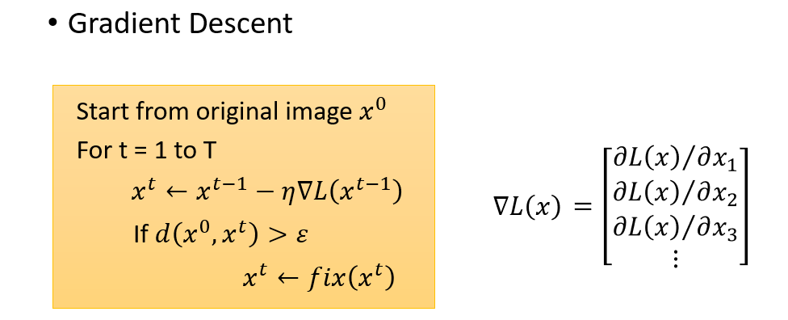

我们将原始的 $x_0$ 作为初始值，用计算梯度，然后更新输入为 $x^t$ ，然后做个判断，看看 $x^t$ 和 $x^0$ 之间的距离是否大过阈值，如果超过的话就修正一下输入，让输入符合constraint，否则就继续。那怎么修正呢，这个fix函数可以这样做：

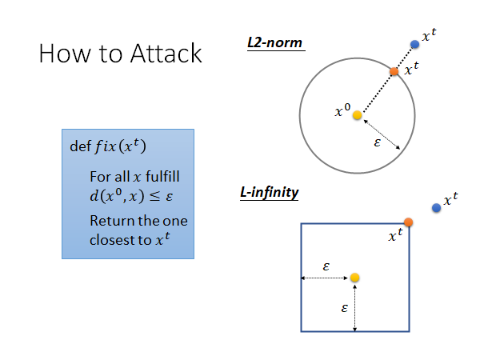

fit()：对于所有符合constraint的 $x$ 我们返回一个最接近 $x^t$ 的就可以了。

如上图所示，对于二范数衡量distance，就是在 $x^0$ 为圆心，ε 为半径的圆内找一个最接近 $x^t$ 的输入替代 $x^t$ ，如果超出了就找圆心和超出的点所在直线与圆的交点替换就可以了；对于无穷范数衡量distance，就是在任意方向上都不可以超出 ε 远的距离，如果超出了就在各个维度上都拽到边界值上就可以了。图中是二维的，实际上就上述小方块来说是12维的，真实的模型通常是上万维的。

### Example-实践

使用上述的方法，在ResNet-50这个模型上做Targeted-Attack实验，原本是一张Tiger cat的图片，$y^{false}$ 定为Star Fish，update 50次参数的攻击效果如下：

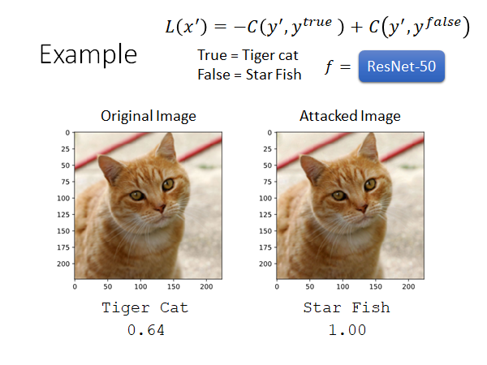

效果是针不戳。我们看看两张图片的差异，因为差异太小肉眼难以看见，所以看看x50倍的效果：

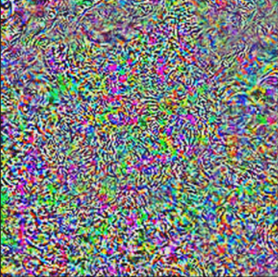

上面我们叠加上去的噪声是我们精心构造的，那我们随机加一些噪声会怎么样呢？

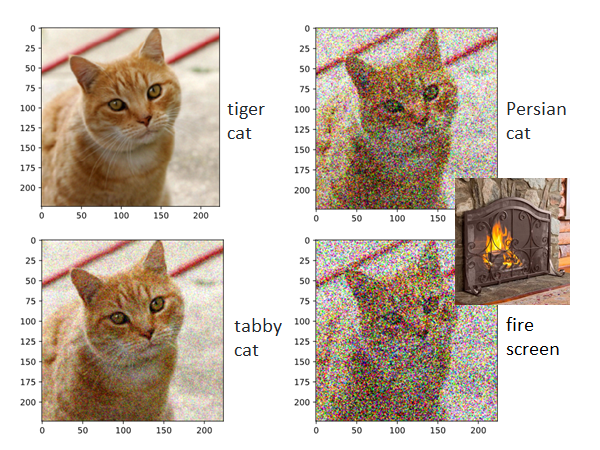

我们可以看到，这些噪声都是比较明显的，但是前两张都被比较正确的识别出来了，至少都还是cat🐱，当我们叠加的噪声十分夸张时机器才没办法辨识这个图片。

### What happend？

总结一下，其实模型很容易就能被attack。但是这件事为什么会发生呢？我们可以这样来解释一下：

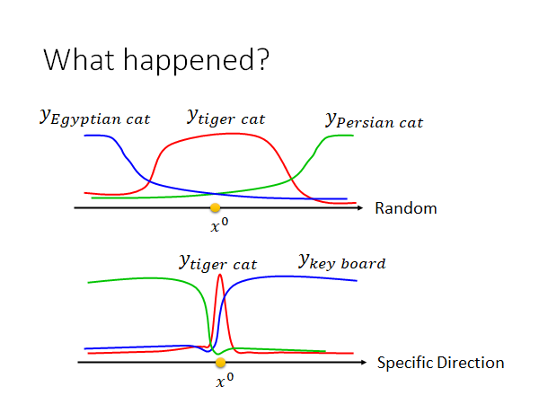

我们可以这样解释，你可以想象 $x^0$ 是在非常高维空间中的一个点，你把这个点随机的移动，你会发现多数情况下在这个点的附近很大一个范围内都是能正确辨识的空间，当你把这个点推到的很远的时候才会让机器识别成类似的事物，当你把它推的非常远时才会被辨识成不相关的事物。但是，有一些神奇维度，在这些神奇的维度上 $x^0$ 的正确区域只有非常狭窄的一点点，我们只要将 $x^0$ 推离原值一点点，就会让模型输出产生很大的变化。

总结这个现象就是在某一些维度上正确域是很狭窄的，只要在这些维度上推离一点点就会让机器判断出错。上述说法只是在现象上解释，出现了什么样的情况，但是没能真正的弄清楚这个现象是怎么出现的，其背后的原理是什么。

### Attack Approaches

可供参考的方法：

- FGSM (https://arxiv.org/abs/1412.6572)

- Basic iterative method (https://arxiv.org/abs/1607.02533)

- L-BFGS (https://arxiv.org/abs/1312.6199)
- Deepfool (https://arxiv.org/abs/1511.04599)

- JSMA (https://arxiv.org/abs/1511.07528)

- C&W (https://arxiv.org/abs/1608.04644)

- Elastic net attack (https://arxiv.org/abs/1709.04114)

- Spatially Transformed (https://arxiv.org/abs/1801.02612)

- One Pixel Attack (https://arxiv.org/abs/1710.08864)

- …… only list a few

有很多五花八门的不同的攻击方法，但是这些攻击方法往往不同之处就在于使用不同的distance测量方法作为constraint，还有使用不同的优化Loss的方法：

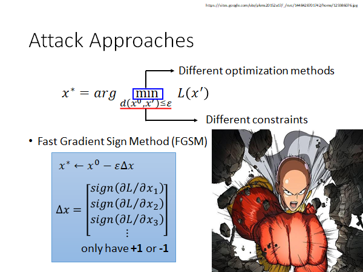

FGSM（Fast Gradient Sign Method）可能不是一个非常好的方法，但是他确实是一个非常简单的方法。他的做法如上图蓝框框所示，我们只要把 $x^0$ 减去一个 $εΔx$ 就算完了。这个 $Δx$ 就是Loss对 $x$ 的偏微分的正负。举例来说，如果 $\partial L/\partial x_1$ 是正的，那我们就在 $x^0$ 的第一维减掉一个 ε ，反之则加上 ε 。这个方法就像一拳超人一样，只要攻击一次就达成目标。

其实，多攻击几次在文献中的结果看来效果是更好的，这种攻击叫做 Iterative FGSM，这里不展开。

我们来直观的解释一下FGSM：

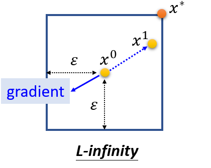

当我们更新输入的时候，我们只要找到梯度的方向，就把输入朝向梯度的反方向更新一个ε，举例来说，在上图二维平面上，如果梯度指向左下角，不管它指向左下角具体哪个角度，我们都会将参数更新到橙色的点。而如果用原来的方法我们就会更新到梯度方向的反方向上，比如点 $x^1$ ，很可能是不会超出constraint的方框的。你可以理解成FGSM是在使用一个巨大的learning rate，大到一次update就会直接跳出constraint，我们再使用fit函数将跑出边界的点拉回到边界的角角上。

### White Box v.s. Black Box

上述的攻击方法，我们都是fix住神经网络的参数去找 $x'$ . 也就是说要想攻击模型，我们必须知道模型的所有参数 $θ$ ，此类攻击我们称为白盒攻击。那如果我们不把模型泄露出去，这样就安全了吗？也不会百分百安全，因为我们还可以采取黑盒攻击。😐 

那黑盒攻击怎么做呢？

### Black Box Attack

现在我们有一个图片辨识模型，完全不知道这个模型的参数和内部结构，但是，**我们能拿到这个模型训练使用的corpus**（数据集，语料库）。

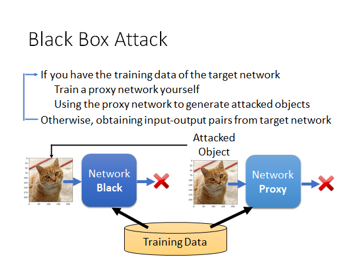

我们可以通过这个数据集自己训练一个模型，称为proxy network。然后，我们用上述的对抗样本的方法攻击这个代理模型，得到一个trigger（恶意样本），用这个恶意样本去攻击原模型。神奇的是，这种方法往往能够成功。

> https://arxiv.org/pdf/1611.02770.pdf

我们来看看这个方法的实验结果，引用自上述论文：

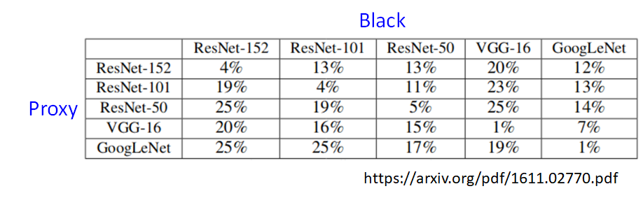

值描述的是模型辨识正确的概率，也就是攻击失败的概率。上述五种神经网络的架构是不一样的，但是我们可以看到即使是不同架构的模型攻击成功的概率也是非常高的，而相同的架构的模型攻击成功率则明显是更高的。

### Universal Adversarial Attack

核心精神是找一个通用的攻击向量，将其叠加到任意样本上都会让模型辨识出错。

> https://arxiv.org/abs/1610.08401

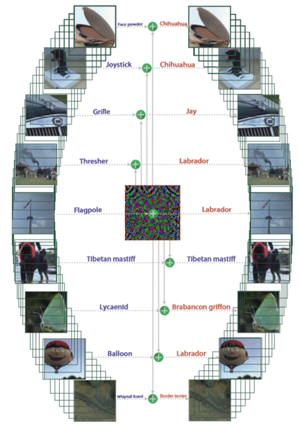

这件事做成以后，你可以想象，只要在做辨识任务的摄像机前面贴一张噪声照片，就可以让所有结果都出错😮。另外，这个通用攻击甚至也可以做上述的黑盒攻击。

### Adversarial Reprogramming

对抗重编程攻击？不知道如何翻译合适，这个攻击的核心精神是：通过找一些噪声，让机器的行为发生改变，达到重编程实现其他功能的效果。举个栗子：

> *Gamaleldin* *F.* *Elsayed**, Ian Goodfellow,* *Jascha* *Sohl-Dickstein, “*Adversarial Reprogramming of Neural Networks*”, ICLR, 2019*

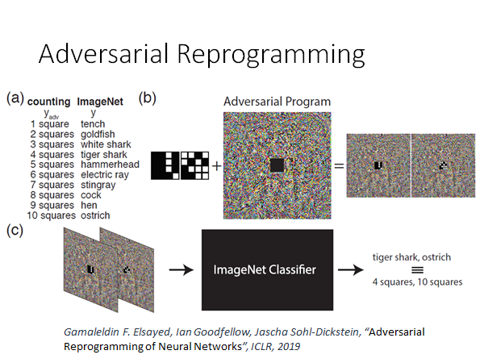

本来模型在做图片辨识，我们通过攻击希望这个模型能做**数方块**这个任务，当我们把图片中间贴上上图中那种方块图，机器就会帮我们数出途中方块的个数，如果有一个方块会输出tench，有两个方块就输出goldfish... 这件事还挺神奇的，因为我们并没有改变机器的任何参数，我们只是用了和前述相同的方法，找了一个噪声图片，然后把要数方块的图贴在噪声上，输入模型就会让模型帮我们数出方块的个数，真实very amazing啊😃。具体方法细节参考引用文章。

### Attack in the Real World

我们想知道上述的攻击方法是否能应用在现实生活中，上述的所有方法中加入的噪声其实都非常的小，在数字世界中这些噪声会对模型的判别造成很大影响似乎是很合理的，但是在真实的世界中，机器是通过一个小相机看世界的，这样的小噪声通过相机以后可能就没有了。那我们就来看看其他人做的实验：

视频连接：https://www.youtube.com/watch?v=zQ_uMenoBCk&feature=youtu.be

从视频中的结果来看似乎在现实世界中攻击是非常可行的。

视频中只是在打印出来的图片上加噪声，但是在人脸识别任务中，你总不可能打印出人脸再上加噪声吧，有人就提出在眼睛框上加噪声：

> https://www.cs.cmu.edu/~sbhagava/papers/face-rec-ccs16.pdf

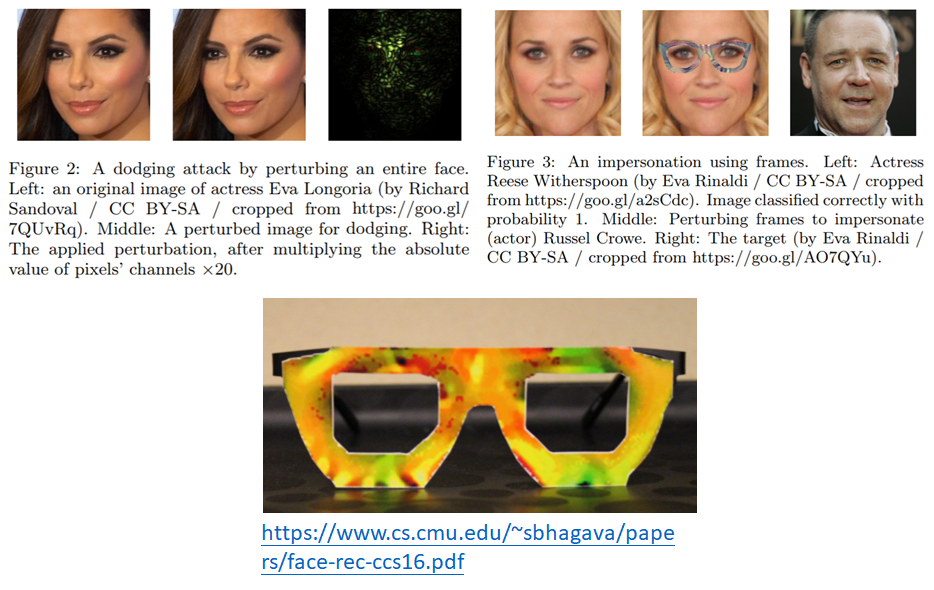

左侧图是在整个人脸上加噪声，但是这种方法只能在实验室做，而右侧是让一个女性带上特制的noise眼镜，就会被是被成一个男性。这个work的作者在做演讲的时候是实际做了现场实验的。总之这种攻击在三次元世界中是切实可行的，但是要做到这件事也是要做非常多的努力的，列出几个难点：

1. 攻击者需要找到超越单个图像的扰动。（人是会动的，所以要保证所有角度都能攻击成功）
2. 极度不同的相邻像素之间的差异不太可能被相机准确捕捉到。（因相机解析度，人物运动等因素，要保证噪声以较大的色块的方式呈现，且不能出现相邻色块的极端差异，才能被相机正确捕捉）
3. 保证颜色是设备能够辨认的。（受限于设备工艺，尽量避免超出常见颜色阈值的色彩）

另外一个栗子：

对路边交通标志进行攻击，希望下列所有表示都能被是被成限速15的标志。他们也考虑了物理世界的种种显示，考虑到不能产生非常奇怪的图案引起怀疑，考虑到不同远近和角度，所以这个攻击确实会在未来自动驾驶道路上造成阻碍。

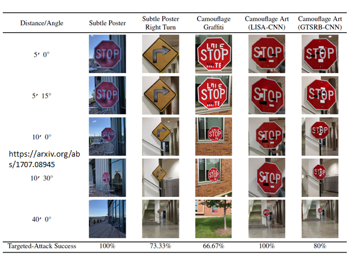

### Attack Beyond Image

攻击也不知出现在图片辨识上，其他领域也是存在的，具体不展开了，只给出reference。

- You can attack audio 
  - [https://nicholas.carlini.com/code/audio_adversarial_examples/](https://nicholas.carlini.com/code/audio_adversarial_examples/)
  - [https://adversarial-attacks.net](https://adversarial-attacks.net/) 
- You can attack text
  - [https://arxiv.org/pdf/1707.07328.pdf](https://arxiv.org/pdf/1707.07328.pdf)

## Defense

有人觉得这种攻击能够成功，就是因为它对训练数据过拟合了，但这并不完全正确，因为就算你对model作regularization，作dropout，作model的ensemble，你也不能抗住攻击。可能你会觉得作ensemble尤其可能抵御住攻击，你攻击成功一个模型，我还有其他模型，但是这种想法是不行的，因为上面我们看到了attack是可以跨模型的，只要攻击成功ensemble中的一个模型，对其他模型也往往效果显著。

现在的防御手段主要分成两大类：

- Passive defense：在不修改model的情况下，识别出被污染的输入。类似于在model外面加一层护盾
- Proactive defense：在训练模型时考虑对抗攻击的防御，让模型变得robust起来

### Passive Defense

> 可参考：https://evademl.org/

怎么做被动攻击呢？我们来举个几个栗子：

#### Filter

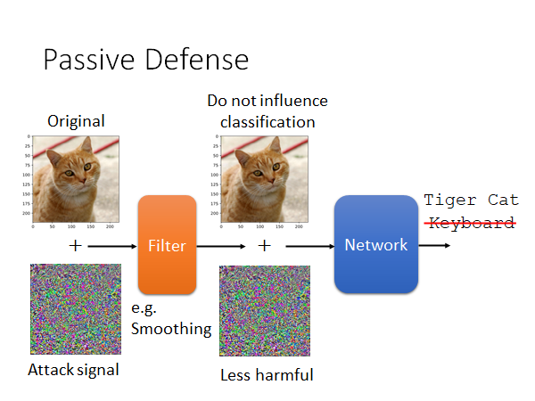

我们在模型前加一个Filter，让有噪声的数据输入到Filter中做一个变换（比如，Smoothing），以尽可能消除噪声的影响。一张被加了对抗噪声的猫🐱片被识别为键盘，我们希望通过filter的处理以后能够减轻noise的伤害，而其他的正常图片经过filter处理后对辨识结果的影响尽可能小。

那什么样的filter可以做到这件事呢，其实不需要太复杂的filter就可以做到这件事，比如作平滑化smoothing。来看看实验结果：

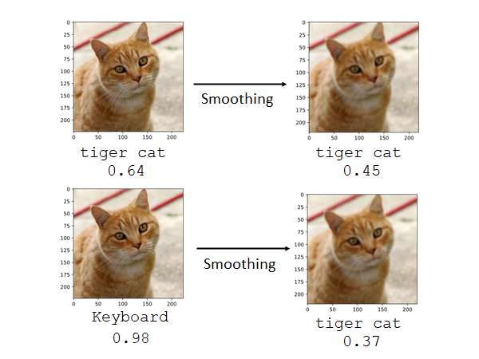

为什么这件事会成功抵御攻击呢，我们可以想象攻击噪声只有在某些特殊的维度上才能造成显著的攻击效果，我们现在一旦加上filter，把那些特殊维度的值改变了，攻击效果就显著下降了，而这样的行为对正常的样本影响并不大。

基于这样的思想我们再看一种方法，特征压缩。

#### Feature Squeeze

> https://evademl.org/docs/featuresqueezing.pdf
>
> https://github.com/uvasrg/FeatureSqueezing

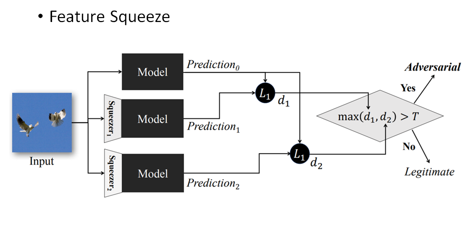

核心思想是对输入样本的特征通过不同方式进行压缩简化，输入到model中得出预测结果和原样本的预测结果进行对别，如果差别较大，就判定为样本是恶意的对抗样本。更多细节可以阅读上述论文。

#### Randomization at Inference Phase

> https://arxiv.org/abs/1711.01991

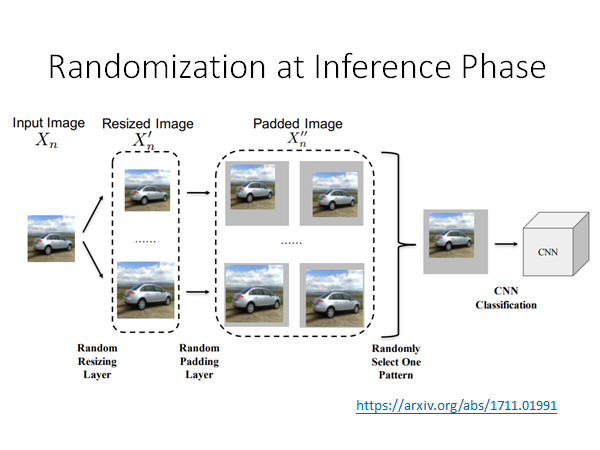

如上图所示，我们将土图片做一些小小的缩放，在旁边加上小小的padding，将padded image输入模型，这样的方法再防御上也是效果显著的。

上述的三个方法都是在模型前面加一层护盾的形式，类似这种方法的弱点就是，当防御方法被泄露的时候，攻击者就能比较容易的攻破护盾。比如，加Filter的方法，攻击者可以将这个filter想象成模型的一个layer，用传统的攻击方法进行攻击就可以了，从而设计出加了filter护盾的模型的恶意对抗样本；又或者说加上random缩放这个方法，如果你random作padding的方法被泄露出去，攻击有可能是成功的，可能可以做到universal的attack，也就是说针对所有的random padding都通用的attack的noise。

### Proactive Denfense

核心精神：找出漏洞，补漏洞

过程如下：

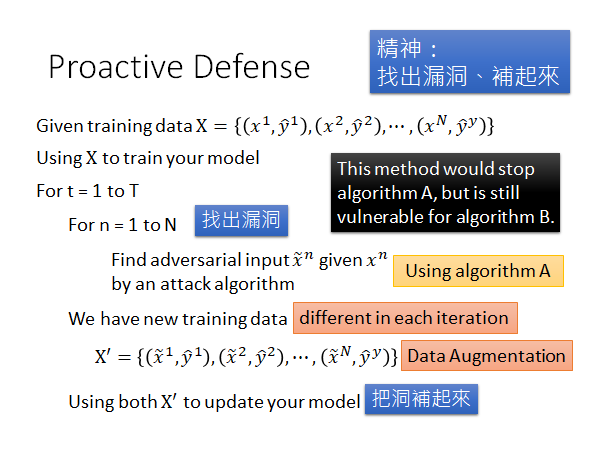

我们训练network的方法就是给出训练数据，然后用这个数据集train出你的model。接下来就是对模型进行修补：

你要再训练T次迭代，每次迭代过程中，要用对每个样本 $x^n$ 根据攻击算法找出其可以attack的对抗样本，记作 $\widetilde{x}^n$ ，将这些对抗样本加入数据集重训练model。

这个增加训练数据的方法有点像Data Augmentation。为什么要作T次迭代呢，因为每次我们重训练以后model的参数就变了，就可能产生新的漏洞所以我们要不断的迭代多次，尽可能修补所有漏洞，实际上是不可能修补所有漏洞的。

还有一件事，我们要注意在这个过程中找漏洞的algorithm，比如我们使用不同的算法，最后得到的是抗不同算法攻击的model，所以或许我么需要用不同算法，做多次这种防御攻击的重训练。

## To Learn More

- Reference
  - https://adversarial-ml-tutorial.org/ (Zico Kolter and Aleksander Madry)
- Adversarial Attack Toolbox:
  - https://github.com/bethgelab/foolbox
  - https://github.com/IBM/adversarial-robustness-toolbox
  - https://github.com/tensorflow/cleverhans

**★推荐综述**：[人工智能系统安全与隐私风险](http://crad.ict.ac.cn/EN/abstract/abstract4023.shtml)

> 更多的参考：
>
> Adversarial Attack Reference:
>
>Intriguing properties of neural networks
> [https://arxiv.org/pdf/1312.6199](https://arxiv.org/pdf/1312.6199?fbclid=IwAR28sk7LH7qQ1D56s4I8z5HX99ycW4hrb6oPVwUTv0-cIvZSEA7Xe9NO4IQ)
>  
>Explaining and Harnessing Adversarial Examples
>  [https://arxiv.org/abs/1412.6572](https://l.facebook.com/l.php?u=https%3A%2F%2Farxiv.org%2Fabs%2F1412.6572%3Ffbclid%3DIwAR28sk7LH7qQ1D56s4I8z5HX99ycW4hrb6oPVwUTv0-cIvZSEA7Xe9NO4IQ&h=AT1IgeLGzPrSZg73vqbMfYFE4N_qJQzq_jFwMDt7AkHw3Gio-dHLeWRDTlUh2eGcjE_sTeD0qbFYUh0k6YY7EJBNxeqOrqf2LdHMfzZvETwRvKyGXKGjIi2C_8BWbNw92T_hcoEXXbKprQB4W4KnbQ)
>  
>Towards Evaluating the Robustness of Neural Networks
>  [https://arxiv.org/pdf/1608.04644.pdf](https://l.facebook.com/l.php?u=https%3A%2F%2Farxiv.org%2Fpdf%2F1608.04644.pdf%3Ffbclid%3DIwAR3xzQ_rqpl1uqPvEwTCdBtxEse6NPlQZf6IBB43Fi4P4nRM_u_TU76IsjU&h=AT1IgeLGzPrSZg73vqbMfYFE4N_qJQzq_jFwMDt7AkHw3Gio-dHLeWRDTlUh2eGcjE_sTeD0qbFYUh0k6YY7EJBNxeqOrqf2LdHMfzZvETwRvKyGXKGjIi2C_8BWbNw92T_hcoEXXbKprQB4W4KnbQ)
>  
>ADVERSARIAL REPROGRAMMING OF NEURAL NETWORKS
>  https://arxiv.org/pdf/1810.00069.pdf
>  
>Audio Adversarial Examples: Targeted Attacks on Speech-to-Text
>  https://arxiv.org/pdf/1801.01944.pdf
>  
>Towards Deep Learning Models Resistant to Adversarial Attacks
>  [https://arxiv.org/abs/1706.06083](https://l.facebook.com/l.php?u=https%3A%2F%2Farxiv.org%2Fabs%2F1706.06083%3Ffbclid%3DIwAR1G9HBl0913uy4I-MEeJynGo9mOkow2QglIwQo7qKbnB6gqlPza40NPUKY&h=AT1IgeLGzPrSZg73vqbMfYFE4N_qJQzq_jFwMDt7AkHw3Gio-dHLeWRDTlUh2eGcjE_sTeD0qbFYUh0k6YY7EJBNxeqOrqf2LdHMfzZvETwRvKyGXKGjIi2C_8BWbNw92T_hcoEXXbKprQB4W4KnbQ)
>  
>Obfuscated Gradients Give a False Sense of Security: Circumventing Defenses to Adversarial Examples
>  [https://arxiv.org/pdf/1802.00420.pdf](https://arxiv.org/pdf/1802.00420.pdf?fbclid=IwAR1XMush-GGz1oBKRt694di5GDaCRTMX1RfXfSxNEoN0sa_OwDrToJTcSmE)
>  
>
>  
>[One pixel attack for fooling deep neural networks](https://arxiv.org/abs/1710.08864)
> 
>------
> 
>Slide :https://media.neurips.cc/Conferences/NIPS2018/Slides/adversarial_ml_slides_parts_1_4.pdf 
> 
>
> 
>Two hour tutorial: https://www.youtube.com/watch?v=TwP-gKBQyic (good one, with web page)
> 
>
>  
>Good fellow
> 
>https://www.youtube.com/watch?v=CIfsB_EYsVI
> 
>
>  
>More videos (I am not sure about the quality)
> 
>https://www.youtube.com/watch?v=r8cW1p8VBOU
> 
>https://www.youtube.com/watch?v=sh6OS6Lssv4
> 
>
>  
>
>Tutorial which is too long: http://pralab.diee.unica.it/en/wild-patterns
> 
>
> 
>科普
> 
>Video: https://www.youtube.com/watch?v=oZYgaD004Dw
> 
>Video: https://www.youtube.com/watch?v=SA4YEAWVpbk
> 
>
> 
>
>------------------------------------------------------------------------------------------------------
> 
>https://zhuanlan.zhihu.com/p/37922148
> 
>Slide :https://media.neurips.cc/Conferences/NIPS2018/Slides/adversarial_ml_slides_parts_1_4.pdf 
> 
>
>Two hour tutorial: https://www.youtube.com/watch?v=TwP-gKBQyic (good one, with web page)
> 
>Good fellow
> https://www.youtube.com/watch?v=CIfsB_EYsVI
> 
>More videos (I am not sure about the quality)
> https://www.youtube.com/watch?v=r8cW1p8VBOU
> https://www.youtube.com/watch?v=sh6OS6Lssv4
> 
>
>Tutorial which is too long: http://pralab.diee.unica.it/en/wild-patterns
> 
>科普
> Video: https://www.youtube.com/watch?v=oZYgaD004Dw
> Video: https://www.youtube.com/watch?v=SA4YEAWVpbk

