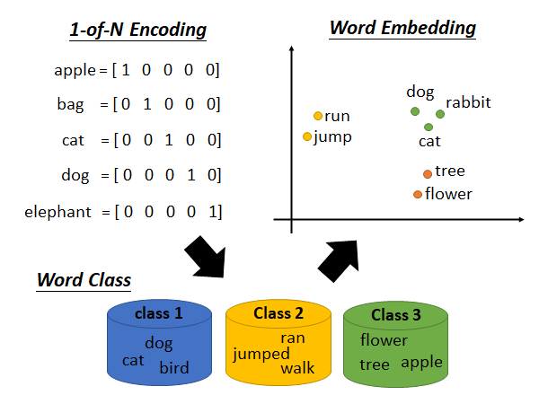
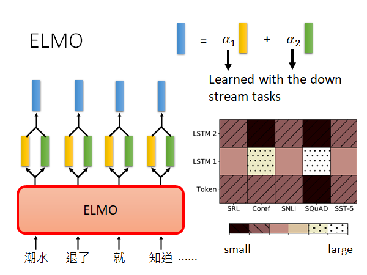

# ELMO, BERT, GPT

这节课要讲的是关于如何让机器看懂人类的文字，也就是自然语言模型。今天要将的是到今天为止（2019年6月），这个方向上最较新的模型包括BERT 还有和BERT 很相似的也很知名的模型ELMO 和GPT 。

## Representation of Word

先回顾一下，在计算机中怎么表示一个词。

**1-of-N Encoding**

最早的词表示方法。它就是one-hot encoding 没什么好说的，就是说如果词典中有N个词，就用N维向量表示每个词，向量中只有一个位置是1，其余位置都是0.

但是这样的方式就失去的词意，比如说dog cat bird 都是动物，这些词的表示在数学上要是接近的。

**Word Class**

根据词的类型划分，但是这种方法还是太粗糙了，比如说dog cat 都是哺乳动物，bird是鸟类应该再细分，而dog cat 又不是同一科又可以再分，且cat 和car都是四个腿或许这两个词应该近一些。于是就有了Word Embedding

**Word Embedding**

有点像是soft 的word class，把词嵌入到高维空间中，具有相同属性，或者相似的词之间，距离近一些。Word Embedding的技术过去讲过，参考：https://www.youtube.com/watch?v=X7PH3NuYW0Q

接下来进入没讲过的知识

## 一词多义

>https://arxiv.org/abs/1902.06006

如上图所示，上面五个bank有三种意思。也就是说同一个词往往在不同的上下文中具有不一样的意思，就是说我们希望一个词可以有多个embedding 。以前要处理这件事，我们是让机器去查词典，看这个词有几种解释就给它设置几个embedding，然后通过语料库train 出这些向量。但是不同的词典对同一个词有不同的解释，比如说上图第五个blood bank（血库），有的词典认为这个bank就是银行的意思，有的词典认为这是区别于银行的第三种意思。事实上，有很多这种微妙的词汇，让人难以判断它应该设置几个embedding 。

## Contextualized Word Embedding

我们希望机器能做到：

- 每个token（不同上下文中的词）都有一个embedding （无论它们在词典解释中是否属于同一类）

- word token 的embedding 依赖于上下文

如上图所示，三个bank是不同的token，它们的上下文是不一样的，未来将有不同的embedding （包括灰色的方块，每个token都会输出一个embedding）。这个技术叫做Contextualized Word Embedding 。

那怎么做到Contextualized Word Embedding 呢，有一个实现的技术叫做：Embeddings from Language Model (ELMO)

## Embeddings from Language Model (ELMO)

>https://arxiv.org/abs/1802.05365

ELMO是一个RNN-based Language Model，训练的方法就是找一大堆的句子，也不需要做标注，然后做上图所示的训练，RNN忘记了的话去看以前的讲解吧。

RNN-based Language Model 的训练过程就是不断学习预测下一个单词是什么。举例来说，你要训练模型输出“潮水退了就知道谁没穿裤子”，你教model，如果看到一个开始符号\<BOS\> ，就输出潮水，再给它潮水，就输出退了，再给它退了，就输出就...学完以后你就有Contextualized Word Embedding ，我们可以把RNN 的hidden layer 拿出来作为Embedding 。

为什么说这个hidden layer 做Embedding 就是Contextualized 呢，因为RNN中每个输出都是结合前面所有的输入做出的。

你可能会疑惑上图不是只看了单词的前文吗，怎么说是上下文呢？

事实上，我们是如上图所示做了正反双向的训练，最终的word embedding 是把正向的RNN 得到的token embedding 和反向RNN 得到的token embedding 接起来作为最终的Contextualized Word Embedding 。

现在出现了新的问题，通常来说RNN都是Deep的，如下图所示：

中间的word embedding通常是多个，怎么解决呢？ELMO的解决方法很简单就是：我全部都要

如上图所示，ELMO会将每个词输出多个embedding，这里我们假设LSTM叠两层。ELMO会用做weighted sum，weight是根据你做的下游任务训练出来的，下游任务就是说你用EMLO做SRL（Sematic Role Labeling 语义角色标注）、Coref（Coreference resolution 共指解析）、SNLI（Stanford Natural Language Inference 自然语言推理）、SQuAD（Stanford Question Answering Dataset） 还是SST-5（5分类情感分析数据集）。

具体来说，你要先train好EMLO，得到每个token 对应的多个embedding，然后决定你要做什么task，然后在下游task 的model 中学习weight 的值。

原始ELMO的paper 中给出了上图实验结果，Token是说没有做Contextualized Embedding之前的原始向量，LSTM-1、LSTM-2是EMLO的两层得到的embedding，然后根据下游5个task 学出来的weight 的比重情况。我们可以看出Coref 和SQuAD 这两个任务比较看重LSTM-1抽出的embedding，而其他task 都比较平均的看了三个输入。

## Bidirectional Encoder Representations from Transformers (BERT)

**BERT = Encoder of Transformer**

我们在transformer 一节中讲过Transformer 了，BERT 也有提及。

如果后面讲的东西你没有听的很懂的话，你就记住BERT的用法就是吃一个句子，输出句中每个词的embedding 。

这里老师做了一个提醒，由于中文的词太多，所以用词作为sequence的基本单位，可能导致输入向量过长（one-hot），所以也许使用字作为基本单位更好。

### Training of BERT

paper上提及的BERT的训练方法有两种，**Masked LM** 和**Next Sentence Prediction** 。

**Masked LM**

基本思路：盖住输入的句子中15%的词，让BERT把词填回来。具体方法是，挖空的位置用符号[MASK]替换，然后输入到BERT，BERT给出输出向量，将挖空地方的输出向量，输入到一个简单的线性模型中，这个模型会分辨这个向量是那个词。所以说，BERT必须好好做embedding ，只有BERT抽出的向量能很好地表示被挖空的词，这个简单的线性模型才能找到到底是哪个词被Masked。

**Next Sentence Prediction**

基本思路：给BERT两个句子，然后判断这两个句子是不是应该接在一起。具体做法是，[SEP]符号告诉BERT交接的地方在哪里，[CLS]这个符号通常放在句子开头，它通过BERT得到的embedding 输入到简单的线性分类器中，分类器判断当前这个两个句子是不是应该接在一起。

你可能会疑惑[CLS]难道不应该放在句末，让BERT看完整个句子再做判断吗？

你仔细想想看，BERT里面一般用的是Transformer的Encoder，也就是说它做的是self-attention，我们之前说self-attention layer 不受位置的影响，它会看完整个句子，所以一个token放在句子的开头或者结尾是没有差别的。

最后提一下上述两个方法中，**Linear classifier 是和BERT一起训练的**。**上述两个方法在文献上是同时使用的**，让BERT的输出去解这两个任务的时候会得到最好的训练效果。

### How to use BERT

你当然可以把BERT当作一个抽embedding 的工具，抽出embedding 以后去做别的task，但是在文献中并不是这样，文献中是把BERT和down stream task 一起做训练😮。举了四个栗子：

如上图，输入一个sentence 输出一个class ，有代表性的任务有情感分析，文章分类等。

具体做法，以句子情感分析为例，你找一堆带有情感标签的句子，丢给BERT（BERT有trained model），再句子开头设一个判断情感的符号[CLS]，把这个符号通过BERT的输出丢给一个线性分类器做情感分类。线性分类器是随机初始化参数用你的训练资料train 的，这个过程你也可以堆BRET进行fine-tune ，或者就fix 住BRET的参数，都行。

如上图，输入一个句子，输出每个单词的类别。有代表性的栗子，Slot filling。

和上一个栗子类似，这里你就去train 每个线性分类器就好了，BERT也可以去fine-tune 。

如上图，输入两个句子，输出自然语言推理的结果。举栗来说，给出一个前提一个假设，机器根据这个前提判断这个假设是T/F/unknown.

做法如上图所示，你在开头设一个提问的符号，在把两个句子用[SEP]接起来，上面接一个线性分类器（3分类），同上的训练方法。

那BERT解QA问题，而且明确是Extraction-based Question Answering ，这种QA问题是说，文中一定能找到问题的答案。

解这种QA问题的model 如上图所示，模型输入Document D 有N个单词，Query Q有M个单词，模型输出答案在文中的起始位置和结束位置：s和e。举例来说，上图中第一个问题的答案是gravity，是Document 中第17个单词；第三个问题的答案是within a cloud，是Document 中第77到第79个单词。

怎么用BERT解这个问题呢？

输入如上图所示，Document 中每个词都会有一个向量表示，然后你再去learn 两个向量，上图红色和蓝色条，这两个向量的维度和BERT的输出向量相同，红色向量和Document 中的词汇做点积得到一堆数值，把这些数值做softmax 最大值的位置就是s，同样的蓝色的向量做相同的运算，得到e：

如果e落在s的前面，有可能就是无法回答的问题。

这个训练方法，你需要label很多data，每个问题的答案都需要给出在文中的位置。两个向量是白手起家learn出来的，BERT可能需要fine-tune 。

### BERT 屠榜

现在BERT在NLP任务中几乎是屠榜的，几乎每个NLP任务都已经被BERT洗过了。

### Enhanced Representation through Knowledge Integration (ERNIE)

> https://arxiv.org/abs/1904.09223
>
> https://zhuanlan.zhihu.com/p/59436589

ERNIE是转为中文设计的NLP预训练模型，by 百度。细节可以看一下文章。

### What does BERT learn?

> https://arxiv.org/abs/1905.05950
>
> https://openreview.net/pdf?id=SJzSgnRcKX

思考一下BERT每一层都在做什么，列出上述两个reference 给大家做参考。假如说我们的BERT有24层，down stream task有POS、Consts等等，我们来分析一下上述实验结果。这个实验把BERT的每一层的Contextualized Embedding 抽出来做weighted sum，就和EMLO的做法一样，ELMO就是把每层的Contextualized Embedding 抽出来做weighted sum，然后通过下游任务learn 出weight。

这里也一样，假设我们是单纯用BERT做embedding ，用得到的词向量做下游任务。那BERT有24层，所以每个词都会抽出24个vector ，把这些vector 做weighted sum，weight 是根据下游任务learn出来的，看最后learn出的weight 的情况，就可以知道这个任务更需要那些层的vector 。

上图中右侧蓝色的多个柱状图，代表通过不同任务learn 出的BERT各层的weight ，POS是做词性标注任务，会更依赖11-14层，Coref是做分析代词指代，会更依赖BERT高层的向量，而SRL语义角色标注就比较平均地依赖各层抽出的信息。

### Multilingual BERT

> https://arxiv.org/abs/1904.09077

Multilingual BERT 用104种语言去训练。google 到wiki百科上爬了104种语言的百科给BERT学习，虽然BERT没看过这些语言之间的翻译，但是它看过104种语言的百科以后，它似乎自动学会了不同语言之间的对应关系。

所以，如果你现在要用这个预训练好的BERT去做文章分类，你只要给他英文文章分类的label data set，它学完之后，竟然可以直接去做中文文章的分类 amazing😮。更多细节你可以参考上述reference

## Generative Pre-Training (GPT) 

> https://d4mucfpksywv.cloudfront.net/better-language-models/language_models_are_unsupervised_multitask_learners.pdf
>
> Source of image: https://huaban.com/pins/1714071707/

从上图你就可以看出，GPT非常巨大，其实它的卖点就是大。

GPT目前有三个版本，GPT就是最开始版本，它的大小是平平无奇的，只是提出了一种NLP预训练模型架构，GPT-2是GPT的加大版本，GPT-3是上一个版本的加大版本。也就是中杯、大杯和超大杯。尤其是GPT-3在2020年引起了较大轰动，有人说它能为人工智能的热潮续命5年，关于GPT-3的文章已经有很多了，感兴趣可以自行查阅，本节主要探究GPT的架构。

为什么用独角兽的形象，后面会解释。

我们上面说BERT是Transformer 的Encoder ，GPT其实是Transformer 的Decoder 。

GPT和一般的Language Model 做的事情一样，就是你给他一些词汇，它预测接下来的词汇。举例来说，如上图所示，把“潮水的”q拿出来做self-attention，然后做softmax 产生 $\hat{\alpha}$ ，再分别和v做相乘求和得到b，self-attention 可以有很多层（b是vector，上面还可以再接self-attention layer），通过很多层以后要预测“退了”这个词汇。

预测出“退了”以后，把“退了”拿下来，做同样的计算，预测“就”这个词汇，如此往复。

### Result of GPT

**GPT-2是一个巨大的预训练模型**，它可以在没有更多训练资料的情况下做以下任务：

- **Reading Comprehension**

BERT也可以做Reading Comprehension，但是BERT需要新的训练资料train 线性分类器，对BERT本身进行微调。而GPT可以在没有训练资料的情况下做这个任务。

如上图所示，你就给GPT-2一段文章，给出一个问题，再写一个A:，他就会尝试做出回答。右侧是GPT-2在CoQA上的结果，最大的GPT-2可以和DrQA达到相同的效果，不要忘了GPT-2在这个任务上是zero-shot learning ，从来没有人教过它做QA 。

- **Summarization**

给出一段文章加一个too long don't read 的缩写"TL;DR:" 就会尝试总结这段文字。

- **Translation**

以上图所示的形式给出 一段英文=对应的法语，这样的栗子，然后机器就知道要给出第三句英文的法语翻译。

其实后两个任务效果其实不是很好，Summarization就像是随机生成的句子一样。

### Visualization

>https://arxiv.org/abs/1904.02679

有人分析了一下GTP-2的attention做的事情是什么。

上图右侧的两列，GPT-2中左列词汇是下一层的结果，右列是前一层需要被attention的对象，我们可以观察到，She 是通过nurse attention 出来的，He是通过doctor attention 出来的，所以机器学到了某些词汇是和性别有关系的（虽然它大概不知道性别是什么）。

上图左侧，是对不同层的不同head 做一下分析，你会发现一个现象，很多不同的词汇都要attend 到第一个词汇。一个可能的原因是，如果机器不知道应该attend 到哪里，或者说不需要attend 的时候就attend 在第一个词汇。如果真是这样的话，以后我们未来在做这种model 的时候可以设一个特别的词汇，当机器不知道要attend 到哪里的时候就attend 到这个特殊词汇上。这就是Visualization 可以告诉我们的事情。

### GPT-2 write novel

GPT-2是OpenAI 做的，上图是OpenAI 用GPT-2 做了一个续写故事的栗子，他们给机器看第一段，后面都是机器脑部出来的。机器生成的段落中提到了独角兽和安第斯山，所以现在都拿独角兽和安第斯山来隐喻GPT：

OpenAI 担心GPT-2最大的模型过于强大，可能会被用来产生假新闻这种坏事上，所以只发布了GPT-2的小模型。BERT是你能得到模型，GPT-2却是你得不到的，于是上图就很形象的表达了众多平民AI Master 的心情。

有人用GPT-2的公开模型做了一个在线demo，大家可以去试试：

https://app.inferkit.com/demo

参考文章：

> Attention isn’t all you need！BERT的力量之源远不止注意力：https://zhuanlan.zhihu.com/p/58430637

