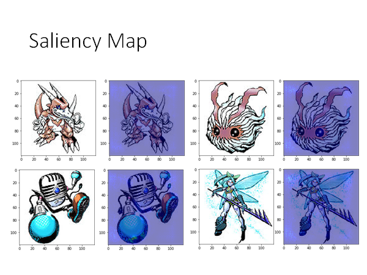

# Explainable ML

## 基本概念

举例来说，在图片识别任务中，我们给机器一张图片，它就会告诉我们图片中有什么事物，但是我们不只希望机器能告诉我们图片中有什么，我们还希望它能告诉我们它判断图片中存在该事物的理由。

如上图所示，可解释的机器学习目前分为两种类型：

- 局部解释

  为什么你认为图中有一只猫🐱？

- 全局解释

  你认为猫🐱应该是什么样子的？

## 为什么我们需要Explainable ML

> 举例来说：
>
> 现在很多公司都会想要用机器来协助做履历的判读，我们希望用机器来做履历的判读的时候是公平的，那我怎么让人知道机器是不是公平的呢？也许我们就需要机器它一边判读，一边告诉我们他筛选履历的理由，这样我们就可以知道机器到底是真的在判读一个人的能力，还是仅仅凭借肤色和性别这样的数据进行判断。
>
> 又或者，让机器协助判断一个罪犯是否可以被假释，我们需要知道机器是否真的根据具体的事证来判断这件事，还是仅仅凭借肤色和性别这样的数据进行判断。
>
> 又或者，进行金融相关的决策需要提供判断理由，比如为什么不给某人贷款？
>
> 还有，当我们可以做可解释的机器学习模型时，我们就能做模型诊断，就可以知道机器到底学到了什么，是否和我们的预期相同。（ps: 准确率不足以让我们精确调整模型，只有当我们知道why the answer is wrong, so i can fix it. ）

## My Point of View

我（李宏毅老师）的观点

**可解释机器学习的目标 != 完全了解机器学习模型如何工作** 可以说完全了解它是如何工作，这件事未必是必要的。

- 很多人不信任机器学习模型，因为他们认为它是个黑盒
- 但是人类本身也是个黑盒

所以可解释机器学习的目标应该是 **让人（你的客户、老板、你自己）舒服** 😆 

也许最终在未来，可解释机器学习可以根据不同的人给出不同的解释。比如，给小学生和大学生解释机器为什么会学习这件事，给出不同的解释。

## Interpretable v.s. Powerful

可解释性 v.s. 强大

- 简单的模型似乎不会很强
- 深度学习模型是复杂的，却是强大的

这里是说，可解释的机器学习不是放弃复杂的模型，只使用简单的模型，而是去尝试解释复杂模型。

- 那有没有即容易解释又强大的模型呢，比如决策树？

但是，事实上只用一棵决策树效果并不好，通常我们都会使用很多决策树结合起来得到比较强的效果，比如随机森林，xgboost 等，这些强大的模型也是很难解释的：

https://stats.stackexchange.com/questions/230581/decision-tree-too-large-to-interpret

## Local Explanation Explain the Decision

Question: why do you think this image is a cat? 

我们想知道机器在图片上的那部分看到了猫🐱，或者说它把那部分认成了猫。

### 基本精神

现在有一个object $x$ ，其中有$N$个Component，**现在希望知道哪些Component对机器做判定是重要的**。

- Component

  在图片辨识任务中，component可以是一个pixel，或者一个segment（如上图中分割的图片块）

  在NLP任务中，component可以是一个word。

**关键精神**：拿掉某个component或者改动其数值，观察决策变化。如果这个改动使模型决策发生非常大的变化，那这个component就是比较重要的。

### 举栗来说：

> Reference: Zeiler, M. D., & Fergus, R. (2014). Visualizing and understanding convolutional networks. In *Computer Vision–ECCV 2014* (pp. 818-833)

我们使用一个灰色的方块盖住图片的某个位置，观察模型的判断，最终得到如下结果。蓝色的部分是灰色方块覆盖该位置时模型认为该图片大概率不是正确标签的，红色部分表示当灰色方块覆盖该位置时模型认为该图片大概率是正确标签。

上图反映出，该模型确实学习到正确的事物。另外，覆盖图片的方块的颜色、大小都是需要人工调整的参数，这其实是至关重要的。

> Karen Simonyan, Andrea Vedaldi, Andrew Zisserman, “Deep Inside Convolutional Networks: Visualising Image Classification Models and Saliency Maps”, ICLR, 2014

对于每一个输 $x$ 将其某个维度加上一个小小的扰动，然后观察模型判断结果和原判断结果的差值，根据这个扰动造成的结果差值来了解机器对图片中哪些像素比较敏感。（其实这个扰动造成的影响，可以理解为偏微分$\frac{\partial y_k}{\partial x_n}$） 根据这个偏微分的值，我们画出了上图的结果，亮度越大表示偏微分值越大。可见，该模型确实学习到正确的事物。

### Case Study: Pokémon v.s. Digimon

我们想看看Saliency Map能带来什么样的结果，用机器学习辨识输入进来的图片是pokemon还是digimon。

我们看看结果：

好像很厉害哦，但是我们使用saliency map看看机器到底学到了什么。

我们看到，机器好像把关注点都放在了本体之外的部分上，原来pokemon和digimon数据集一个是png，一个是jpg，两者的背景一个是透明的一个是纯黑的🤣

### 更多...

- Grad-CAM (https://arxiv.org/abs/1610.02391)

- SmoothGrad (https://arxiv.org/abs/1706.03825)

- Layer-wise Relevance Propagation(https://arxiv.org/abs/1604.00825)

- Guided Backpropagation(https://arxiv.org/abs/1412.6806)

### Limitation of Gradient based Approaches

基于梯度下降的方法的限制

刚才我们用gradient的方法判断一个pixel或者一个segment是否重要，但是梯度有一个限制就是gradient saturation（梯度饱和）。

- gradient saturation

举例来说，我们如果通过鼻子的长度来判断一个生物是不是大象，鼻子越长是大象的信心分数越高，但是当鼻子长到一定程度信心分数就不太会变化了，信心分数就封顶了。在上图标记的点，梯度已经很小了，这和我们想要的结果不太一样了，因为我们希望鼻子的长度越长，它是大象的信心分数就越大。回到先前的判断重要性的方法，也就是说当某个特征梯度饱和时，用gradient based的方法判断，这个特征对模型做判别变得不重要了。

那怎么解决这个问题呢，如图中列出的参考方法。

### Attack Interpretation

攻击机器学习的解释是可能的吗？（可能的）

> Interpretation of Neural Networks is Fragile
> Amirata Ghorbani, Abubakar Abid, James Zou
>
> https://arxiv.org/abs/1710.10547

我们可以加一些神奇的扰动到图片上，人眼虽然辨识不出来，也不改变分类结果，但是模型聚焦的判定点却变了。

## Global Explanation: Explain the whole Model

Question: What do you think a “cat” looks like?

我们想知道为什么机器认为的猫🐱具体长什么样子。（也就是去做一个生成器Generator）

### Activation Maximization(review)

这个技术之前讲深度学习的时候讲过，[参考](https://youtu.be/FrKWiRv254g?t=2810)，是说找一个样本让某一个filter的output或者是某一个neuron的output最大化：

举例来说，在手写数字辨识的任务中，我们想知道机器心里理想的1长什么样子，也就是说要让机器画出一个1。做法是我们照一张图片作为输入$x^*$让代表1的output的那一个维度的值最大化，即：
$$
x^* = arg \max_{x} y_i
$$
画出来的结果如上图所示，很差😐。鉴于之前讲过的Adversarial Attack，这个结果大概也在我们的意料之中了，在Adversarial Attack中我们给图片加上一个微小的扰动，模型就会将其辨识成不同的类别，现在也是一样，我们给机器看一个杂讯，它可能就会认为这个杂讯图片就是1，就是2......所以，我们光是让机器找一张图片，maximize output的某一维度，不足以告诉我们机器心中认为的该output维度代表的数字的样子。

我们需要加一些额外的限制：

我们不仅要maximize output的某个维度，还要加一个限制函数$R(x)$让$x$尽可能像一个数字图片，这个函数输入是一张图片，输出是这张图片有多像是数字。

那这个限制函数$R(x)$要怎么定义呢，定义方式有很多种，这里就简单的定义为所有pixel的和的数值，这个值越小说明黑色rgb(0,0,0)越多，这个图片就越像是一个数字，由于这里数字是用白色的笔写的，所以就加一个负号，整体去maximize $y_i$与$R(x)$的和，形式化公式就变成了：
$$
x^* = arg \max_{x}( y_i + R(x) )
$$
得到的结果如上图所示，比加限制函数之前要好很多了，从每个图片中多少能看出一点数字的形状了，尤其是6那一张。

在更复杂的模型上，比如要在ImgNet这个大语料库训练出的模型上做上述的事情，在不加限制函数的情况下将会得到同样杂乱无章的结果。而且在这种复杂模型中要想得到比较好的Global Explanation结果，往往要加上更多、更复杂、更精妙的限制函数。以下是研究者做出的比较厉害Global Explanation的结果：

参考：https://arxiv.org/abs/1506.06579

### Constraint from Generator 

生成器的约束

刚才是用人想象的方法（限制函数），告诉机器什么样的东西看起来像是一张正常的图片。现在我们让机器自己生成图片。只要我们收集一大堆图片给机器看，然后训出一个图片生成器。

图片生成器会接收一个低维向量，输出一张图片。这个低维向量$z$可能是从gaussian distribution或者normal distribution中randomly sample出来的点，把这个输入$z$丢入生成器他就会输出一个图片。关于怎么根据这些训练资料训练出这个生成器，你可以使用GAN，VAE等方法，这里不需要展开。

那怎么把这个图片生成器作为限制函数，限制我们让机器画出来的图片呢？如上图下半部分所示，我们将方法转变为：找一个$z$，将它输入到图片生成器中产生一个图片，再将这个图片输入原来的图片分类器，得到一个类别判断$y$，我们同样要maximize $y_i$. 其实可以考虑为我们把图片生成器和图片分类器连接在一起，fix住两者的参数，通过梯度下降的方法不断改变$z$，最终找到一个合适的$z^*$可以maximize $y_i$.之后我们只要将这个$z^*$丢入图片生成器就可以拿到图片$x^*$了。形式化表述为：
$$
z^* = arg \max_{x} y_i
$$
通过上述的方法（再加上亿点点trick），可以得到的结果如下图：

参考：https://arxiv.org/abs/1612.00005

## Using A Model To Explain Another

**核心思想**：Using interpretable model to mimic uninterpretable models.

用一个可解释的模型，去解释一个复杂的不可解释的模型

**方法**：用一个可解释的模型，去模拟一个不可解释的模型的行为。如下图所示：

比如说，训练一个线性模型（蓝色）去模拟神经网络模型（黑色，黑盒）的行为，让两者的输出尽可能相同。但是问题是，由于线性模型太弱了，不足以模拟复杂的神经网络模型，难顶😑。那其实我们可以只模拟神经网络的一部分：

### Local Interpretable Model-Agnostic Explanations (LIME)

不可知模型的局部解释

如上图所示，黑盒模型是蓝色线条，我们可能无法用线性函数拟合这条曲线，但是我们可以尝试模拟图中标记点的部分，如红线所示。

LIME的步骤：

1. 给出你想解释的数据点
2. 在这个点附近sample数据点
3. 用线性（或其他可解释模型）fit这些点
4. 解释线性模型

通过上述步骤，我们就能近似的解释我们感兴趣的点的附近区域内，模型的行为。问题又来了，我们怎么定义“附近”这个概念呢，我们对附近的定义不同，我们得到的分析结果就不同，就像上面Local Explanation中覆盖图片的方块的大小和颜色不同会得到不同的结果。对于上面的图，如果我们把附近定的比较宽泛，就会变成这样：

显然，得到的线性模型就很不一样了。所以结论就是，这个附近是需要你自己调整的hyperparameter. 

PS：LIME通常只能用作局部近似分析，因为可解释模型一般都很简单，简单到不能模拟复杂模型的行为。

### LIME - Image 实践

接下来我们实际把LIME用作解释一个图片分类器：

> Ref: https://medium.com/@kstseng/lime-local-interpretable-model-agnostic-explanation-%E6%8A%80%E8%A1%93%E4%BB%8B%E7%B4%B9-a67b6c34c3f8

1. 首先现有一张要解释的图片，我们想知道模型为什么把它认作树蛙

2. 在这张图附近sample一些数据

   我们通常会用一些toolkit把图片做一下切割，然后随机的丢掉一些图块，得到的新图片作为原图片附近区域中的数据点。

3. 把上述这些图片输入原黑盒模型，得到黑盒的输出

4. 用线性模型（或者其他可解释模型）fit上述数据

   在上面的栗子中我们在做图片辨识任务，此时我们可能在将图片丢到线性模型之前先做一个特征抽取，如下图所示：

​		根据你做的任务不同有不同的trick。

5. 解释你的线性模型

   

   如上图所示，当线性模型种某个特征维度对应的weight：

   - 趋近于零，说明这个segment对模型判定树蛙不重要
   - 正值，说明这个segment对模型判定树蛙有作用
   - 负值，说明这个segment对模型判定树蛙有反作用

李宏毅老师实做：

机器认为图中25%的概率有和服，5%的概率有实验袍。用LIME分析一下，机器认为哪部分是和服，哪部分是实验袍。结果如上图所示。🤔

### Decision Tree

上面使用线性模型解释黑盒模型，我们也可以使用其他的可解释的简单模型来解释，比如决策树。但是如果我们为了让decision tree模仿一个复杂模型的行为，而训练出一个很深的tree，那就是搬起石头砸自己的脚。也就是说，我们不希望训练出一个太深的decision tree，我们需要限制tree的深度。

我们将模拟黑盒模型 $θ$ 的决策树模型写作 $T_θ$，我们希望有一个函数 $O(T_θ)$ 表示 $T_θ$ 有多复杂，比如说这个函数可以用 $T_θ$ 的平均深度表示。我们现在希望复杂模型找到一个决策树，同时希望这个决策树的复杂度小，怎么做这件事呢，看看下面这个work：

> https://arxiv.org/pdf/1711.06178.pdf

想法是：我们来训练一个特别的神经网络，我们在训练这个神经网络时就考虑到它将来要被决策树分析，我们在训练它本身的参数时，同时要考虑到最小化后面用来分析它的决策时的复杂度。我们可以在损失函数种加入 $O(T_θ)$ 作为regularization，这个东西也可叫做tree的regularization。

但是这个 $O(T_θ)$ 是不可微分的，怎么做梯度下降呢？这也是这篇文章神奇的地方，作者说他train了一个神奇的神经网络，我们可以给这个神经网络另一个神经网络的参数，它就可以输出一个数值，来表示输入的网络的复杂度。所以我们只要用这个神奇的网络，替换树正则项，就可以做梯度下降了。其实，文中描述的这个神奇的神经网络只是一个简单的前反馈神经网络而已。这个网络还蛮准确的预测到输入的网络如果用decision tree模拟时，decision tree的深度😮。

这个神奇的网络怎么来呢？训练这个神奇的网络，可以通过我们自己random的生成一些NN，然后用DT模拟这些NN，再把NN和DT的深度做为样本，train出这个神奇的神经网络。

细节可以参考上述文献。

