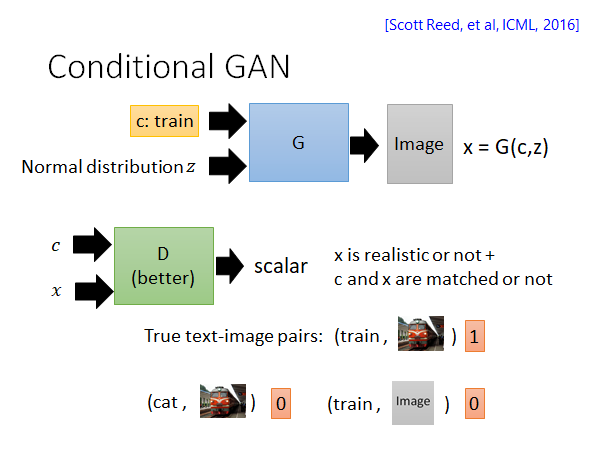

# GAN(Quick Review)

本节的目的就是帮大家复习一下GAN，如果你对GAN不是特别感兴趣，你就可以通过这节课了解本课程需要用到的GAN的知识。如果听完以后对GAN产生了浓厚的兴趣，你可以去看2018年的GAN的课程视频：https://youtube.com/playlist?list=PLJV_el3uVTsMq6JEFPW35BCiOQTsoqwNw

## Three Categories of GAN

我们把GAN分为以下三种：

## 1.Typical GAN

第一种经典的GAN就是训练一个Generator，这个生成器吃一个向量，生成一个目标对象。比如说，你要做二次元人脸图片的生成，你就collect 一大堆的动漫人脸图片，然后喂给Generator 去训练，Generator 就会学会生成二次元人脸的图像。

那怎么训练这个Generator 呢，模型的架构是什么样子的呢？

在经典的GAN方法中，我们会有一个Generator 和一个Discriminator ，这两者是交替的训练出来的，怎么交替训练后面叙述。我们继续以生成二次元人脸图像为例，Generator 就是的input 是一个低维向量，output 是一个高维向量。Discriminator 输入就是Generator 生成的图片，输出是一个分数，这个分数就是说输入有多像二次元人脸，如果很想的话就给出高分，否则就给出低分。这就是经典GAN的基本架构。

### Algorithm

现在来讲一下Generator 和Discriminator 是怎么被训练出来的。这里先明确G和D都是神经网络，这两者的具体架构根据具体的任务而定，比如说你要做图像生成那你可能就会用CNN，如果你要让Generator 通过一些词生成文章，你可能就会用RNN...我们今天不做过多讨论这方面的内容，而是关注于G和D是怎么交替训练的。

首先，G和D是迭代的训练的，在每个training iteration 中有两个步骤：

step1：固定住G，只更新D的参数。也就是说通过当前iteration分配的一个mini batch data 进行Discriminator 的训练。你可以把这个训练看作是分类问题，也可以看作回归问题，相当于如果是动漫人物头像就输出1，否则输出0。这就达到了我们的目的，训练一个Discriminator 它看到好的图片就给一个高分，看到差的就给低分。另外提一下，Database 中都是我们收集的正类样本，而此时Generator 产生样本就可以作为负类。

step2：固定住D，只更新G。这个步骤你可以把G和D两个网络连起来看成一个大的网络，这个网络输入就是低维vector，输出就是一个分数，中间某个维度拿出来就是一张图片，这整个网络仍然用backpropagation更新参数，只不过是固定住后面D的参数。这一步训练目的是为了让Generator 努力骗过Discriminator ，这样G生成的图片就会更像是我们收集的数据集中的样本。

你也可以这样考虑，我们原本train 一个网络是去optimize 人定的objective function，或者是minimize 人定的loss function，但是现在我们训练的Discriminator 就相当于是让机器学了一个objective function或者说loss function，让G朝着这个方向努力。

实际在训练的时候就是如上图所示，train D、train G、train D、train G...交替进行。在网络上比较好的栗子：

<video data-v-ed3efdca="" width="400" height="400" autoplay="autoplay" loop="loop" muted="muted" playsinline=""><source data-v-ed3efdca="" src="images/female.mp4" type="video/mp4">
                Your browser does not support the video tag.
              </video>

https://crypko.ai/#/

### GAN is hard to train...

众所周知，GAN这个技术是比较难train起来的，实际上有很多人提出了更好的训练GAN的方法，WGAN，improve WGAN...如果你有兴趣就去看文章开头链接的课程吧。

## 2.Conditional GAN

上面我们说的是用GAN的技术随机生成目标，更多的情况下我们是希望控制机器产生的东西。比如说我们输入一端文字，让机器根据这段文字生成一张图像，比如下图所示，如果我们输入“Girl with red hair”机器就会生成一张夏娜的图片。

这种根据某个特定输入产生对应的输出的Generator 叫做Conditional GAN 。

我们以文字产生影像为例子，假如说你能收集到文字和图像对应的数据：

接下来你就可以套用传统的监督学习方法，直接训练一个网络输入一段文字，输出一张图片。但是这样训练方法往往不理想，举一个直观的栗子，如上图所示，如果文字是火车，对应火车的图片有火车的各个方向，还有各种不同的火车，这样机器在考虑火车的特征的时候就会把所有的已知特征取平均，这样的话结果就会垮掉。

所以我们就需要新的技术，比如说Conditional GAN，我们会用这个技术做给出文字生成对应影像的任务。Conditional GAN 也是需要label data 的也就是说同样是监督学习，但是它和传统的监督学习的学习目标是不太一样的（事实上Conditional GAN 也可以在无监督的情况下做，这个我们会在后面讲到）。怎么个不一样呢，如上图所示，Generator 的输入是一段描述，输出对应图片，它不去看输入输出是否对应而是看Discriminator 给出的得分。关于Discriminator 我们不仅要输入Generator 生成的图片，还要输入。原因是这样，如果D只吃一张图片的话，那G只要生成出像真实世界的图片就可以骗过D了，这样的话G就会变得很懒惰，就学不起来。如上图所示，Generator 忽视了input condition。

所以我们要给Discriminator 多输入一段描述，Discriminator 输出的分数包含两个含义，一个是x到底有多像真实世界的影像，一个是c和x有多match。训练D的时候要用到如上图所示的输入，text-image pair 需要包含文字匹配真实图像，文字匹配G生成影像，文字不匹配真实图像这些情况，这是第一次实作Conditional GAN容易忽略的点。

### Conditional GAN - Sound-to-image

其实上述使用Conditional GAN 根据文字生成影像的应用已经满坑满谷了，其实只要你有label data 你都可以尝试使用Conditional GAN 来试试，这里老师实作了一个根据声音生成图像的栗子。

从video中提取音轨和图像，就得到了一段声音和图像的对应关系，就可以作为data set 使用上述的Conditional GAN 方法进行训练。

> The images are generated by Chia-Hung Wan and Shun-Po Chuang.
>
> https://wjohn1483.github.io/audio_to_scene/index.html

上图老师实作的结果，第一行是一段类似电视雪花的声音，是识别结果是小溪，然后调大声音，识别结果渐渐变成了瀑布。第二行是类似螺旋桨轰鸣声，识别结果是海上的快艇，随着声音增大，快艇周围的水花逐渐增大。这两个结果其实是有carry kick 的，第三行是一些音乐，识别结果就烂掉了，但总体来说我觉得还不错，有兴趣的话可以去上面那个链接看看。👀

### Conditional GAN - Image-to-label

我们反向思考，可以做根据图像生成对应标签的模型，把Conditional GAN 用在multi-label image classification 任务上：

所谓multi-label 就是说目标的类别不止一个，比如上图所示，示例图片中有person、sports ball、baseball bat、baseball glove，这张图片属于上述所有类别，或者说这张图片拥有这些属性。我们可以把一张图片拥有多个类别想象成一个生成问题，就是说给出一张图片生成它可能拥有的类别或者说属性。

你就把这个问题当作一般的Conditional GAN 做下去就可以了，图片作为condition 输入，类别作为Generator 的输出。

上图是实验的结果，用$F_1$分数来评价，分数越高表示分类准确率越好，使用了两个corpus：MS-COCO和NUS-WIDE，几个不同架构的模型的表现都是加上GAN就会变得更好。

### Talking Head

这里还有一个效果更好的，根据一张人脸照片，一个人脸line mark，去产生另外一张人脸。能做你拿一张蒙娜丽莎的图片，再拿一张人脸line mark，就可以让蒙娜丽莎摆出人脸line mark的表情。

> https://arxiv.org/abs/1905.08233

直观一点，效果就是：

<iframe width="560" height="315" src="https://www.youtube.com/embed/AeHVVFnNDwk" frameborder="0" allow="accelerometer; autoplay; clipboard-write; encrypted-media; gyroscope; picture-in-picture" allowfullscreen></iframe>

## 3.Unsupervised Conditional GAN

最后，我们要讲的是无监督的GAN，上面讲的Conditional GAN 是需要输入输出的对应关系的，实际上我们是有机会能在不知道输入输出的对应关系的情况下，教会机器把输入转成输出。这种技术最常见的应用场景是image style transformation ：

### Cycle GAN

> https://arxiv.org/abs/1703.10593
>
> https://junyanz.github.io/CycleGAN/
>
> Berkeley AI Research (BAIR) laboratory, UC Berkeley

这里我们以Cycle GAN 为例，如上图所示，这个GAN的架构和Conditional GAN 好像没什么不同。G就是将输入转换成一个同样大小的输出但是风格产生变化，D就是将G的输出和梵高的画作做对比，相似性较高的就给出高分，较低就给出低分。我们希望用这样的方法使得G产生的output是带有梵高风格的画作。

但是这样做G有可能就学会只输出梵高的某一幅画或者某几幅画来骗过D，所以这样是不行的。我们要做改进：

通过加一个G将前一个G生成的图片还原回原图片的方式，限制G通过产生固定输出骗过D的情况出现。这种方法叫做cycle consistency 所以这种GAN叫做cycle GAN。

cycle GAN 可以是双向的：刚才讲的是先$X \rightarrow Y$ 再$Y \rightarrow X$，你现在可以先$Y \rightarrow X$再$X \rightarrow Y$ ，你同样要一个X domain 的discriminator 看看$Y \rightarrow X$的结果想不想是真实的X domain 的图片，用另外一个$X \rightarrow Y$的Generator 把输出转回输入，让两者越接近越好。

同样的技术也可以用在其他任务上，举例来说，假设现在X domain Y domain 是两个人的声音，那你就可以用Cycle GAN 做音色转换。再比如说，X domain Y domain 是不同风格的文字，那你就可以用Cycle GAN 做文字风格转换。再比如说，X domain Y domain 是正面和负面的句子，我们就可以用同样的训练的想法将负面的句子转成正面的句子。

### Discrete Issue

需要提醒一下，如果直接把影像的技术套用到文字上是会有一些问题的。

上图就是Cycle GAN 的架构，大概率会使用seq2seq的模型来处理文字，而中间生成的positive 的句子作为一个hidden layer的话，就不可以微分了，因为这个句子他是一个token，是离散的值，所以没办法用backpropagation更新参数。之前做的图像的任务G生成的图像是连续值，是可微分的。那怎么办呢，其实在文献上是有各种而样的办法的，这里就不展开了：

> - Gumbel-softmax
>   - \[Matt J. Kusner, et al, arXiv, 2016\]
>
> - Continuous Input for Discriminator
>   - \[Sai Rajeswar, et al., arXiv, 2017\]\[Ofir Press, et al., ICML workshop, 2017\]\[Zhen Xu, et al., EMNLP, 2017\]\[Alex Lamb, et al., NIPS, 2016\]\[Yizhe Zhang, et al., ICML, 2017\]
>
> - “Reinforcement Learning”
>   - \[Yu, et al., AAAI, 2017\]\[Li, et al., EMNLP, 2017\]\[Tong Che, et al, arXiv, 2017\]\[Jiaxian Guo, et al., AAAI, 2018\]\[Kevin Lin, et al, NIPS, 2017\]\[William Fedus, et al., ICLR, 2018\] 

这是一个实作的结果。

### Speech Recognition

上述的Unsupervised GAN的技术其实不只能用于风格迁移、正负面转换这些场景，还可以有很多其他的应用，比如说一个很有意义的就是语音识别。

在语音识别任务中，监督学习需要大量的语音注释。然而，大多数语言资源不足。我们这么考虑，一个domain是语音，一个domain是文字，而无标签的语音和文字的数据在网络上是由很多很多的，所以有没有可能用Unsupervised GAN的技术在无标签的情况下就让机器学会语音辨识，细节其实比较复杂，这里就跳过，感兴趣就去看文章开头的课程。

#### Experimental Result

这里讲一下结果，上图李宏毅老师的实验室做的结果。TIMIT Benchmark Corpus 上进行测试，在Nonmatched PER上达到了33.1% 是一个很低的错误率了。Nonmatched是说训练数据中音频和文字是不对应的，并不是说文字是根据音频人工写出来的，而是不对应的。PER（phoneme error rate）你可以理解为音表错误率。

可以看到在准确率上，这个无监督的GAN训练出来的模型可以和三十年内的有监督学习的匹敌。

