# Graph Neural Network

slides: http://speech.ee.ntu.edu.tw/~tlkagk/courses/ML2020/GNN.pdf

## Introduction

### 定义

GNN 图神经网络 就是把图作为神经网络的输入，识别图结构，提取图信息，或生成特定结构的图的神经网络模型。

这里的“图”是指图论中的图，即由边和节点构成的图，比如下图中化学分子结构图，二叉树、台湾省地铁线路图：

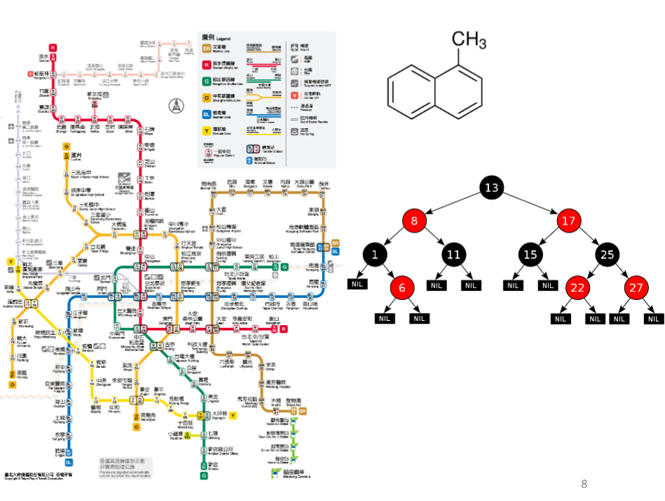

### 训练GNN将遇到的问题

如何利用图的结构和节点之间的关系信息训练模型（即模型如何吃Graph）？

如果图非常大怎么办？

图非常大的时候通常我们没有所有node的label information，怎么办？

首先第一个问题，model如何吃graph的问题：

convolution？

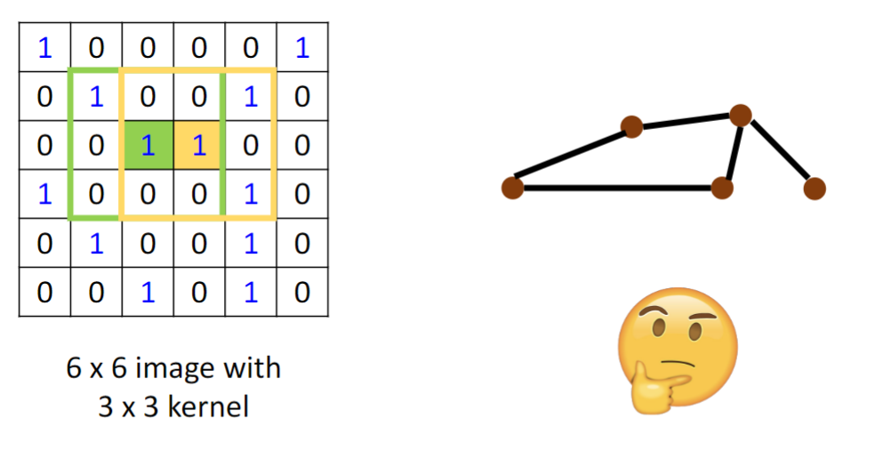

如何把CNN里卷积的方法移植到图神经网络？

所以如何使用convolution将node 嵌入到一个feature space？

- Solution 1: Generalize the concept of convolution (corelation) to graph >> Spatial-based convolution
- Solution 2: Back to the definition of convolution in signal processing >> Spectral-based convolution

## Roadmap

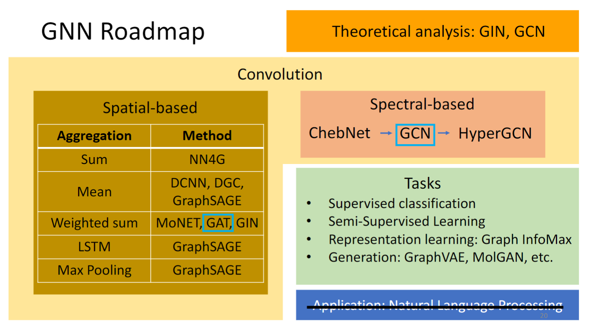

**本节会讲的是：GAT和GCN**.

## Tasks, Dataset, and Benchmark

Tasks
- Semi-supervised node classification
- Regression
- Graph classification
- Graph representation learning
- Link prediction

Common dataset
- CORA: citation network. 2.7k nodes and 5. 4k links
- TU-MUTAG: 188 molecules with 18 nodes on average

这些benchmark的task和dataset用来评估GNN模型好坏，建议先看完下一节Spatial-based GNN再回来看这些任务

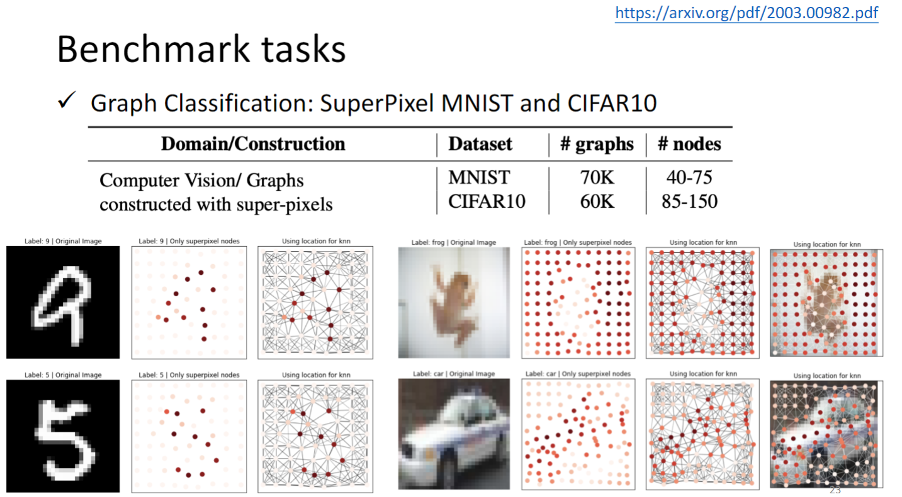

这个数据集通过某种算法将原始MNIST和CIFAR10的图片转成graph，GNNs的任务就是graph classification

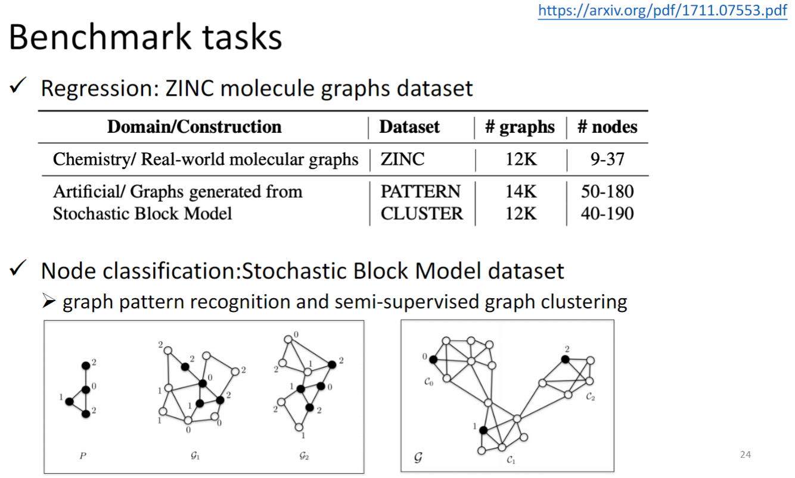

ZINC 是通过分子graph 计算分子溶解度，属于回归任务

Stochastic Block Model dataset 是给出一个pattern，model要是别这个pattern是否出现在一个graph中

这个数据集还可以做另一个任务：每个图由不同的community或者说cluster，model要判断一个node属于哪个cluster

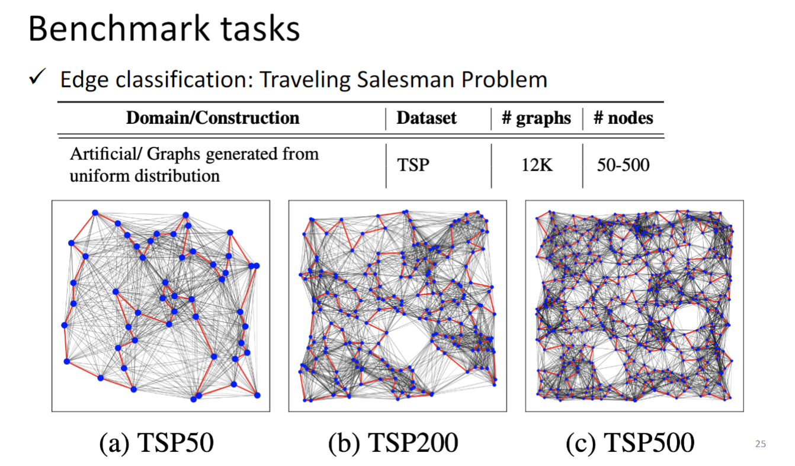

TSP 路径规划问题，就不用赘述了.

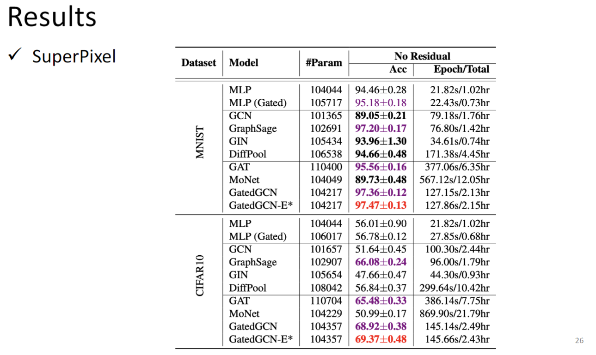

## Spatial-based GNN

复习一下CNN的Convolution：

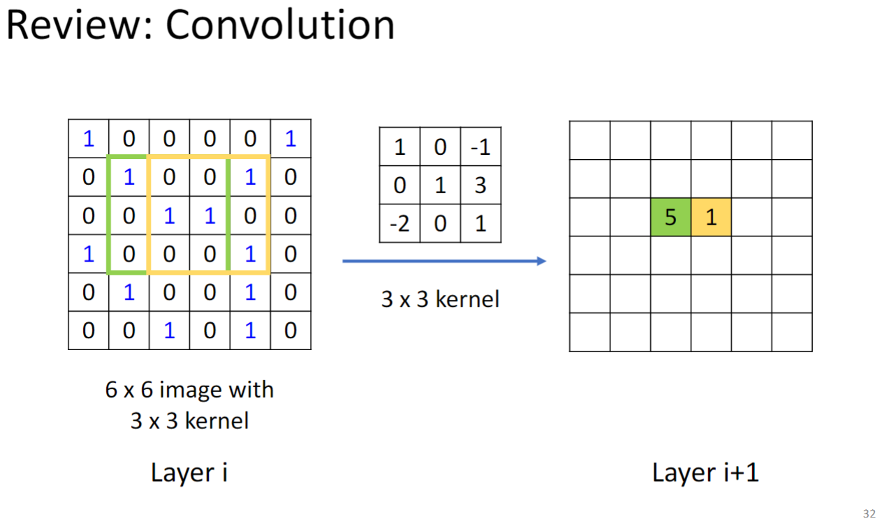

CNN在layer i上通过kernel计算feature得到layer i+1层的feature，类比到Graph上：

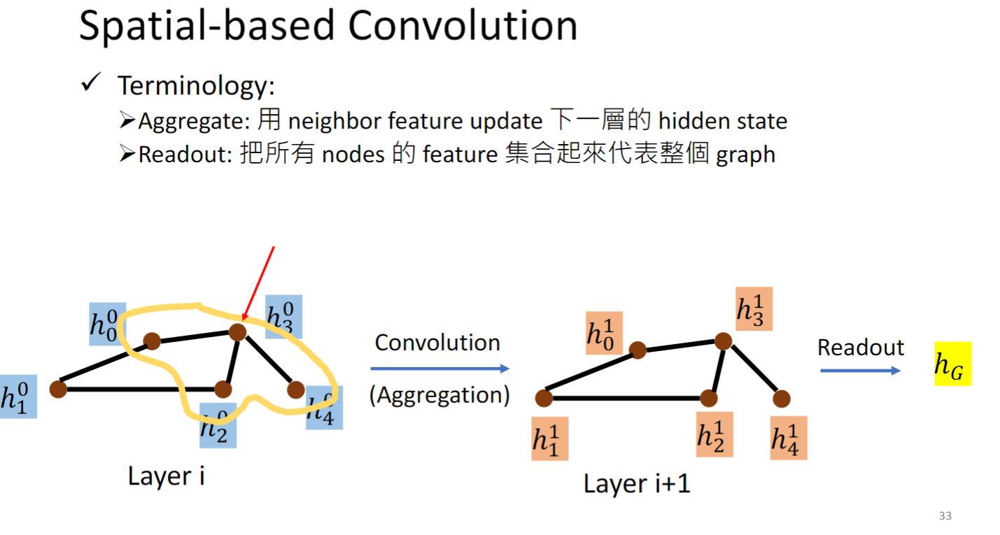

以 $h_3^0$ 为例，0表示第0 layer，3表示第3个node，它的邻居是黄色圈起来的三个几点，我们就用这三个邻居的hidden feature 来算出下一层的hidden layer，这一招叫做**Aggregation**.

如果我们还想同时计算出某一层整个graph的representation，预测一个分子是否会变异，就把所有node的feature集合起来，这个操作叫做**readout**.

### NN4G(Neural Networks for Graph)

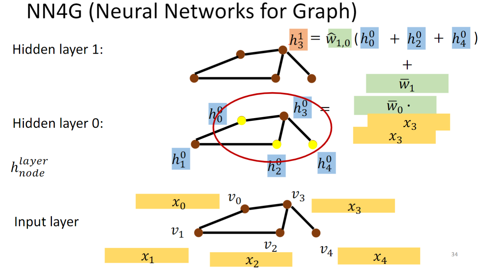

> ref: https://ieeexplore.ieee.org/document/4773279

NN4G这个模型的做法如上图所示，每个节点v都用一个特征向量x表示，对每个节点做embedding，即乘一个矩阵w，得到h，然后从一个hidden layer到下一个hidden layer做Aggregation，具体做法就是将一个节点的邻居的h加起来乘上一个w，就得到这个节点在下一个hidden layer的h.

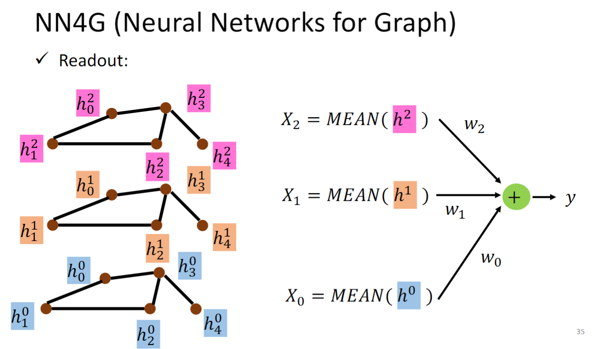

NN4G这个模型Readout的做法如上图所示，无需多言.

### DCNN(Diffusion-Convolution Neural Network)

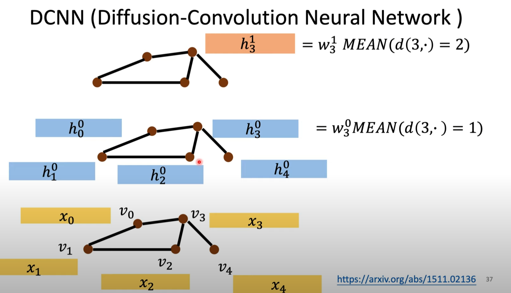

> ref: https://arxiv.org/abs/1511.02136

这个模型的Aggregation的做法是：每一层都从第一层计算得来，算是这样算的：
$$
h_3^0= w_3^0 MEAN(d(3, \cdot )=1)
$$
这是说和$v_3$距离为1的节点取平均，乘上一个权重矩阵$w_3^0$，即节点v0 v2 v4。算完每个节点以后得到第一层的h。
$$
h_3^1 = w_3^1 MEAN(d(3, \cdot )=2)
$$
这是说和$v_3$距离为2的节点取平均，乘上一个权重矩阵$w_3^1$，即节点v1 v3。算完每个节点以后得到第二层的h。

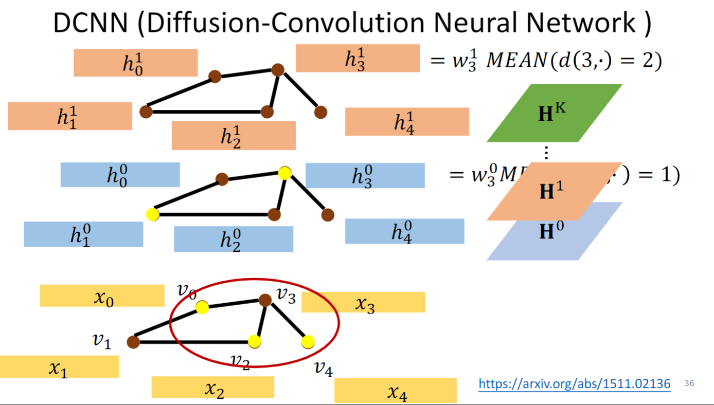

$H^k$ 是将每层的h一行一行放在一起，叠成一个矩阵.

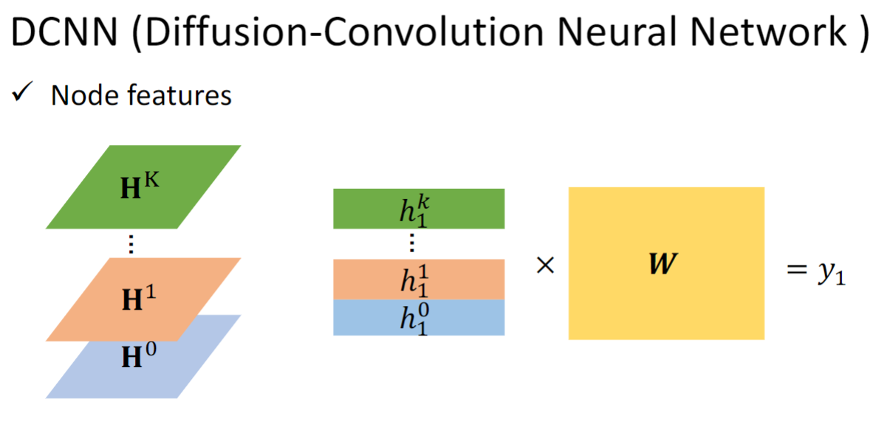

readout的做法如上图所示，无需多言.

### MoNET (Mixture Model Networks)

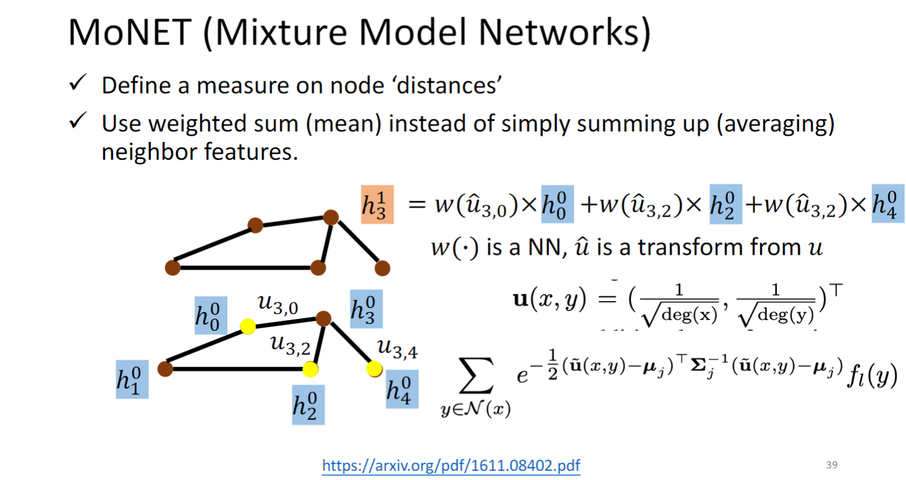

> ref: https://arxiv.org/pdf/1611.08402.pdf

MoNET 对图中的边定义了距离权重，这篇文章中距离是由公式定义的，是可以直接计算的，也有的模型（GAT ）是通过graph data学出的.

MoNET 将weighted sum neighbor features取代了NN4G和DCNN简单的相加求平均.

### GAT (Graph Attention Networks)

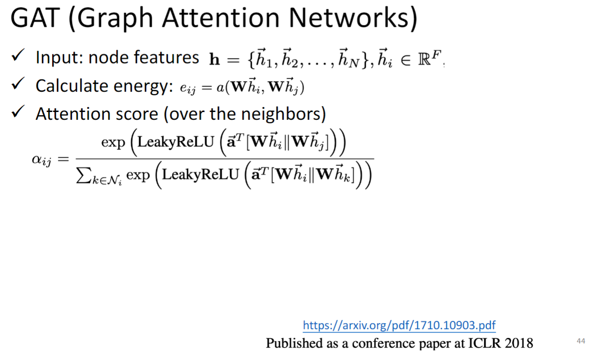

> ref: https://arxiv.org/pdf/1710.10903.pdf

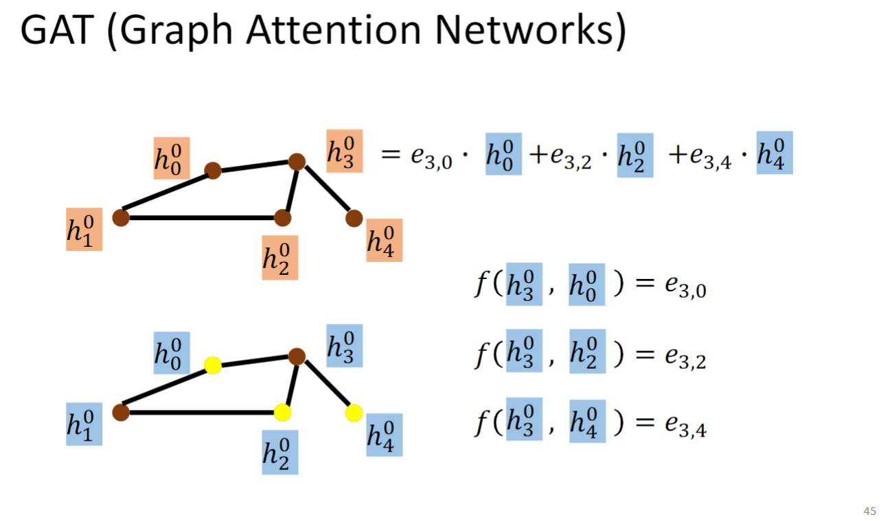

GAT计算节点在下一层上的hidden representation的时候，先算一个节点对它所有邻接节点的energy（即可变的weight） ，然后把这个energy作为权重乘上节点在当前层上的hidden representation，再求和（如上图所示），作为最终的在下一层的表示. 

### GIN (Graph Isomorphism Network)

前面的方法我们就直接用了，也没有问为什么它们会work，GIN这篇paper给出了一些证明，告诉你什么样的GNN model会work

> ref: https://openreview.net/forum%3Fid=ryGs6iA5Km

- A GNN can be at most as powerful as WL isomorphic test 
- Theoretical proofs were provided 

**结论**：更新节点 representation 的时候最好使用下图中的公式所示的方式更新. 

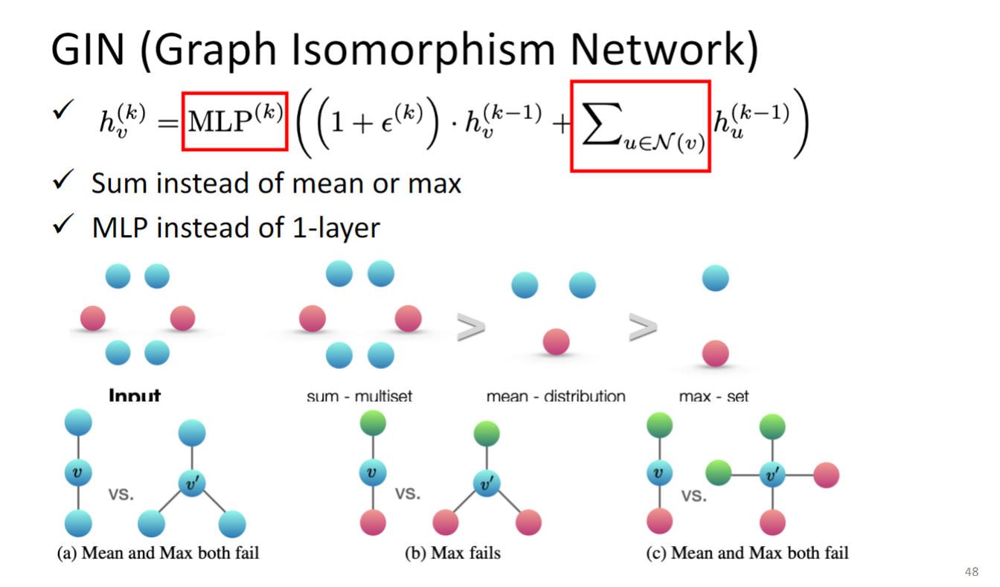

上图公式：
$$
h_v^{(k)} = MLP^{(k)} ((1 + \epsilon^{(k)} )\cdot h_v^{(k-1)} + \sum_{u \in N(v)} h_v^{(k-1)})
$$
k是layer，v是node id，h update的方式应该要先将neighbor 全都加起来，而不能用max pooling也不能用mean pooling，然后加上某个constant 乘以 自己的feature，这个constant就是 $1 + \epsilon^{(k)} $ 这里的 $\epsilon$ 是可以学出来的，但是paper中也说了这里设为0也没太大差别.

为什么不能用max pooling也不能用mean pooling，看上图下面一排：

a告诉我们，max or mean 无法区分a中的两个graph；

max无法分辨b中的两个graph；

max和mean也无法分辨c中的两个graph；

MLP是multi layer perceptron

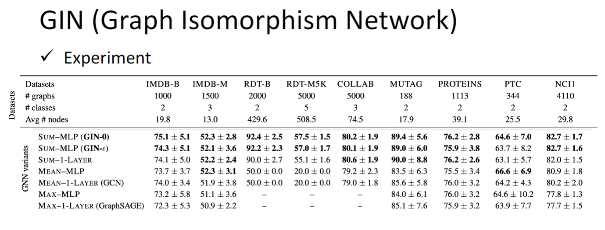

## Graph Signal Processing and Spectral-based GNN

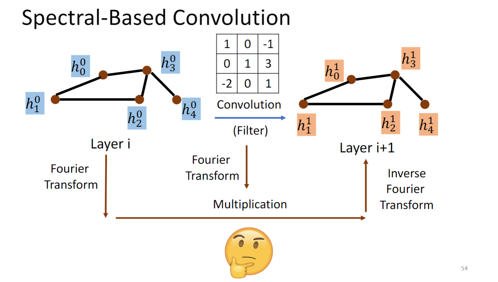

Spectral-based GNN 要做的事情就是将graph 和convolution kernel 都转换到傅里叶域中，在傅里叶域中做multiplication，再转换回去，就是得到下一个layer.

问题是这个傅里叶变换要怎么做呢，要回答这个问题要引入很多信号与系统的东西. 

### Warning of  ~~Math~~ Signal And System

没学过信号与系统，听不懂，但不影响对整个GNN的理解（大概

如果想很好的理解下面讲的Spectral-based GNN的话，建议还是好好理解一下 Warning of  Signal And System 这一部分.

### ChebNet

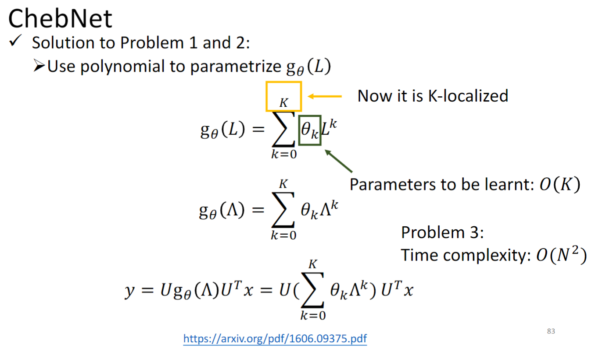

主打特性是快，且localize

> ref: https://arxiv.org/pdf/1606.09375.pdf

$L^k$ 是拉普拉斯算子Laplacian的一个多项式函数，通过你选择让 $g_\theta(L)$ 是多项式函数的方式，你就可以让他是K-localized，因为根据上一节原理中讲的，如果你让g函数只到k次方，它就只能看到k-neighbor.

用Chebyshev 多项式解决时间复杂度太高的问题：

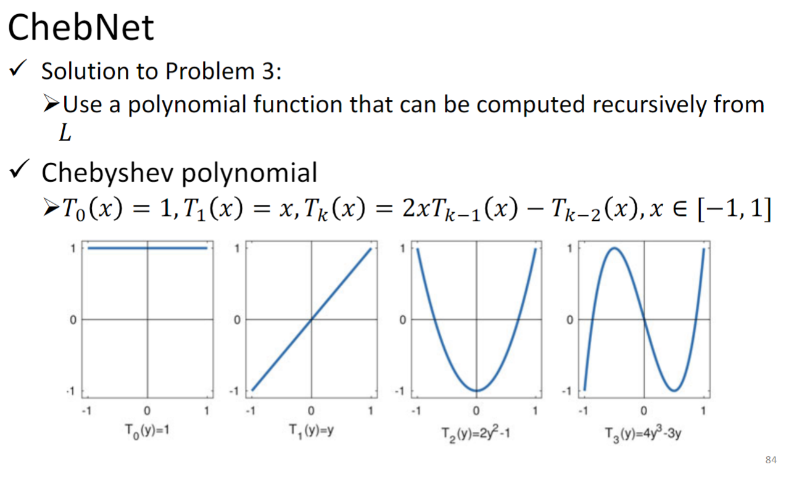

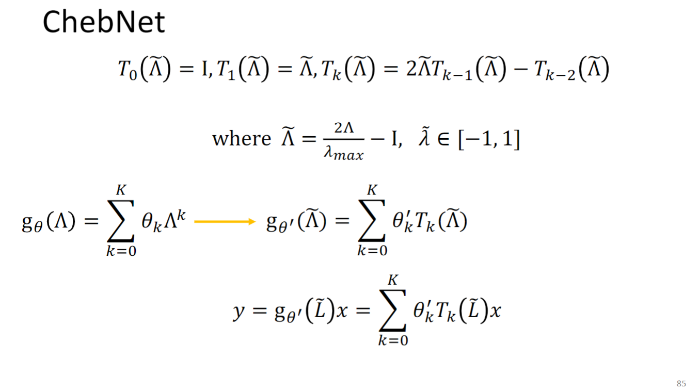

所以原本的 $g_\theta(\Lambda)$  变为 $g_{\theta'}(\widetilde\Lambda)$ ，怎么理解这个转换的作用，为什么要把一个多项式组合换成另一个多项式组合呢？你可以参考下面这个高中数学题：

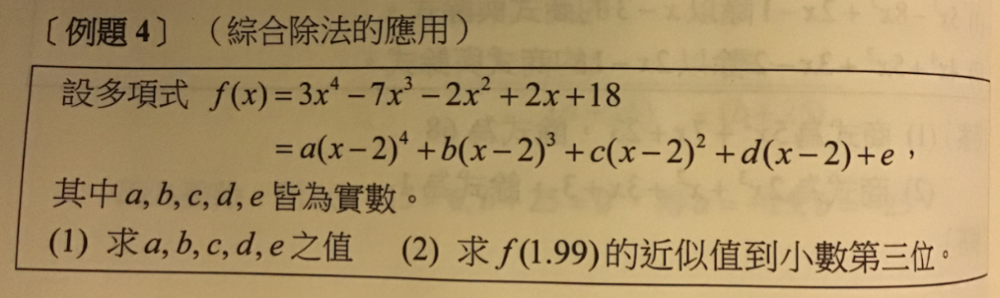

你可以把 $g_\theta(\Lambda)$  看成$3x^4-7x^3-2x^2+2x+18$ 把 $g_{\theta'}(\widetilde\Lambda)$ 看作后面的形式，这个转换使得 $f(1.99)$ 更容易计算了.

所以最后模型要学的东西就是 $g_{\theta'}(\widetilde\Lambda)$ 中的 $\theta_k'$ .

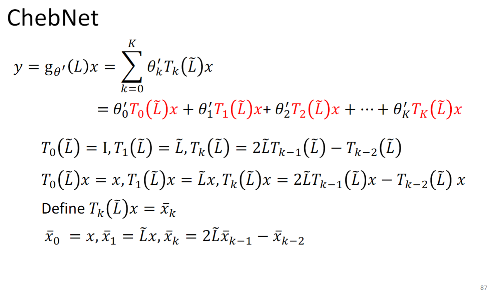

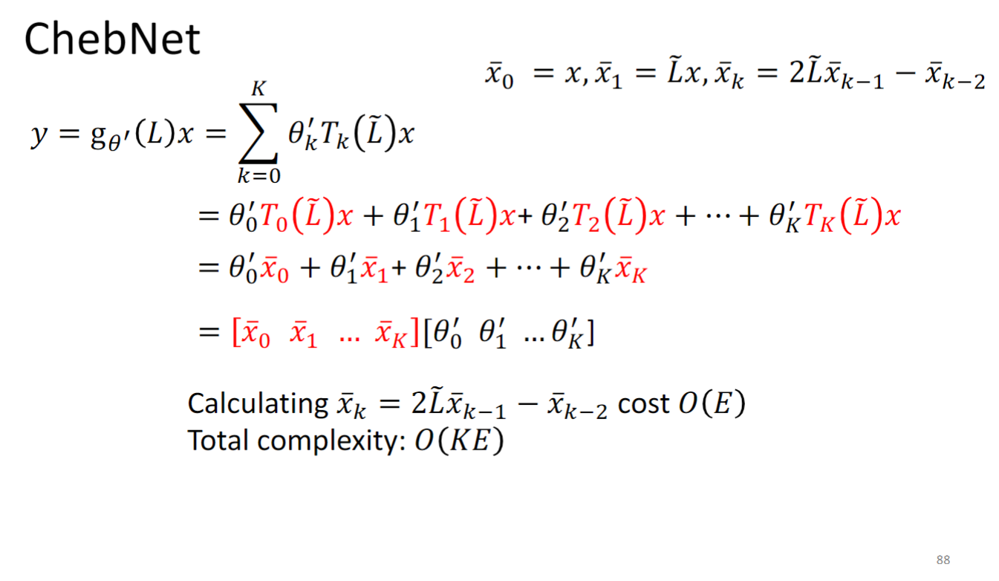

### GCN

这是比较受喜欢的，被大家广泛使用的模型.

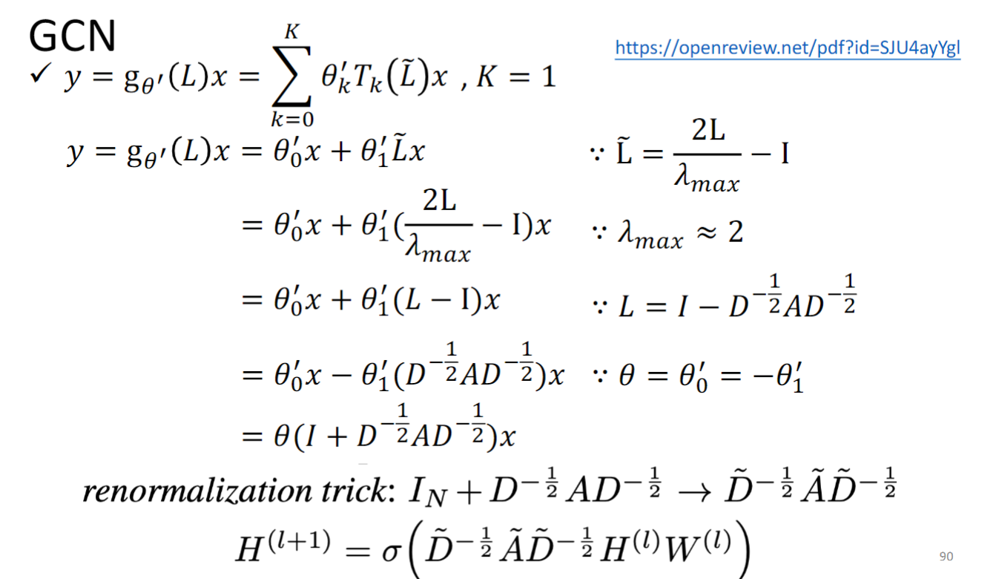

> ref: https://openreview.net/pdf%3Fid=SJU4ayYgl

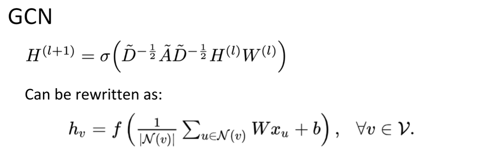

GCN对每个layer中的node $h_v$ 计算就是将所有neighbor包括他自己乘一个weight，再加起来，，再加上一个bias，再经过一个nonlinear activation，就结束.

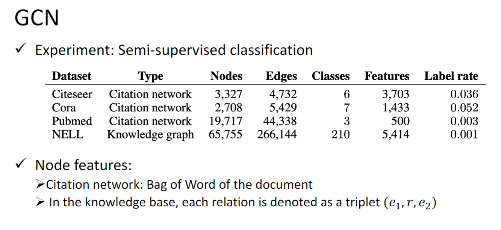

## Graph Generation

- VAE-based model: Generate a whole graph in one step
- GAN-based model: Generate a whole graph in one step
- Auto-regressive- based model: Generate a node or an edge in one step

### VAE-based model

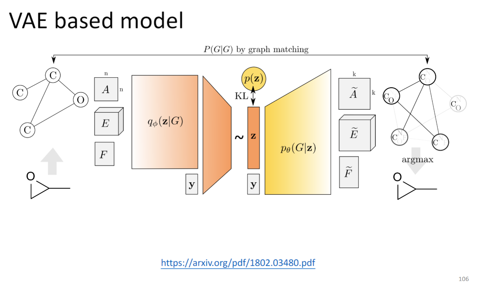

> ref: https://arxiv.org/pdf/1802.03480.pdf

左边是encoder，右边是decoder，input是一个adjacency matrix，Edge Feature 和node Feature，生成一样是一个adjacency matrix，Edge Feature 和node Feature.

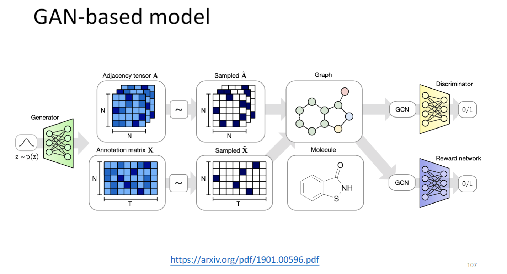

> ref: https://arxiv.org/pdf/1901.00596.pdf

GAN的输入是adjacency matrix和feature matrix

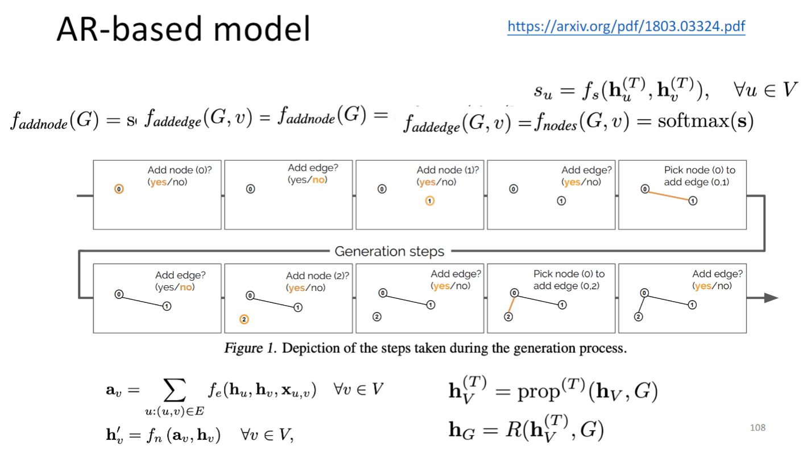

> ref: https://arxiv.org/pdf/1803.03324.pdf

## Online Resources

PyTorch Geometric: https://github.com/rusty1s/pytorch_geometric

Deep Graph Library: http://dgl.ai/

