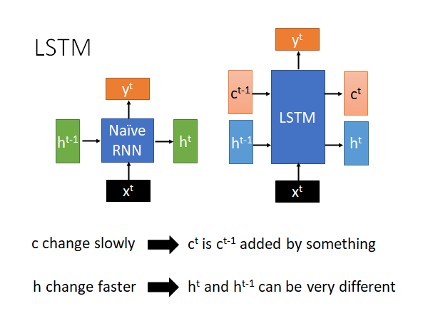

# Meta Learning - Gradient Descent as LSTM

上节课讲了MAML 和Reptile ，我们说Meta Learning 就是要让机器自己learn 出一个learning 的algorithm。今天我们要讲怎么把我们熟悉的learning algorithm ：Gradient Descent ，当作一个LSTM 来看待，你直接把这个LSTM train下去，你就train 出了Gradient Descent 这样的Algorithm 。（也就是说我现在要把学习算法，即参数的更新算法当作未知数，用Meta Learning 训练出来）

上周我们讲的MAML 和Reptile 都是在Initial Parameters 上做文章，用Meta Learning 训练出一组好的初始化参数，现在我们希望能更进一步，通过Meta Learning 训练出一个好的参数update 算法，上图黄色方块。

我们可以把整个Meta Learning 的算法看作RNN，它和RNN 有点像的，同样都是每次吃一个batch 的data ，RNN 中的memory 可以类比到Meta Learning 中的参数 $\theta$ 。

把这个Meta Learning 的算法看作RNN 的思想主要出自两篇paper ：

> [Optimization as a Model for Few-Shot Learning | OpenReview](https://openreview.net/forum?id=rJY0-Kcll&noteId=ryq49XyLg)
>
> Sachin Ravi, Hugo Larochelle
>
> [[1606.04474\] Learning to learn by gradient descent by gradient descent (arxiv.org)](https://arxiv.org/abs/1606.04474)
> Marcin Andrychowicz, Misha Denil, Sergio Gomez, Matthew W. Hoffman, David Pfau, Tom Schaul, Brendan Shillingford, Nando de Freitas

第二篇文章的题目非常有趣，也说明了此篇文章的中心：让机器学习用梯度下降学习这件事，使用的方法就是梯度下降。

## Review: RNN

从与之前略微不同的角度快速回顾一下RNN。

RNN就是一个function f，这个函数吃h,x 吐出 h',y  ，每个step 会有一个x（训练样本数据）作为input，还有一个初始的memory 的值 $h_0$ 作为input，这个初始参数有时候是人手动设置的，有时候是可以让模型learn 出来的，然后输出一个y和一个 $h^1$ 。到下一个step，它吃上一个step 得到的 $h^1$ 和新的x，也是同样的输出。需要注意的是，h的维度都是一致的，这样同一个f 才能吃前一个step 得到h 。这个过程不断重复，就是RNN。

所以，无论多长的input/output sequence 我们只需要一个函数f 就可以运算，无论你的输入再怎么多，模型的参数量不会变化，这就是RNN 厉害的地方，所以它特别擅长处理input 是一个sequence 的状态。（比如说自然语言处理中input 是一个长句子，用word vector 组成的很长的sequence）

我们如今用的一般都是RNN 的变形LSTM，而且我们现在说使用RNN 基本上就是在指使用LSTM 的技术。那LSTM 相比于RNN 有什么特别的地方呢。

如上图，LSTM（右）相比于RNN ，把input 的h 拆解成两部分，一部分仍然叫做 $h$ ，一部分我们叫做 $c$ 。为什么要这样分呢，你可以想象是因为 $c$ 和 $h$ 扮演了不同的角色。

- $c$ 变化较慢，通常就是把某个向量加到上一个 $c^{t-1}$ 上就得到了新的 $c^t$ ，这个 $c^t$ 就是LSTM 中memory cell 存储的值，由于这个值变化很慢，所以LSTM 可以记住时间比较久的数据
- $h$ 变化较快， $h^{t-1}$ 和 $h^t$ 的变化是很大的

## Review: LSTM

我们接下来看看LSTM 的做法和结构：

$c^{t-1}$ 是memory 记忆单元，把x和h拼在一起乘上一个权重矩阵W，再通过一个tanh 函数得到input z，z是一个向量。同样的x和h拼接后乘上对应的权重矩阵得到对应向量input gate $z^i$ ，forget gate $z^f$ ，output  gate $z^o$ ，接下来：

 $z^f \cdot c^{t-1}$ 决定是否保留上个memory， $z^i \cdot z$ 决定是否把现在的input 存到memory；

通过 $z^o \cdot tanh(c^t)$ 得到新的 $h^t$ ；

$W'$ 乘上新的 $h^t$ ，再通过一个sigmoid function 得到当前step 的output $y^t$ ；

重复上述步骤，就是LSTM 的运作方式：

好，讲了这么多，它和Gradient Descent 到底有什么样的关系呢？

## LSTM similar to gradient descent based algorithm

我们把梯度下降参数θ更新公式和LSTM 的memory c更新公式都列出来，如下图所示：

我们知道在gradient descent 中我们在每个step 中，把旧的参数减去，learning rate 乘梯度，作为更新后的新参数，如上图所示，此式，和LSTM 中memory 单元 $c$ 有些相似，我们就把 $c$ 替换成 $\theta$ 看看：

接下来我们再做一些变换。输入$h^{t-1}$ 来自上一个step，$x^t$ 来自外界输入，我们就把$h^{t-1}$ $x^t$ 换成$-\nabla_\theta l $ 。然后我们假设从input 到z 的公式中乘的matrix 是单位矩阵，所以z 就等于$-\nabla_\theta l $ 。再然后，我们把$z^f$ 定位全1的列向量，$z^i$ 定位全为learning rate 的列向量，此时LSTM 的memory $c$ 的更新公式变得和Gradient Descent 一摸一样：

所以你可以说Gradient Descent 就是LSTM 的简化版，LSTM中input gate 和forget gate是通过机器学出来的，而在梯度下降中input gate 和forget gate 都是人设的，input gate 永远都是学习率，forget gate 永远都是不可以忘记。😮

现在，我们考虑能不能让机器自己学习gradient descent 中的input gate 和forget gate 呢？

另外，input的部分刚才假设只有gradient 的值，实作上可以拿更多其他的数据作为input，比如常见的做法，可以把 $c^{t-1}$ 在现在这个step算出来的loss 作为输入来control 这个LSTM的input gate 和forget gate 的值。

如果们可以让机器自动的学input gate 和forget gate 的值意味着什么，意味着我们可以拥有动态的learning rate，每一个step 中learning rate 都是不一样的而不是一个不变的值。而 $z^f$ 就像一个正则项，它做的事情是把前一个step 算出来的参数缩小。我们以前做的L2 regularization 又叫做Weight Decade ，为什么叫Weight Decade，因为如果你把它微分的式子拿出来看，每个step 都会把原来的参数稍微变小，现在这个$z^f$ 就扮演了像是Weight Decade 的角色。但是我们现在不是直接告诉机器要做多少Weight Decade 而是要让机器学出来，它应该做多少Weight Decade 。

## LSTM for Gradient Descent

我们来看看一般的LSTM和for Gradient Descent 的LSTM：

Typical LSTM 就是input x ，output c 和 h，每个step 会output 一个y ，希望y 和label 越接近越好。

Gradient Descent 的LSTM是这样：我们先sample 一个初始参数θ ，然后sample 一个batch 的data ，根据这一组data 算出一个gradient $\nabla_\theta l$ ，把负的gradient input 到LSTM 中进行训练，这个LSTM 的参数过去是人设死的，我们现在让参数在Meta Learning 的架构下被硬learn 出来。上述的这个update 参数的公式就是：
$$
\theta^t = z^f \cdot \theta^{t-1} + z^i \cdot -\nabla_\theta l
$$
$z^f$ $z^i$ 以前是人设死的，现在LSTM 可以自动把它学出来。

现在就可以output 新的参数$\theta^1$ ，接着就是做一样的事情：再sample 一组数据，算出梯度作为新的input，放到LSTM 中就得到output $\theta^2$ ，以此类推，不断重复这个步骤。最后得到一组参数$θ^3$（这里假设只update 3次，实际上要update 更多次），拿这组参数去应用到Testing data 上算一下loss ： $l(θ^3)$ ，这个loss 就是我们要minimize 的目标，然后你就要用gradient descent 调LSTM 的参数，去minimize 最后的loss 。

> 到这里可能比较懵了，我在这里写一下我的理解不一定对，欢迎指正。看完下面的[Experimental Results](#Experimental Results) 一节可以回来再看一遍这个解释：
>
> 一般来说我们使用network 作为模型，其中会有很多参数θ，这些参数每一个都会拿到这个LSTM 中做如上述训练，一方面在train LSTM 中的参数，一方面在train 每一个参数θ。当network中所有θ都经过一轮上述的LSTM 的训练以后，得到的一组参数放回network 中，用testing data 计算loss of θ，据此用梯度下降回调LSTM 参数。如此往复，去minimize loss，最后就得到了一组比较好的参数，使得network 能在testing data 上取得比较好的成绩，这个过程中LSTM 担任了以前使用的梯度下降来update 参数的角色，而且LSTM 中的$z^f$ $z^i$ 还是动态变化的，可能要比经典梯度下降效果好。

这里有一些需要注意的地方。在一般的LSTM 中c 和x 是独立的，LSTM 的memory 存储的值不会影响到下一次的输入，但是Gradient Descent LSTM 中参数θ会影响到下一个step 中算出的gradient 的值，如上图虚线所示。所以说在Gradient Descent LSTM 中现在的参数会影响到未来看到的梯度。所以当你做back propagation 的时候，理论上你的error signal 除了走实线的一条路，它还可以走θ到$-\nabla_\theta l$ 虚线这一条路，可以通过gradient 这条路更新参数。但是这样做会很麻烦，和一般的LSTM 不太一样了，一般的LSTM c 和x 是没有关系的，现在这里确实有关系，为了让它和一般的LSTM 更像，为了少改一些code ，我们就假设没有虚线那条路，结束。现在的文献上其实也是这么做的。

另外，在LSTM input 的地方memory 中的初始值可以通过训练直接被learn 出来，所以在LSTM中也可以做到和MAML相同的事，可以把初始的参数跟着LSTM一起学出来。

## Real Implementation

LSTM 的memory 就是要训练的network 的参数，这些参数动辄就是十万百万级别的，难道要开十万百万个cell 吗？平常我们开上千个cell 就会train 很久，所以这样是train不起来的。在实际的实现上，我们做了一个非常大的简化：我们所learn 的LSTM 只有一个cell 而已，它只处理一个参数，所有的参数都公用一个LSTM。所以就算你有百万个参数，都是使用这同一个LSTM 来处理。

也就是说如上图所示，现在你learn 好一个LSTM以后，它是直接被用在所有的参数上，虽然这个LSTM 一次只处理一个参数，但是同样的LSTM 被用在所有的参数上。$θ^1$ 使用的LSTM 和$θ^2$ 使用的LSTM 是同一个处理方式也相同。那你可能会说，$θ^1$ 和 $θ^2$ 用的处理方式一样，会不会算出同样的值呢？会不，因为他们的初始参数是不同的，而且他们的gradient 也是不一样的。在初始参数和算出来的gradient 不同的情况下，就算你用的LSTM的参数是一样的，就是说你update 参数的规则是一样的， 最终算出来的也是不一样的 $θ^3$ 。

这就是实作上真正implement LSTM Gradient Descent 的方法。

这么做有什么好处：

- 在模型规模上问题上比较容易实现
- 在经典的gradient descent 中，所有的参数也都是使用相同的规则，所以这里使用相同的LSTM ，就是使用相同的更新规则是合理的
- 训练和测试的模型架构可以是不一样的，而之前讲的MAML 需要保证训练任务和测试任务使用的model architecture 相同

## Experimental Results

> https://openreview.net/forum?id=rJY0-Kcll&noteId=ryq49XyLg

我们来看一个文献上的实验结果，这是做在few-shot learning 的task上。横轴是update 的次数，每次train 会update 10次，左侧是forget gate $z^f$ 的变化，不同的红色线就是不同的task 中forget gate 的变化，可以看出$z^f$ 的值多数时候都保持在1附近，也就是说LSTM 有learn 到$θ^{t-1}$ 是很重要的东西，没事就不要给他忘掉，只做一个小小的weight decade，这和我们做regularization 时候的思想相同，只做一个小小的weight decade 防止overfitting 。

右侧是input gate $z^i$ 的变化，红线是不同的task，可以看出它的变化有点复杂，但是至少我们知道，它不是一成不变的固定值，它是有学到一些东西的，是动态变化的，放到经典梯度下降中来说就是learning rate 是动态变化的。

## LSTM for Gradient Descent (v2)

只有刚才的架构还不够，我们还可以更进一步。想想看，过去我们在用经典梯度下降更新参数的时候我们不仅会考虑当前step 的梯度，我们还会考虑过去的梯度，比如RMSProp、Momentum 等。

在刚才的架构中，我们没有让机器去记住过去的gradient ，所以我们可以做更进一步的延伸。我们在过去的架构上再加一层LSTM，如下图所示：

蓝色的一层LSTM 是原先的算learning rate、做weight decade 的LSTM，我们再加入一层LSTM ，让算出来的gradient $-\nabla_\theta l$ 先通过这个LSTM ，把这个LSTM 吐出来的东西input 到原先的LSTM 中，我们希望绿色的这一层能做到记住以前算过的gradient 这件事。这样，可能就可以做到Momentum 可以做的的事情。

上述的这个方法，是老师自己想象的，在learning to learn by gradient descent by gradient descent 这篇paper 中上图中蓝色的LSTM 使用的是一般的梯度下降算法，而在另一篇paper 中只有上面没有下面，而老师觉得这样结合起来才是实现，能考虑过去的gradient 的gradient descent 算法的完全体。

## Experimental Result 2

learning to learn by gradient descent by gradient descent 这篇paper 的实验结果。

> https://arxiv.org/abs/1606.04474

第一个实验图，是做在toy example 上，它可以制造一大堆训练任务，然后测试在测试任务上，然后发现，LSTM 来当作gradient descent 的方法要好过人设计的梯度下降方法。

第二张图把这个技术应用带MNIST 上，这个实验是训练任务测试任务都是MNIST。

第三张图是说虽然训练和测试任务都是相同的dataset也是相同的，但是train 和test 的时候network 的架构是不一样的。 在train 的时候network 是只有一层，该层只有20个neuron。这张图是training 的结果。

第四张图是上述改变network 架构后在testing 的结果，testing 的时候network 只有一层该层40个neuron。从图上看还是做的起来，而且比一般的gradient descent 方法要好很多。

第五张图是上述改变network 架构后在testing 的结果，testing 的时候network 有两层。从图上看还是做的起来，而且比一般的gradient descent 方法要好很多。

第六张图是上述改变network 激活函数后在testing 的结果，training 的时候激活函数是sigmoid 而testing 的时候改成ReLU。从图上看做不起来，崩掉了，training 和testing 的network 的激活函数不一样的时候，LSTM 没办法跨model 应用。