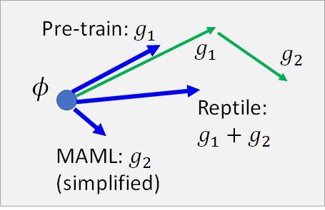

# Meta Learning-MAML

Meta learning 总体来说就是让机器学习如何学习。

如上图，我们希望机器在学过一些任务以后，它学会如何去学习更有效率，也就是说它会成为一个更优秀的学习者，因为它学会了**学习的技巧**。举例来说，我们教机器学会了语音辨识、图像识别等模型以后，它就可以在文本分类任务上做的更快更好，虽然说语音辨识、图像识别和文本分类没什么直接的关系，但是我们希望机器从先前的任务学习中学会了学习的技巧。

讲到这里，你可能会觉得Meta Learning 和 Life-Long Learning 有点像，确实很像，但是LLL 的着眼点是用同一个模型apply 到不同的任务上，让一个模型可以不断地学会新的任务，而Meta Learning 中不同的任务有不同的模型，我们的着眼点是机器可以从过去的学习中学到学习的方法，让它在以后的学习中更快更好。

我们先来看一下传统的ML 的做法：

我们过去学过的ML ，通常来说就是定义一个学习算法，然后用训练数据train ，吐出一组参数（或者说一个参数已定的函数式），也就是得到了模型，这个模型可以告诉我们测试数据应该对应的结果。比如我们做猫狗分类，train 完以后，给模型一个猫的照片，它就会告诉我们这是一只猫。

我们把学习算法记为 $F$ ，这个学习算法吃training data 然后吐出目标模型 $f^*$ ，形式化记作：
$$
f^* = F(D_{train})
$$
Meta Learning 就是要让机器自动的找一个可以吃training data 吐出函数 $f^*$ 的函数 $F$ 。

总结一下：

Machine Learning 和Meta Learning 都是让机器找一个function ，只不过要找的function 是不一样的。

我们知道Machine Learning 一共分三步（如下图），Meta Learning 也是一样的，你只要把**Function $f$** 换成**学习的算法 $F$ **这就是Meta Learning 的步骤：

1. 我们先定义一组Learning 的Algorithm 我们不知道哪一个算法是比较好的，

2. 然后定义一个Learning Algorithm 的Loss ，它会告诉你某个算法的好坏，

3. 最后，去train 一发找出哪个Learning Algorithm比较好。

所以接下来我们将分三部分来讲Meta Learning 的具体过程。

## Three Step of Meta-Learning

### Define a set of learning algorithm

什么是一组learning algorithm 呢？

如上图所示，灰色框中的，包括网络（模型）架构，初始化参数的方法，更新参数的方法，学习率等要素构成的整个process ，可以被称为一个learning algorithm 。在训练的过程中有很多要素都是人设计的，当我们选择不同的设计的时候就相当于得到了不同的learning algorithm 。现在，我们考虑能不能让机器自己学出某一环节，或者全部process 的设计。比如说，我们用不同的初始化方法得到不同的初始化参数以后，保持训练方法其他部分的相同，且用相同的数据来训练模型，最后都会得到不同的模型，那我们就考虑能不能让机器自己学会初始化参数，直接得到最好的一组初始化参数，用于训练。

我们就希望通过Meta Learning 学习到初始化参数这件事，好，现在我们有了一组learning algorithm ，其中各个算法只有初始化参数的方法未知，是希望机器通过学习得出来的。

那现在我们怎么衡量一个learning algorithm 的好坏呢？

### Define the goodness of a function F

我们需要很多个task，每个task都有training set 和testing set，然后就把learning algorithm 应用到每个task上，用training set 训练，用testing set 测试，得到每一个task 的loss $l^i$，对于一个learning algorithm $F$ 的整体loss 就可以用每个task 的loss 进行求和。
$$
L(F) = \sum\limits_{n=1}^{N}l^n
$$

从这里我们就能看出，meta learning 和传统的machine learning 在训练资料上是有些不同的：

做meta learning 的话你可能需要准备成百上千个task，每个task 都有自己的training set 和testing set 。这里为了区分，我们把meta learning的训练集叫做Training Tasks，测试集叫做Testing Tasks，其中中每个task 的训练集叫做Support set ，测试集叫做 Query set 。

PS：这里有学生提问，根据老师的回答，大意就是，training tasks 和testing tasks可以是不同类型的任务，比如全部用影像辨识任务训练然后用语音辨识任务测试也是可以做得起来的。这取决于你的meta learning 的algorithm 是什么样的，有的训练和测试任务的类型可以是不一样的有些是需要一样的。

讲到这里你可能觉得比较抽象，后面会讲到实际的栗子，你可能就理解了meta learning 的实际运作方法。Meta learning 有很多方法，加下来会讲几个比较常见的算法，本节课会讲到一个最有名的叫做MAML ，以及MAML 的变形叫做Reptile 。

### Find the best function $F^*$

定好了loss function 以后我们就要找一个最好的$F^*$ ，这个$F^*$可以使所有的training tasks 的loss 之和最小，形式化的写作下图下面的公式（具体计算方法后面再讲）：

现在我们就有了meta learning 的algorithm ，我们可以用testing tasks 测试这个$F^*$。把测试任务的训练集放丢入Learning Algorithm $F^*$，就会得到一个$f^*$ ，再用测试任务的测试集去计算这个$f^*$ 的loss ，这个loss 就是整个meta learning algorithm 的loss ，来衡量这个方法的好坏。

## Omniglot Corpus

### Introduction

> https://github.com/brendenlake/omniglot

这是一个corpus，这里面有一大堆奇怪的符号，总共有1623个不同的符号，每个符号有20个不同的范例。上图下侧就是那些符号，右上角是一个符号的20个范例。

### Few-shot Classification

N-ways K-shot classification 的意思是，分N个类别，每个类别有K个样例。

所以，20 ways 1shot 就是说分20类，每类只有一个样例。这个任务的数据集就例如上图中间的20张support set 和1张query set 。

- 把符号集分为训练符号集和测试符号集
  - 从训练符号集中随机抽N个符号，从这N个符号的范例中各随机抽K个样本，这就组成了一个训练任务training task 。
  - 从测试符号集中随机抽N个符号，从这N个符号的范例中各随机抽K个样本，这就组成了一个测试任务testing task 。

## Techniques Today

这两个大概是最近（2019年）比较火的吧，Reptile 可以参考一下openai的这篇文章。

> [Reptile: A Scalable Meta-Learning Algorithm (openai.com)](https://openai.com/blog/reptile/)

接下来先将MAML（详细） ，再讲Reptile（简略）。

## MAML

MAML要做的就是学一个初始化的参数。过去你在做初始化参数的时候你可能要从一个distribution 中sample 出来，现在我们希望通过学习，机器可以自己给出一组最好的初始化参数。

做法就如上图所示，我们先拿一组初始化参数 $\phi$ 去各个training task 做训练，在第n个task 上得到的最终参数记作 $\hat{θ}^n$ ，而$l^n(\hat{θ}^n)$ 代表第n个task 在其testing set 上的loss，此时整个MAML 算法的Loss 记作：
$$
L(\phi) = \sum\limits_{n=1}^{N}l^n(\hat{θ}^n)
$$
这里提示一下，MAML就是属于需要所有任务的网络架构相同的meta learning algorithm，因为其中所有的function 要共用相同的初始化参数 $\phi$ 。

那怎么minimize $L(\phi)$ 呢？

答案就是Gradient Descent，你只要能得到 $L(\phi)$ 对 $\phi$ 的梯度，那就可以更新 $\phi$ 了，结束。😮
$$
\phi = \phi - \eta \nabla_{\phi}L(\phi)
$$
这里我们先假装已经会算这个梯度了，先把这个梯度更新参数的思路理解就好，具体的更新算法在[Warning of Math](#Warning of Math)中会将到，我们先来康一下MAML 和 Model Pre-training 在Loss Function 上的区别。

### MAML v.s. Model Pre-training

通过上图我们仔细对比两个损失函数，可以看出，MAML是根据训练完的参数 $\hat{θ}^n$ 计算损失，计算的是训练好的参数在各个task 的训练集上的损失；而预训练模型的损失函数则是根据当前初始化的参数计算损失，计算的是当前参数在要应用pre-training 的task 上的损失。

再举一个形象一点的栗子：

（横轴是模型参数，简化为一个参数，纵轴是loss）

如上图说的，我们在意的是这个初始化参数经过各个task 训练以后的参数在对应任务上的表现，也就是说如果初始参数 $\phi$ 在中间位置（如上图），可能这个位置根据当前参数计算的总体loss 不是最好的，但是在各个任务上经过训练以后 $\hatθ$ 都能得到较低的loss（如 $\hat{θ}^1$、$\hat{θ}^2$），那这个初始参数 $\phi$ 就是好的，其loss 就是小的。

反之，在Model pre-training 上：

我们希望直接通过这个 $\phi$ 计算出来的各个task 的loss 是最小的，所以它的取值点就可能会是上图的样子。此时在task 2上初始参数可能不能够被更新到global minima，会卡在local minima 的点 $\hat{θ}^2$。

综上所述：

MAML 是要找一个 $\phi$ 在**训练以后**具有好的表现，注重参数的潜力，Model Pre-training 是要找一个 $\phi$ 在训练任务上得到好的结果，注重现在的表现。

### MAML Only Update One Time

在MAML 中我们只update 参数一次。所以在训练阶段，你只做one-step training ，参数更新公式就变成上图右下角的式子。

只更新一次是有些理由的：

- 为了速度，多次计算梯度更新参数是比较耗时的，而且MAML 要train 很多个task
- 把只更新一次作为目标
- 实际上你可以在training 的时候update 一次，在测试的时候，解testing task 的时候多update 几次结果可能就会更好
- 如果是few-shot learning 的task，由于data 很少，update 很多次很容易overfitting

### Toy Example

> Source of images [Paper repro: Deep Metalearning using “MAML” and “Reptile”](https://towardsdatascience.com/paper-repro-deep-metalearning-using-maml-and-reptile-fd1df1cc81b0)

- 要拟合的目标函数是 $y=asin(x+b)$ 
- 对每个函数，也就是每个task，sample k个点
- 通过这些点做拟合

我们只要sample 不同的a, b就可以得到不同的目标函数。

来看看对比结果：

可以看到，预训练模型想要让参数在所有的task 上都做好，多个task叠加起来，导致预训练模型最后拟合得到的是一条直线。

MAML 在测试task 上training step 增加的过程中有明显的拟合效果提升。

### Omniglot & Mini-ImageNet

在MAML 的原始论文中也把这个技术用于Omniglot & Mini-ImageNet

> https://arxiv.org/abs/1703.03400

我们看上图下侧，MAML, first order approx 和 MAML 的结果很相似，那approx 是怎么做的呢？解释这个东西需要一点点数学：

### Warning of Math

这一段不想听的同学可以睡一会。😁

MAML 的参数更新方法如上图左上角灰色方框所示，我们来具体看看这个 $\nabla_\phi L(\phi)$ 怎么算，把灰框第二条公式带入，如黄色框所示。其中 $\nabla_\phi l^n(\hat{θ}^n)$ 就是左下角所示，它就是loss 对初始参数集 $\phi$ 的每个分量的偏微分。也就是说 $\phi_i$ 的变化会通过 $\hat{θ}$ 中的每个参数 $\hat{θ}_i$ ，影响到最终训练出来的 $\hat{θ}$ ，所以根据chain rule 你就可以把左下角的每个偏微分写成上图中间的公式。
$$
\frac{\partial{l(\hat{θ})}}{\partial{\phi_i}} = \sum\limits_{j}\frac{\partial{l(\hat{θ})}}{\partial\hat{θ}_j}\frac{\partial\hat{θ}_j}{\partial{\phi}_i}
$$
上式中前面的项 $\frac{\partial{l(\hat{θ})}}{\partial\hat{θ}_j}$ 是容易得到的，具体的计算公式取决于你的model 的loss function ，比如cross entropy 或者regression，结果的数值却决于你的训练数据的测试集。

后面的项 $\frac{\partial\hat{θ}_j}{\partial{\phi}_i}$ 是需要我们算一下。可以分成两个情况来考虑：

根据灰色框中第三个式子，我们知道 $\hat{θ}_j$ 可以用下式代替：
$$
\hat{θ}_j = \phi_j - \epsilon\frac{\partial{l(\phi)}}{\partial{\phi_j}}
$$
此时，对于 $\frac{\partial\hat{θ}_j}{\partial{\phi}_i}$ 这一项，分为i=j 和 i!=j 两种情况考虑，如上图所示。在MAML 的论文中，作者提出一个想法，不计算二次微分这一项。如果不计算二次微分，式子就变得非常简答，我们只需要考虑i=j 的情况，i!=j 时偏微分的答案总是0。

此时， $\frac{\partial{l(\hat{θ})}}{\partial\phi_i}$ 就等于 $\frac{\partial{l(\hat{θ})}}{\partial{θ}_i}$ 。这样后一项也解决了，那就可以算出上图左下角 $\nabla_\phi l(\hat{θ})$ ，就可以算出上图黄色框  $\nabla_\phi L(\phi)$ ，就可以根据灰色框第一条公式更新 $\phi$ ，结束。😮

在原始paper 中作者把，去掉二次微分这件事，称作using a first-order approximation 。

当我们把二次微分去掉以后，上图左下角的 $\nabla_\phi l(\hat{θ})$ 就变成 $\nabla_\hat{θ} l(\hat{θ})$ ，所以我们就是再用 $\hat{θ}$ 直接对 $\hat{θ}$ 做偏微分，就变得简单很多。

### MAML-Real Implementation

来看看MAML 实际上是怎么运行的，据说很简单。

实际上，我们在MAML 中每次训练的时候会拿一个task batch 去做，这里我们就先假定每个batch 就只有一个task好了。如上图，当我们初始化好参数 $\phi_0$ 我们就开始进行训练，完成task m训练以后，根据一次update 得到 $\hat{θ}^m$ ，我们再计算一下 $\hat{θ}^m$ 对它的loss function 的偏微分，也就是说我们虽然只需要update 一次参数就可以得到最好的参数，但现在我们update 两次参数，第二次更新的参数的用处就是， $\phi $ 的更新方向就和第二次更新参数的方向相同，可能大小不一样，毕竟它们的learning rate 不一样。

刚才我们讲了在精神上MAML 和Model Pre-training 的不同，现在我们来看看这两者在实际运作上的不同。如上图，预训练的参数更新完全和每个task 的gradient 的方向相同。

### MAML 实际应用

这里有一个把MAML 应用到机器翻译的栗子：

> https://arxiv.org/abs/1808.08437

18个不同的task：18种不同语言翻译成英文

2个验证task：2种不同语言翻译成英文

Ro 是validation tasks 中的任务，Fi 即没有出现在training tasks 也没出现在validation tasks

横轴是每个task 中的训练资料量。MetaNMT 是MAML 的结果，MultiNMT 是 Model Pre-training 的结果，我们可以看到在所有情况下前者都好过后者，尤其是在训练资料量少的情况下，MAML 更能发挥优势。

## Reptile

非常简单。

做法就是初始化参数 $\phi_0$ 以后，通过在task m上训练跟新参数，可以多更新几次，然后根据最后的 $\hat{θ}^m$ 更新 $\phi_0$ ，同样的继续，训练在task n以后，多更新几次参数，得到 $\hat{θ}^n$ ，据此更新 $\phi_1$ ，如此往复。

你可能会说，这不是和预训练很像吗，都是根据参数的更新来更新初始参数，希望最后的参数在所有的任务上都能得到很好的表现。作者自己也说，如上图下侧的摘录。

### Reptile & MAML & Pre-training

通过上图来对比三者在更新参数 $\phi$ 的不同，似乎Reptile 在综合两者。但是Reptile 并没有限制你只能走两步，所以如果你多更新几次参数多走几步，或许Reptile 可以考虑到另外两者没有考虑到的东西。

上图中，蓝色的特别惨的线是pre-training ，所以说和预训练比起来meta learning 的效果要好很多。

## More...

上面所有的讨论都是在初始化参数这件事上，让机器自己学习，那有没有其他部分可以让机器学习呢，当然有很多。

比如说，学习网络结构和激活函数、学习如何更新参数......

> https://www.youtube.com/watch?v=c10nxBcSH14

## Think about it...

我们使用MAML 或Reptile 来寻找最好的初始化参数，但是这个算法本身也需要初始化参数，那我们是不是也要训练一个模型找到这个模型的初始化参数......

就好像说神话中说世界在乌龟背上，那这只乌龟应该在另一只乌龟背上......这就是套娃啊🤣

## Crazy Idea?

传统的机器学习和深度学习的算法基本上都还是gradient descent ，你能不能做一个更厉害的算法，只要我们给他所有的training data 它就可以返回给我们需要model，它是不是梯度下降train 出来的不重要，它只要能给我一个能完成这个任务的model 就好。

或者，反之我们最好都要应用到测试集上，那我们干脆就搞一个大黑箱，把training set 和testing set 全部丢给他，它直接返回testing data 的结果，连测试都帮你做好。这些想法能不能做到，留到下一节讲。

