# Meta Learning-Metric-based Approach

加下来我们就要实践我们之前提到的疯狂的想法：直接学一个function，输入训练数据和对应的标签，以及测试数据，直接输出测试数据的预测结果。也就是说这个模型把训练和预测一起做了。

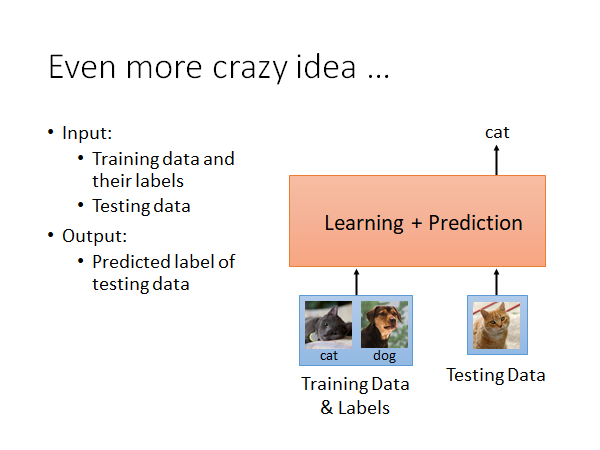

虽然这个想法听起很不错，好像挺难的，但是实际上现实生活中有在使用这样的技术，举例来说：手机的人脸验证

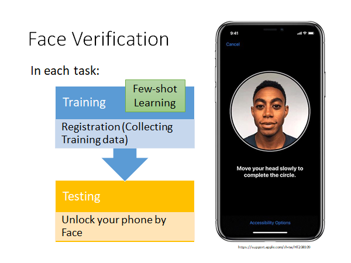

我们在使用手机人脸解锁的时候需要录制人脸信息，这个过程中我们转动头部，就是手机在收集资料，收集到的资料就是作为few-shot learning 的训练资料。另外，语音解锁Speaker Verification 也是一样的技术，只要换一下输入资料和network 的架构。

这里需要注意Face Verification 和Face Recognition 是不一样的，前者是说给你一张人脸，判定是否是指定的人脸，比如人脸验证来解锁设备；后者是辨别一个人脸是人脸集合里面谁，比如公司人脸签到打卡。

下面我们就以Face Verification 为例，讲一下Metric-based Meta Learning

## Training Tasks & Testing Tasks

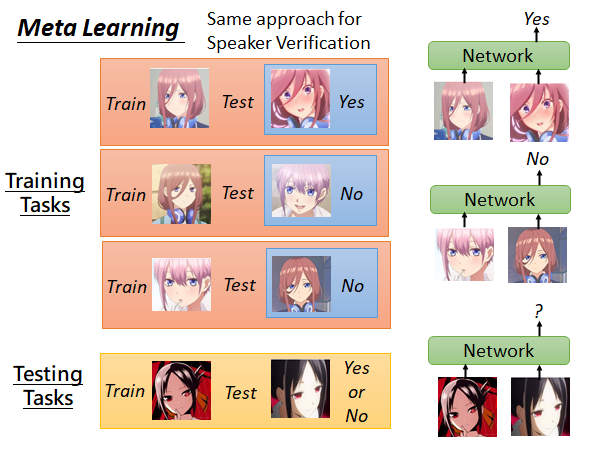

训练任务集中的任务都是人脸辨识数据，每个任务的测试集就是某个人的面部数据，测试集就是按标准（如手机录制人脸）收集的人脸数据，如果这个人和训练集相同就打一个Yes 标签，否则就打一个No 标签。测试任务和训练任务类似。总的来说，network 就是吃训练的人脸和测试的人脸，它会告诉你Yes or No 。

## Siamese Network

实际上是怎么做的呢，使用的技术是Siamese Network（孪生网络）。

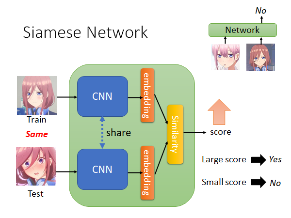

Siamese Network 的结构如上图所示，两个网络往往是共享参数的，根据需要有时候也可以不共享，假如说你现在觉得Training data 和Testing data 在形态上有比较大的区别，那你就可以不共享两个网路的参数。

从两个CNN 中抽出两个embedding ，然后计算这两个embedding 的相似度，比如说计算conference similarity 或者Euclidean Distance ，你得到一个数值score ，这个数值大就代表Network 的输出是Yes ，如果数值小就代表输出是No 。

## Siamese Network - Intuitive Explanation

接下来从直觉上来解释一下孪生网络。

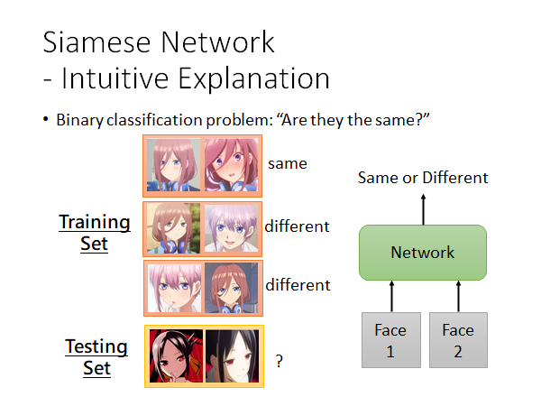

如上图所示，你可以把Siamese Network 看成一个二分类器，他就是吃进去两张人脸比较一下相似度，然后告诉我们Yes or No 。这样解释会比从Meta Learning 的角度来解释更容易理解。

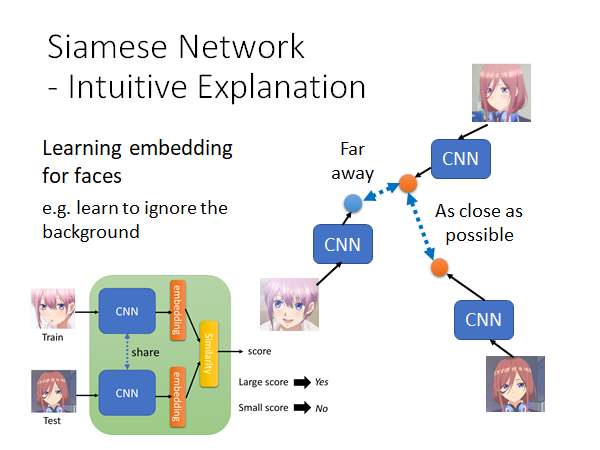

如上图所示，Siamese Network 做的事情就是把人脸投影到一个空间上，在这个空间上只要是同一个人的脸，不管他是往哪边看，不管机器看到的是他的哪一侧脸，都能被投影到这个空间的同一个位置上。

那你就会想了，这种图片降维的方法，这和Auto-Encoder 有什么区别呢，他比Auto-Encoder 好在哪？

你想你在做Auto-Encoder 的时候network 不知道你要解的任务是什么，它会尽可能记住图片中所有的信息，但是它不知道什么样的信息是重要的什么样的信息是不重要的。上图右侧，如果用Auto-Encoder 它可能会认为一花（左下）和三玖（右上）是比较接近的，因为他们的背景相似，这好吗，这不好。在Siamese Network 中，因为你要求network 把一花（左下）和三玖（右上）拉远，把三玖（右上）和三玖（右下）拉近，它可能会学会更加注意头发颜色的信息要忽略背景的信息。

## To learn more...

- What kind of distance should we use?
  - SphereFace: Deep Hypersphere Embedding for Face Recognition
  - Additive Margin Softmax for Face Verification
  - ArcFace: Additive Angular Margin Loss for Deep Face Recognition
- Triplet loss（三元是指：Data 可以包括训练人脸，正确的测试人脸，错误的测试人脸）
  - Deep Metric Learning using Triplet Network
  - FaceNet: A Unified Embedding for Face Recognition and Clustering

## N-way Few/One-shot Learning 

刚才的栗子中，训练资料都只有一张，机器只要回答Yes or No 。那现在如果是一个分类的问题呢？现在我们打算把同样的概念用在5-way 1-shot 的任务上该怎么办呢？

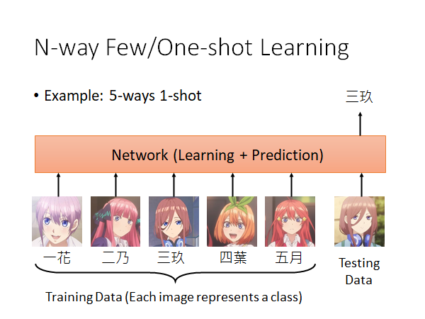

5-way 1-shot 就是说5个类别，每个类别中只有1个样本。就比如说上图，《五等分花嫁》中的五姐妹，要训一个模型分辨一个人脸是其中的谁，而训练资料是每个人只有一个样本。我们期待做到的事情是，Network 就把这五张带标签的训练图片外加一张测试图片都吃进去，然后模型就会告诉我们测试图片的分辨结果。

那模型的架构要怎么设计呢，比如说一个经典的设计：

### Prototypical Network

这是一个经典的做法：

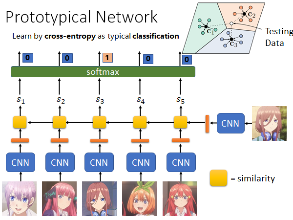

> https://arxiv.org/abs/1703.05175

这个方法和Siamese Network 非常相似，只不过从input 一张training data 扩展到input 多张training data 。

来解释一下这个方法，如上图所示，把每张图片丢到同一个CNN 中算出一个embedding 用橙色条表示，然后把测试图片的embedding 和所有训练图片的embedding 分别算出一个相似度 $s_i$ 。黄色的方块表示计算相似度。接下来，取一个softmax ，这样就可以和正确的标签做cross entropy ，去minimize cross entropy，这就和一般的分类问题的loss function 相同的，就可以根据这个loss 做一次gradient descent ，因为是1-shot 所以只能做一次参数更新。

==？？？？这里有问题呀，如果testing data 是已知标签的数据，用来做了1-shot，那真正的要预测的数据呢？？？？？==

==如果你看明白了，请务必教教我🙏🙏🙏发邮件@sud0su@163.com或者加我Q@2948335218==

那如果是Few-shot 呢，怎么用Prototypical Network 解决呢。如右上角，我们把每个类别的几个图片用CNN 抽出的embedding 做average 来代表这个类别就好了。进来一个Testing Data 我们就看它和哪个class 的average 值更接近，就算作哪一个class 。

### Matching Network

Matching Network 和Prototypical Network 最不同的地方是，Matching Network 认为也许Training data 中的图片互相之间也是有关系的，所以用Bidirectional LSTM 处理Training data，把Training data 通过一个Bidirectional LSTM 也会得到对应的embedding ，然后的做法就和Prototypical Network 是一样的。

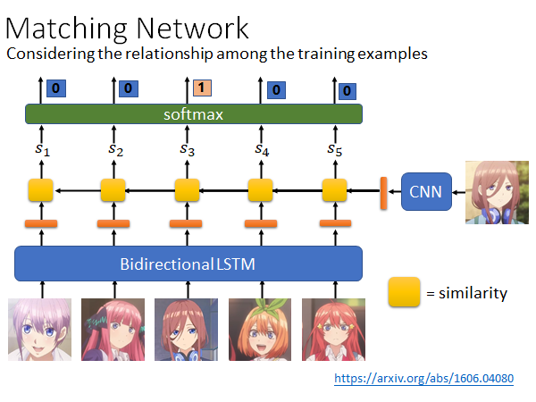

> https://arxiv.org/abs/1606.04080

事实上是Matching Network 先被提出来的，然后人们觉得这个方法有点问题，问题出在Bidirectional LSTM 上，就是说如果输入Training data 的顺序发生变化，那得到的embedding 就变了，整个network 的辨识结果就可能发生变化，这是不合理的。

### Relation Network

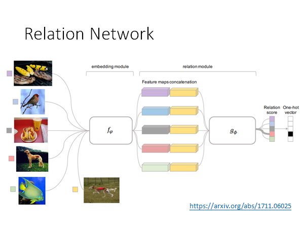

> https://arxiv.org/abs/1711.06025

这个方法和上面讲过的很相似，只是说我们之前通过人定的相似度计算方法计算每一类图片和测试图片的相似度，而Relation Network 是希望用另外的模型 $g_\phi$ 来计算相似度。

具体做法就是先通过一个 $f_\phi$ 计算每个类别的以及测试数据的embedding ，然后把测试数据的embedding 接在所有类别embedding 后面丢入 $g_\phi$ 计算相似度分数。

### Few-shot learning for Imaginary Data

我们在做Few-Shot Learning 的时候的难点就是训练数据量太少了，那能不能让机器自己生成一些数据提供给训练使用呢。这就是Few-shot learning for Imaginary Data 的思想。

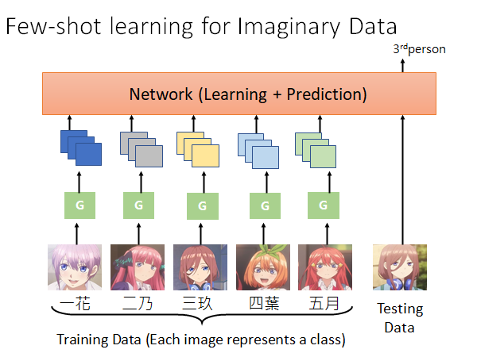

> https://arxiv.org/abs/1801.05401

Learn 一个Generator $G$ ，怎么Learn 出这个Generator 我们先不管，你给Generator 一个图片，他就会生成更多图片，比如说你给他三玖面无表情的样子，他就会YY出三玖卖萌的样子、害羞的样子、生气的样子等等。然后把生成的图片丢到Network 中做训练，结束。

实际上，真正做训练的时候Generator 和Network 是一起训的，这就是Few-shot learning for Imaginary Data 的意思。具体的做法，这里不展开了。

# Meta Learning-Train+Test as RNN

我们在讲Siamese Network 的时候说，你可以把Siamese Network 或其他Metric-based 的方法想成是Meta Learning ，但其实你是可以从其他更容易理解的角度来考虑这些方法。总的来说，我们就是要找一个function，这个function 可以做的到就是吃训练数据和测试数据，然后就可以吐出测试数据的预测结果。我们实际上用的Siamese Network 或者Prototypical Network 、Matching Network 等等的方法多可以看作我们为了实现这个目的做模型架构的变形。

现在我们想问问，有没有可能直接用常规的network 做出这件事？有的。

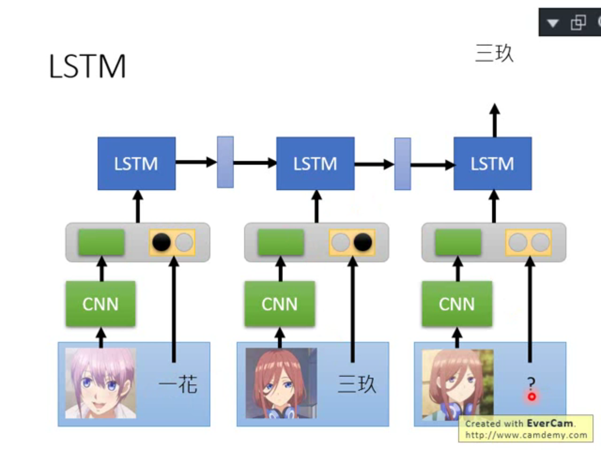

用LSTM 把训练数据和测试数据吃进去，在最后输出测试数据的判别结果。训练图片通过一个CNN 得到一个embedding ，这个embedding 和这个图片的label（one-hot vector）做concatenate（拼接）丢入LSTM 中，Testing data 我们不知道label 怎么办，我们就用0 vector 来表示，然后同样丢入LSTM ，得到output 结束。这个方法用常规的LSTM 是train 不起来的，我们需要修改LSTM 的架构，有两个方法：

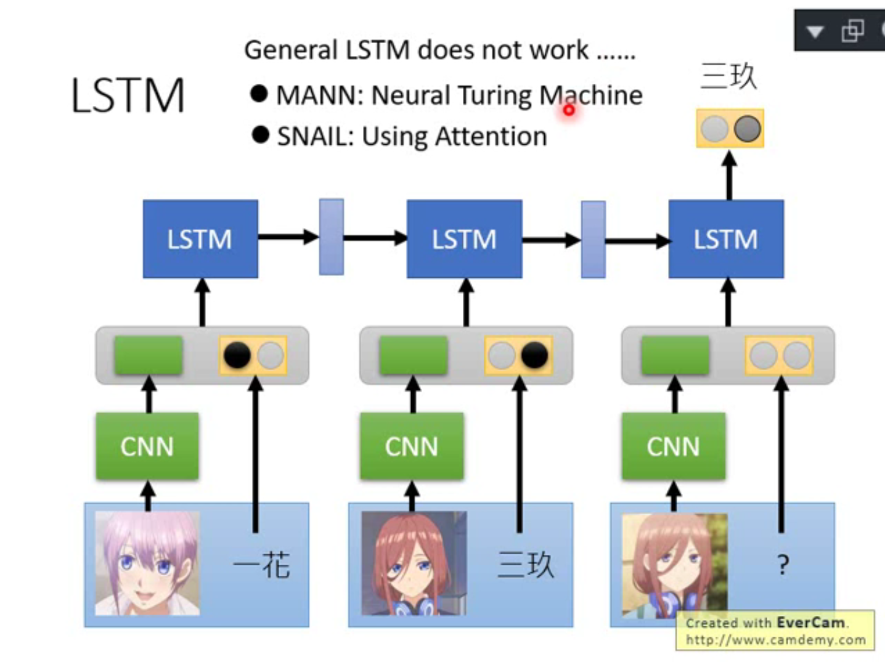

具体方法我们就不展开讲了，放出参考链接：

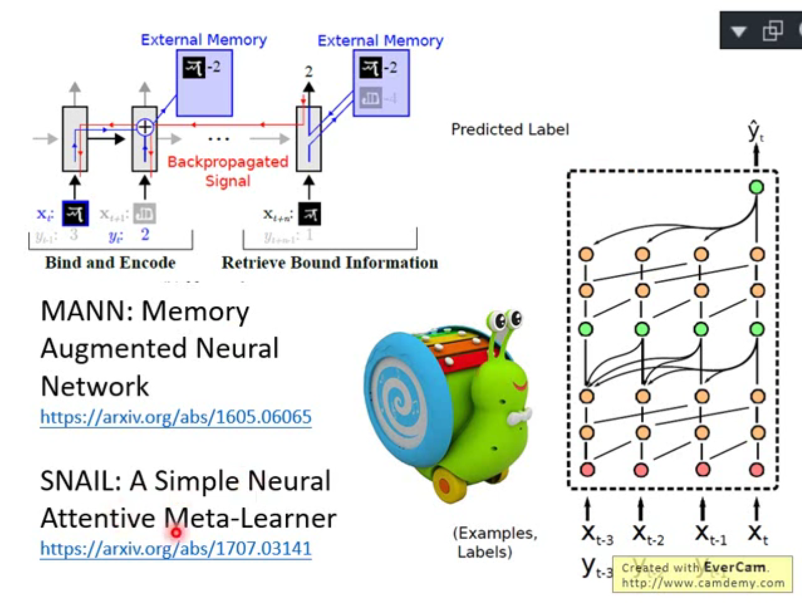

>One-shot Learning with Memory-Augmented Neural Networks
>
>https://arxiv.org/abs/1605.06065
>
>A Simple Neural Attentive Meta-Learner
>
>https://arxiv.org/abs/1707.03141

SNAIL 你看看他的架构图就能了解他在做什么，如上图右侧所示，和我们上面刚说过想法的是一样的，输入一堆训练数据给RNN 然后给他一个测试数据它输出预测结果，唯一不同的东西就是，它不是一个单纯的RNN ，它里面有在做回顾这件事，它在input 第二笔数据的时候会回去看第一笔数据，在input 第三笔数据的时候会回去看第一第二笔数据...在input 测试数据额时候会回去看所有输入的训练数据。

所以你会发现这件事是不是和prototypical network 和matching network 很相似呢，matching network 就是计算input 的图片和过去看过的图片的相似度，看谁最像，就拿那张最像的图片的label 当作network 的输出。SNAIL 的回顾过去看过的数据的做法就和matching network 的计算相似度的做法很像。

所以说，你虽然想用更通用的方法做到一个模型直接给出测试数据预测结果这件事，然后你发现你要改network 的架构，改完起了个名字叫SNAIL 但是他的思想变得和原本专门为这做到这件事设计的特殊的方法如matching network 几乎一样了，有点殊途同归的意思。

## Experiment 

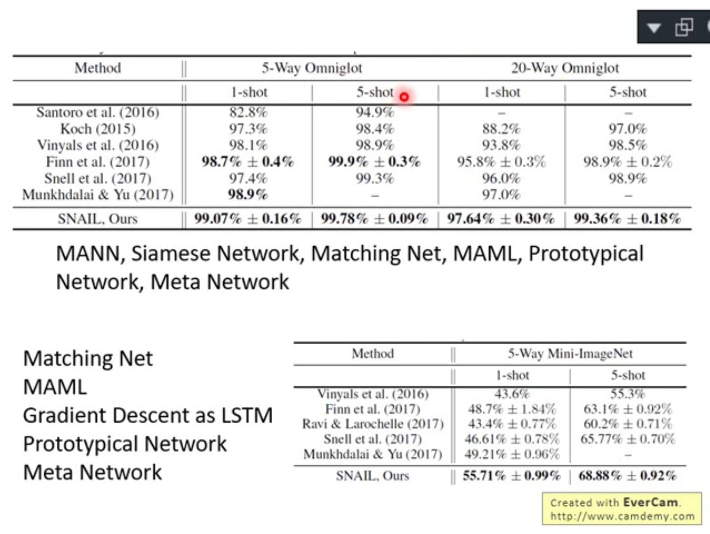

总之SNAIL 和其他方法相比都是最好的，没什么好说的了。