# More about Auto-Encoder

这节课要讲的是在以前的课程上没有讲的， 近年来的热门的Auto-Encoder 技术。

## Review

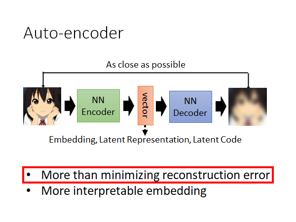

Auto-Encoder 就是有一个Encoder 的network ，有个Decoder 的network ，中间会产出一个vector ，你可以叫它Embedding，Latent Representation，Latent Code等。Decoder 会根据vector 产出一个输出，我们希望这个输出和原始的输入越接近越好，以此作为loss 更新模型参数。

今天要讲的内容分两个部分：

- 为什么一定要Minimize reconstruction error ，有没有其他的做法呢
- 怎么让Encoder 输出的vector 更容易被解读

接下来我们要先讲第一个问题，这里是通过引入Discriminator ，来替代minimize Reconstruction Error 。详情且看下面的描述。

## What is good embedding?

我们回想一下为什么要做embedding 呢，我们是希望通过这个embedding 来代表原来的输入。举例来说，我们看到耳机就能想到三玖，而不会想到一花。🤣

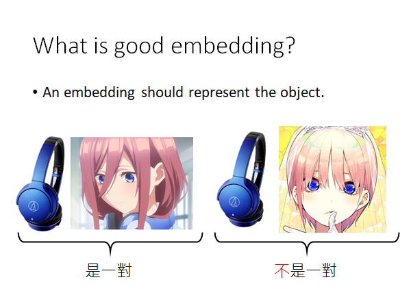

## **Beyond Reconstruction** 

Encoder 吃进一个输入，就产生一个对应的代表该输入的embedding：

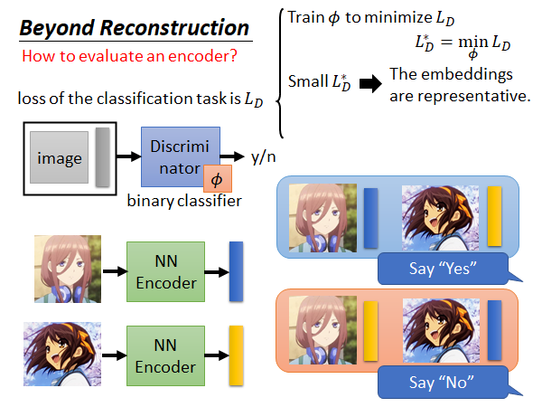

那我们怎么知道这个产生的embedding 的代表性好不好呢，我们训一个Discriminator ，input 是一个张图片和embedding ，output 就是这一对输入是不是对应的，你可以想象这是一个二分类器。如上图左上方所示。

这个Discriminator 的训练资料就是很多（图片+embedding）的二元组，这些二元组有的是对应的有的是故意用不对应的组合，并且打上标签。如上图右下角所示。

然后就要定一个loss function $L_D$，对于这个Discriminator 最简单的就是用Binary cross entropy ，没什么好说的。

接下来就是训练这个Discriminator 去minimize loss function ，去找一组最好的Discriminator 的参数 $\phi$ 。找到的最好的 $\phi$ 达到的最低的loss 我们把此时的损失函数值叫做 ${L_D}^*$ 。

如果说这个 ${L_D}^*$ 很小，那意味着现在这个Encoder 是很好的，Discriminator 很容易就能知道embedding 之间是不同的，可以轻易的分辨出各个embedding 应该对应的原始输入；如果说这个 ${L_D}^*$ 很大，那就意味着现在这个Encoder 就是比较差的，这个Encoder 得到的embedding 都比较相似，Discriminator 难以分辨这些embedding 之间的区别。

如果形象点用颜色来说，好的Encoder 得到的embedding 应该会是如上图颜色各异的，而差的Encoder 得到的embedding 可能就是下面这样颜色相近的：

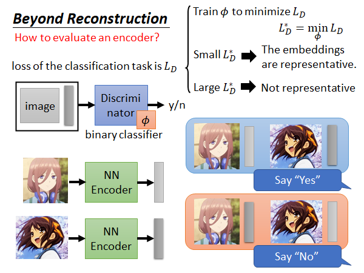

接下来我们要做的事，就是根据 ${L_D}^*$ 调整Encoder 的参数 $\theta$ ，使得Encoder 得到的embedding 在通过Discriminator 时候能被很好的分辨，得到较低的 ${L_D}^*$ 。

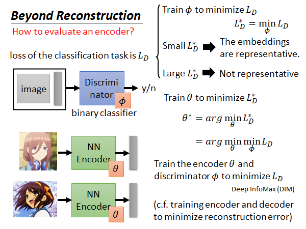

上述的这个方法，被用在Deep InfoMax(DIM) 这篇paper 中。这个Discriminator 可以做不同的设计，比如用不同的loss 计算方法等，结果会不太一样。

在训练的时候，我们一起train Encoder 和Discriminator ，这件事就好像我们在train 一般的Auto-Encoder 时，一起train Encoder 和Decoder 去minimize Reconstruction Error 一样。

这就是引入Discriminator ，来替代minimize Reconstruction Error 的做法。

## Typical auto-encoder is a special case

经典的auto-encoder 可以看作上述的方法的一个特例。怎么说呢

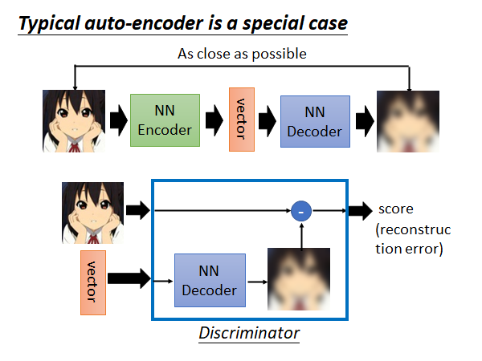

你可以把Discriminator 看作它根据vector 做了一个Decoder 做的事情，然后把输出和原始输入算一个Reconstruction Error 分数。

## Sequential Data

如果你的数据是序列性的，比如说文章，这时你就可以做更多的变化。

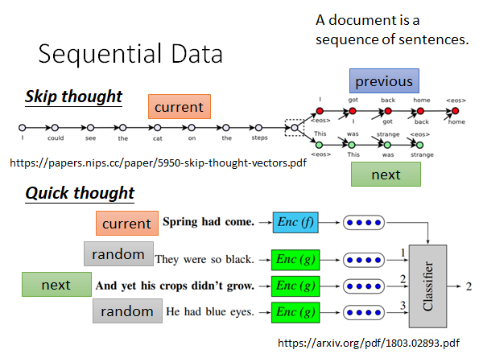

### Skip thought

> https://papers.nips.cc/paper/5950-skip-thought-vectors.pdf

如上图所示，Skip thought 就是根据当前输入的的句子预测上下文。这件事和训 WordEmbedding 是很像的，WordEmbedding 是说把文章中出现在同样或者相似上下文的单词语义应该是一样的，所以用相同或者相似的Embedding 来表示。Skip thought 的思想也是这样，只是扩展到句子，如果两个句子的上下文是相同或者相似的，那这两个句子应该是语义相近的。比如说，A提问这个东西有多贵，B回答10块，A提问这个东西要多少钱，B回答10块。Skip thought 就会知道有多贵和要多少钱的语义是相似的。

Skip thought 不仅要训练Encoder（做embedding） 还要训练Decoder （做预测上下文），让机器产生预测结果，这是比较耗时的。

### Quick thought

> https://arxiv.org/pdf/1803.02893.pdf

这是Skip thought 的升级版，速度比较快。我就只learn encoder 不去learn decode 了。

我们现在把每个句子都同过encoder 得到各自的embedding ，每个句子要跟它的下个句子的embedding 越近越好。如果是其他的句子，那它们的embedding 就要和当前句子的embedding 越远越好。

真正实作的时候就是，有个classifier 它吃当前句子embedding 、下个句子embedding 和一些随机sample 的句子的embedding ，然后给出哪个句子是当前句子的下一句。如上图所示。

classifer 和encoder 是共同训练的。文章中的classifier 是很简单的，它就是算当前句子embedding 和其他句子embedding 之间的内积，内积越大就越相信这个句子是当前句子的下一个。

### Contrastive Predictive Coding (CPC)

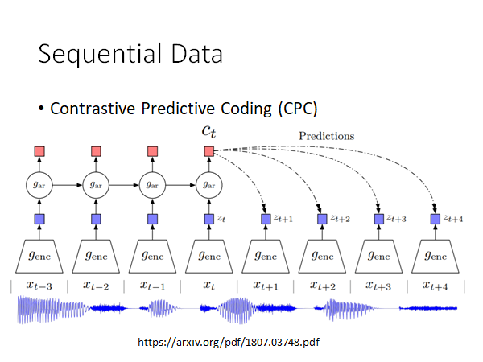

> https://arxiv.org/pdf/1807.03748.pdf

看图就大概能明白它在做什么，输入是一段声音，这段声音分成小段，通过encoder 得到对应的embedding ，希望得到的embedding 能去预测接下来的同一个encoder 会output 的embedding 。就和上面Quick thought 的概念有点像。

## More interpretable embedding

接下来我们进入下一个主题，怎么让embedding 更具解释性。

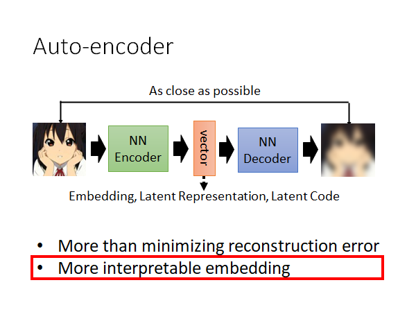

### Feature Disentangle 

Disentangle 这个词的中文意思是"解开"，大概就是下图中一团东西缠在一起想要解开的那个解开的意思。

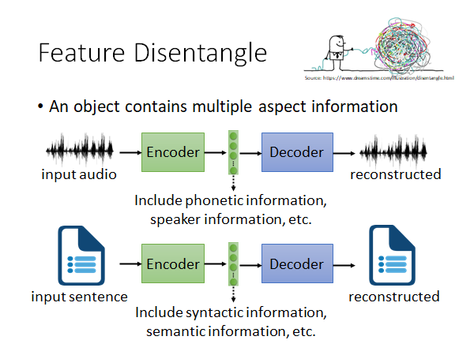

我们encoding 的对象包含各式各样的信息，比如说一段声音信号，包含语者的语义、语者的语调、环境噪音等等的信息，文字也是一样，有语义的信息、文法的信息等，图片也是，内容的信息、图片风格的信息等。

以语音信息为例，encoder 得到的embedding 可能包括语者的语义信息、语调信息、环境噪声等很多信息，但是我们不知道这个向量中那些维度对应那些信息。现在，我们希望decoder 可以告诉我们那些维度是语义信息、哪些维度是语者的信息等等。

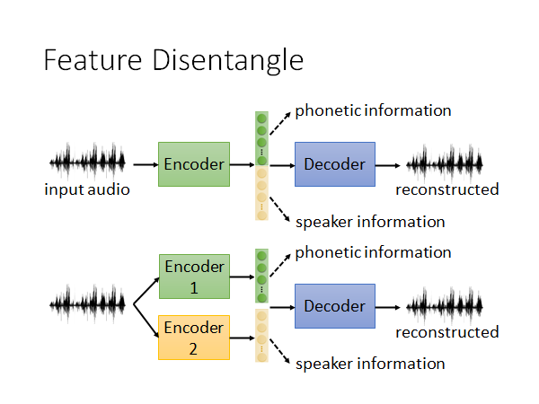

这个想法，可以通过两个思路来做。第一种，如上图上半部分所示，我们希望encoder 输出的embedding 有一部分代表语音信息，一部分代表语者信息。第二种，做个变形如上图下半部分所示，我们搞两个encoder 一个提取出语义信息的embedding 一个提取出语者信息的embedding ，把两个embedding 拼在一起放入Decoder 才能还原输入。

这里是做了简化，假设只有两个信息，实际上有更多的。

那这样的话能做到的什么呢？

### Feature Disentangle-Voice Conversion 

一看就知道李老师也是老变声器了。🤣

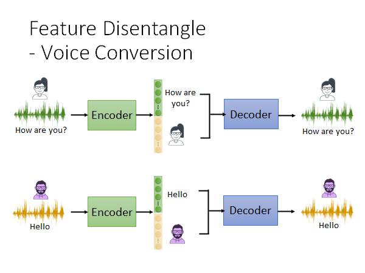

上图很好理解了，我们如上图所示做训练，我们用语音信息训练这个auto-encoder 模型，让encoder output 的embedding 可以把语者和语义信息分开来。然后：

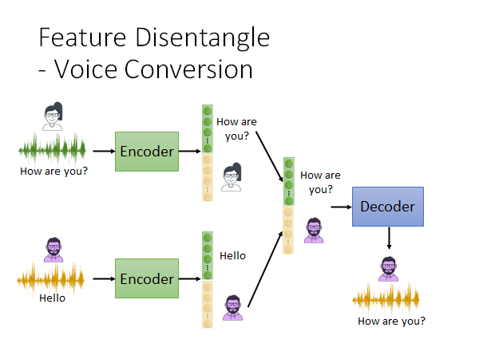

我们做如上图所示的embedding 拼接，丢给decoder 它就能输出男生说"How are you?"的音频。😮

你可能会说这有什么用？这当然有用，比如用新垣结衣的声音劝你读博士，你可能就会满口答应下来。🤣

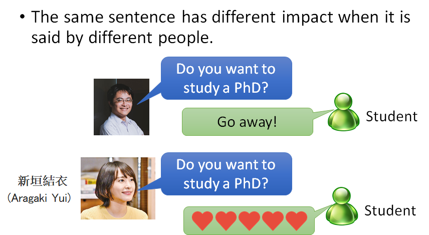

那要怎么做才能让encoder 把不同的信息分开到不同的维度上呢？下面介绍几种做法。

### Feature Disentangle-Adversarial Training 

用GAN的思想

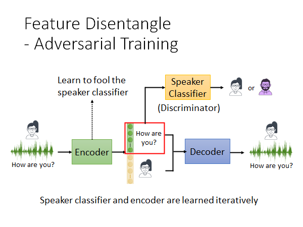

如上图所示，做法是这样的，我们训练一个语者辨识的classifier ，Encoder 想办法去骗过speaker classifier 。比如说把embedding 的前100维给speaker classifier 做辨识，当Encoder 尝试骗过speaker classifier 的时候，Encoder 就可能会把有关语者的信息藏在embedding 后面的维度中。以此，来做到把语者和语义信息分开到不同的维度上。

所以，从GAN的角度来说，speaker classifier 就是Discriminator ，Encoder 就是Generator，speaker classifier 和Encoder 是迭代train的，就是你先train speaker classifier 再train Encoder ，如此交替往复。

### Feature Disentangle-Designed Network Architecture

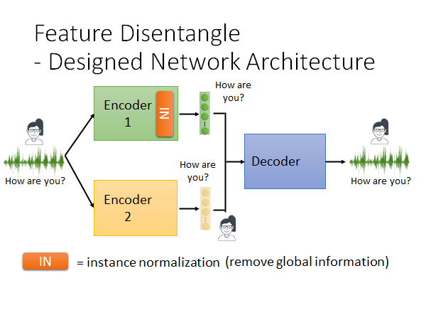

我们还可以直接修改Encoder 的架构，如上图所示，直接让不同的Encoder 输出对应的信息，滤掉不需要的信息。举例来说，有一种神经网络的layer 叫instance normalization ，这种layer 我们就不展开讲了，它能做到的就是移除global information ，global information 就是所有样本都具有的信息。那当我们把同一个人说的话都输入网络，网络种instance normalization layer 就可能会滤掉语者信息。

但是这样是不够的，这样就算我们保证了Encoder1 只包含了语义信息，我们也不能保证Encoder2 只包含语者信息。所以我们要在Decoder 上加一个adaptive instance normalization layer ，如下图所示：

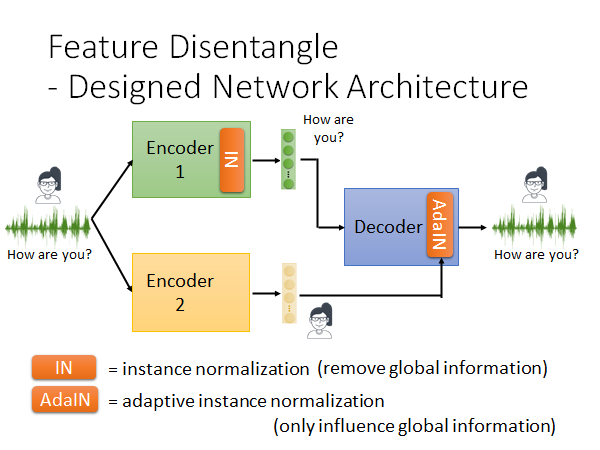

Encoder1 的embedding 直接input 给Deocder ，Encoder2 的embedding input 到AdaIN 这个layer ，AdaIN 会调整输出的global 的information ，也就是说如果Encoder2 在其输出的embedding 中放了语义信息，这个embedding 就会很大程度上改变Deocder 的输出。用这种方法，使Encoder2 输出的embedding 尽量不包含语义信息。 

用这种改变Encoder 架构的方法来实现，将不同信息分离到不同维度上。

这里老师演示了他的学生Ju-chieh Chou 用Adversarial Training 得到的结果，可以参考：

> https://jjery2243542.github.io/voice_conversion_demo/

## Discrete Representation

接下来我们要讲的是，过去我们在训Auto-Encoder 的时候得到的向量都是连续值，这个向量具体表示什么，你可能自己也不是很清楚。现在我们考虑Encoder 能不能输出离散的embedding ，这样我们就更容易解读这个embedding 的含义，也更容易做分群，比如说Encoder 输出是1的图片是一类，输出是2的图片是一类。所以，Encoder 如果能输出Discrete 的embedding ，那解读起来会更容易。

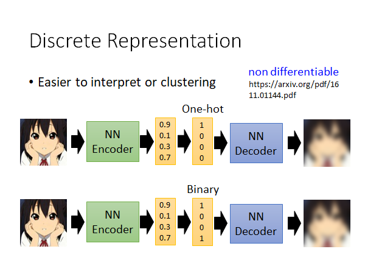

> https://arxiv.org/pdf/1611.01144.pdf

举例来说，我们就让embedding 是One-hot embedding，如上图所示，我们就在Encoder 输出embedding 后面加点东西，它做到的事情就是把整个embedding 中最大的一维设为1，其他都是设0就好了。

如果你不想要one-hot vector ，那也可以让embedding 转为binary vector ，如上图下半部分所示，某个维度的值大于0.5就设1，否则就设0。

你可能会说那这个东西没法微分啊，但是实际上还是有一些技巧可以做的，这里就不展开了，可以自行查阅论文。

### Vector Quantized Variational Auto-encoder (VQVAE)

上述的做法在文献上有个非常知名的做法叫做VQVAE

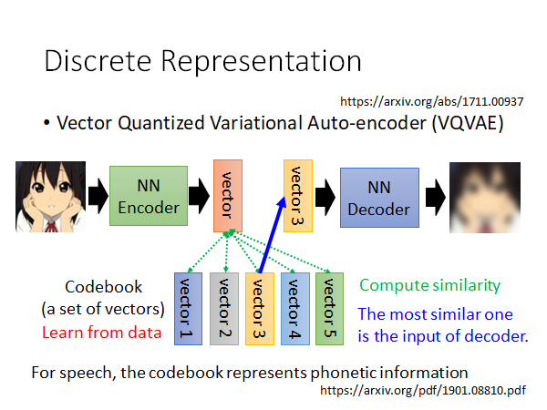

>https://arxiv.org/abs/1711.00937
>
>https://arxiv.org/pdf/1901.08810.pdf

VQVAE 的做法是这样的，有一个Codebook 其中包含多个vector，这里假设只有5个好了，这些vector 是从数据中学出来的。输入一张图片给Encoder 输出一个数值上是连续的embedding ，那这个embedding 和Codebook 中的vector 算相似度，取相似度最高的作为Encoder 的输入，然后取minimize reconstruction error，结束。

你会说，你算完相似度然后取最相似的vector 这个步骤相当于是在做Discrete，但是这不是没法微分吗，实际上是可以做的，有一些技巧，不展开了，自行读文献吧。

还有一个重要的事情是，如果你用VQVAE 或者其他的Discrete embedding的方法，那你就能做到让Deocder 得到的Discrete embedding 只包含语义信息而不包含语者信息和环境噪声等，也就是说只有有关文字的信息才会被存下来。原因是这样的，你想想看这些Discrete embedding 就是容易存Discrete 的信息，而声音信息、环境噪声都是连续的，但文字信息是一个一个的token，是离散的，所以说文字信息被保留下来，其他信息被滤掉了。

### Sequence as Embedding

我们上面说让embedding 变成离散的会更容解读，那我们甚至可以让中间表示不再是一个向量，让它用word sequence 表示：

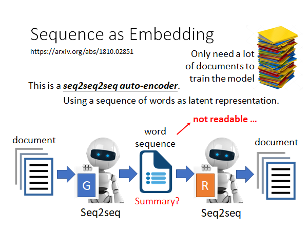

> https://arxiv.org/abs/1810.02851

假如说我们的Encoder 的输入对象是document，我们可以learn 一个seq2seq2seq 的model ，Encoder 做文章压缩，得到中间的word sequence ，Decoder 根据中间词序列做文章还原。这样的话我们直觉上会觉得，中间的word sequence 就是对文章的summary 。但是事实上如果我们直接这么train 下去中间的结果是不可读的。因为，Encoder 和Decoder 都是机器，他们会自己的暗语，说一些只有他们才能懂的word sequence 。比如说，台湾大学，中结果可能不是"台大"，而是是"湾学"，反正只要Deocder 能正确解回台湾大学就可以了。

那怎么让Encoder 输出的sequence 让人能看懂呢，我们就用GAN 的技术。

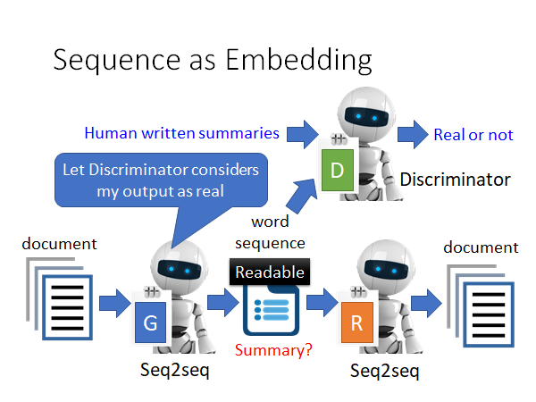

我们再那一个Discriminator 来，它来判断一个句子是不是人写的，让Encoder 努力学习骗过Discriminator 。这样就能让中间的word sequence 变得人类可读。

你可能又说，这里又不能微分啊，中间的latent representation 是一个word sequence ，也是Discrete 的，Encoder Decoder 整个network 合起来不能微分啊。确实不能微分，所以实作的时候是用reinforcement learning 硬train Encoder 和Deocder 的。

下面是一些实验结果：

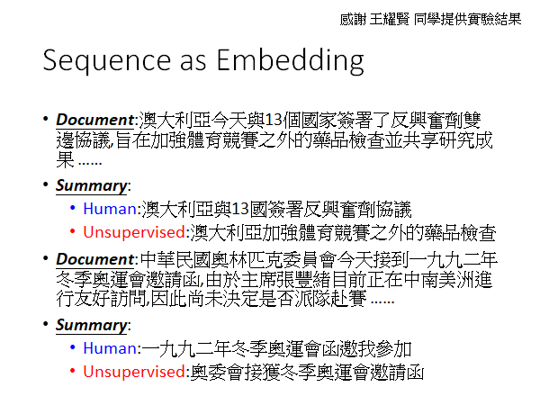

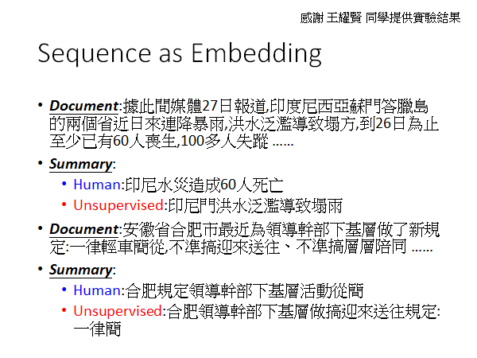

### Tree as Embedding

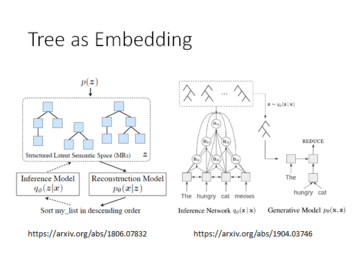

> https://arxiv.org/abs/1806.07832
>
> https://arxiv.org/abs/1904.03746

另外还有一些比较新的研究成果，供大家参考。

## Conclusion

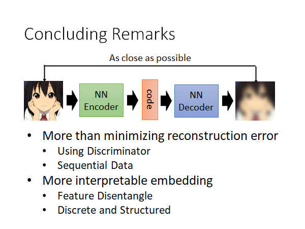

总结一下就是讲了：

- 除了reconstruction error 以外有没有别的做法
  - Using Discriminator
  - Sequential Data
- 有没有比较好的解释embedding 的方法
  - Feature Disentangle
  - Discrete and Structured 