# Network Compression

做网络压缩的原因是这样：我们未来希望把network 放到很多的设备上使用，这些设备上存储空间有限，计算能力有限，所以我们希望能把网络做压缩，而尽可能小的损失其准确度，以适应这些设备。

## Outline

先列一下本节的大纲：

- Network Pruning 

- Knowledge Distillation 

- Parameter Quantization

- Architecture Design

- Dynamic Computation

另外，我们不会讨论硬件加速和优化相关的内容。

## Network Pruning

Network Pruning（网络修剪）就是把一个大的network 把一些neuron 去掉，以达到network compression 的目的。我们之所以能做到这件事，是因为我们相信我们通常训练出来的神经网络是over-parameterized，也就是说网络中的很多参数是没有用的。就是我们不需要那么多参数就能解出当前的问题，但是我们给了网络过多的参数。如果你去分析训出来的network 中的参数，你会发现很多的neuron 的output 总是0，有些weight 是非常接近0的，这些参数是没有作用的。我们就把这些没用的东西剪掉。

这个概念是非常古老的，在90s就已经有了这样的想法：

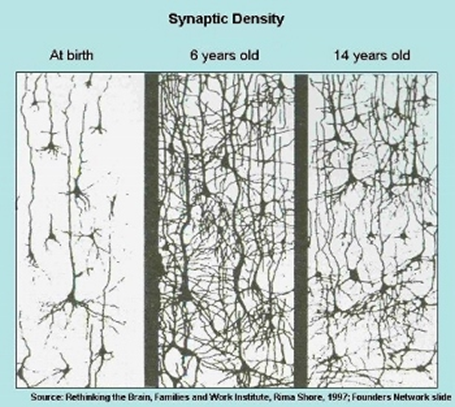

Optimal Brain Damage 意思是最优脑损伤，你可以在直觉上的这样考虑，机器做Network Pruning 就好像人类的大脑发育中的一个现象：如上图所示人类在出生时候脑中神经连接是比较少的在发育的过程中经历了增加又**减少**的过程。

### weight/neuron pruning

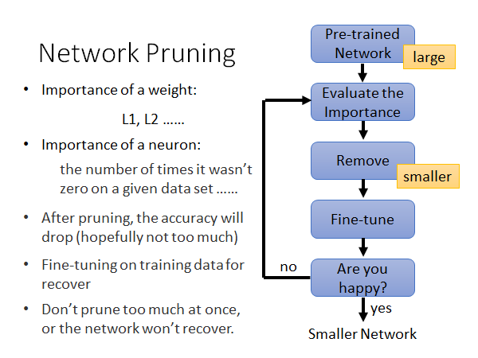

做weight pruning 的过程如上图所示，我们先要有一个训练好的network ，然后评估每个参数（neuron或weight）的重要性。那怎么评估参数重要性呢，已经有很多的评估方法被提出来了。举例来说，对于weight 的重要性我们可以之间看他的数值大小，如果他的值很接近零就可能是不重要的weight，如果它的绝对值很大就可能是重要的参数，所以你可以通过计算weight的L1，L2的数值来看它是不是重要的；对于neuron 的重要性，你给network 一批数据，如果这个neuron 的输出几乎都是零的话，这个neuron 就可能是不重要的。

接下来，你就根据重要新排序weight 或者neuron 然后去除不重要的，你就做好的裁剪的动作。然后，你要做一次fine-tune，去修补你做裁剪的时候损失的准确度，也就是说要修补你做裁剪对模型造成的损伤。接着，你就看看当前这个模型的大小和准确度你是不是满意，如果满意的话网络压缩就结束，否则你就回去步骤二重新评估重要性，以此类推。

这里有个一点需要注意，通常来说你在每次prune 的时候都是裁剪掉一点点，这样迭代多次，而不要一次prune 太多以至于造成没办法修补的损伤。

关于network pruning 的做法就介绍到这里，接下来我考虑一个问题：

### Why Pruning?

我们为什么要做network pruning ，我是说我们为什么不直接train 一个更小的网络？

- 小的神经网络比较难训

- 大的神经网络更容易优化？ https://www.youtube.com/watch?v=_VuWvQUMQVk 

- Lottery Ticket Hypothesis（大乐透假设）
  - https://arxiv.org/abs/1803.03635

第一点没什么好说的，众所周知小的神经网络比较难训。

大的神经网络更容易优化，原因就是大的神经网络比较不容易卡在local minima、saddle point 这些点上。这也许就是为什么小的network 比较难train 的原因。所以说，我们通常选择train 好一个大的network 再做pruning 。

关于大乐透假设，我们来解释一下：

#### Lottery Ticket Hypothesis

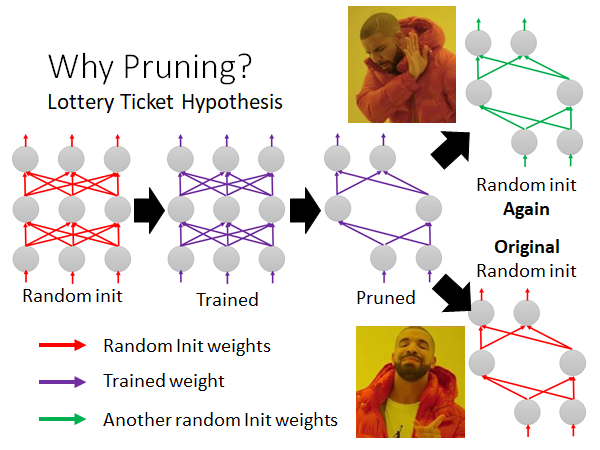

如上图所示，我们将train 好的一个大network 进行pruning 得到一个小的network 如右上角所示，我们随机初始化这个小网络的参数，重新训练这个小的网络，发现train 不起来。我们再把上述紫色的pruned 的network 设为最初始的参数，重新训练小网络，发现train 起来了。

根据这个现象，作者提出了大乐透假说，就是说train network 就像买乐透一样，不同的random initialized parameters 得到不同的初始神经网络，有的train 得起来有的则不行。一个巨大的network 是由很多小的network 组成，这些小的network 就有的能train 起来有的不行，而大的network 中只要有一个小的network 能train 起来，整个大的network 就train 起来。所以你可以直觉上这样想，大的network 就相当于你一次买了很多乐透，增加中奖几率。然后你再把大的network 做pruning 找出那个能train 起来的小的network ，这个小的network 最开始初始的参数是能使它被train 起来的，所以我们看到了上图所述的现象。

下面是一个与上述对立的看法。

#### Rethinking the Value of Network Pruning

> https://arxiv.org/abs/1810.05270

这篇文章主要就是讲小的network 也是train 的起来的。

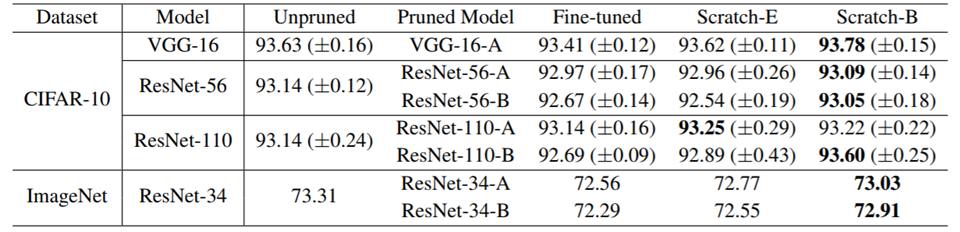

这个文章的实验中的随机初始化参数就是真的随机初始化参数，而不是从原始模型的初始化参数copy 过来。

上图是实验结果，我们可以对比Unpruned 和Fine-tuned 两列，似乎就是pruned network 也是train 的起来的。

所以说，上述这两篇paper 的结论就是矛盾对立的，两篇文章都是发表在ICLR ，且是open review 的，网络上有reviewer 问到两篇paper 的对立观点，他们的作者也都对此做了一些解释，有兴趣可以自行搜索。

### Network Pruning-Practical Issue

Network Pruning 有一些实作上的问题是我们需要注意的，我们上面说你可以衡量weight 或者neuron 的重要性，然后prune 掉不重要的，那weight 和neuron 两者prune哪个比较好呢。

如果我们prune weight：

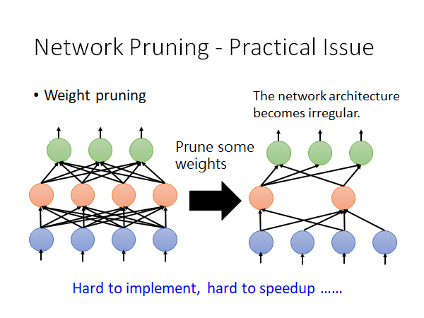

你prune 掉不重要的weight 后，你得到的网络架构是不规则的，所谓不规则是说，在同一层中有的neuron 吃两个input 有的吃四个input，这样的网络的算法程序你比较难实现，就算你真的实现了这种算法，你也不好用GPU 加速矩阵运算。

所以实作上你做weight pruning 的话你就会把weight 设零，而不是拿掉weight，但是这么做你并没有实际上丢掉weight，模型的大小是没有变的，所以这不能达到我们的network compression 的目的。

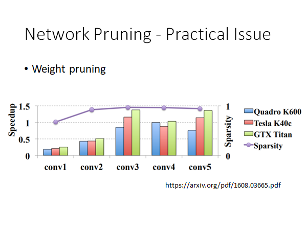

> https://arxiv.org/pdf/1608.03665.pdf

紫色线是我们prune 的量，几乎都在95%以上。我们可以看到prune 以后，集中模型的速度大部分都是有所下降的。所以得不偿失，你以为prune 以后会更快，但实际上变得更慢了。

所以说prune neuron 是比较好实作也比较好加速的：

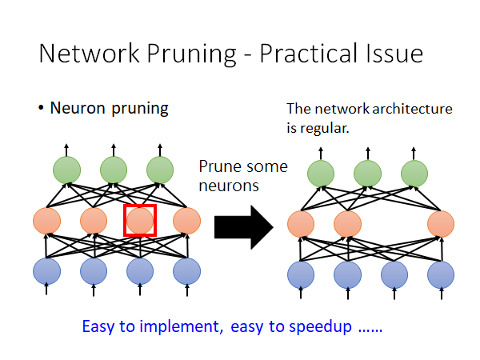

## Knowledge Distillation

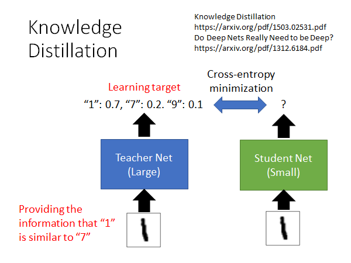

> Knowledge Distillation
>
> https://arxiv.org/pdf/1503.02531.pdf
>
> Do Deep Nets Really Need to be Deep?
>
> https://arxiv.org/pdf/1312.6184.pdf

如上图所示，Knowledge Distillation 就是用一个小的network 去学习大的network 的行为。我们不是较Student Net 正确的结果是什么，而是告诉他当前输入可能是什么，举例来说，当输入是图片1的时候，Student Net 去学习Teacher Net 的输出，它会学到当前图片有0.7的可能性是1，有0.2的可能性是7，有0.1的可能性是9。在这个过程中，Student Net 不仅会学习到当前输入的图片可能是什么，它还会学习到1和7和9是相似的，所以这样的学习方式是可以学习到更丰富的信息的。所以，有可能即使Student Net 没见过图片7，它只见过图片1和9，但是这么学完以后它是可以触类旁通的认出7的。

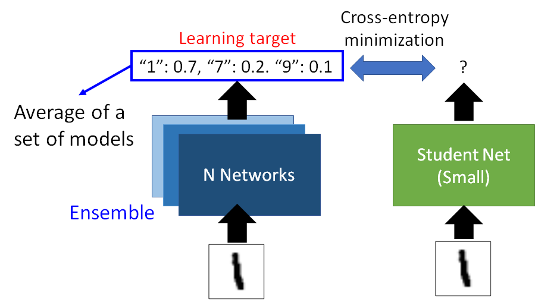

Knowledge Distillation 的一个用处是用一个小的Student Net 模拟一个巨大的ensemble 的Teacher Net 。通常来说ensemble 的方法可以让你的模型的准确度更上一层楼，但是这么做是牺牲了算力和空间的，此时我们就可以用Knowledge Distillation 的方法，用一个小的network 模拟大的ensemble network 达到相近的准确度。

### Temperature

在Knowledge Distillation 的实作上有一个技巧叫做Temperature：

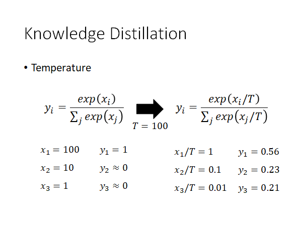

Temperature 就是如上图所示，我们在做classification 的network 的最后会有一个softmax layer ，softmax layer 就是会把network output的值取Exponential 然后做一个normalize。我们通常会在做softmax 之前对network 的output 做除上temperature 的动作，temperature 通常是一个大于1的值。

为什么这样做呢，我们举个例子。首先，我们知道Knowledge Distillation 之所以会有用是因为大的network 的输出是可能性，而不是one-hot 的向量，如果是后者那就失去了不同class 之间的相似性信息，所以为了让不同的label 之间的分数拉近一点，我们就除上temperature。本来的x通过softmax layer 得到的y的后两个维度都接近0，而x除上temperature 后通过softmax layer 得到的y的各个维度之间的分数就被拉近了。

但是，在实际上Knowledge Distillation 没有特别有用。🤣

## Parameter Quantization

参数量化，这一节将在参数上做一点文章。

1. Using less bits to represent a value

这没什么好说的，就是去掉一些参数的精度，来换取存储空间的下降。

2. Weight clustering 

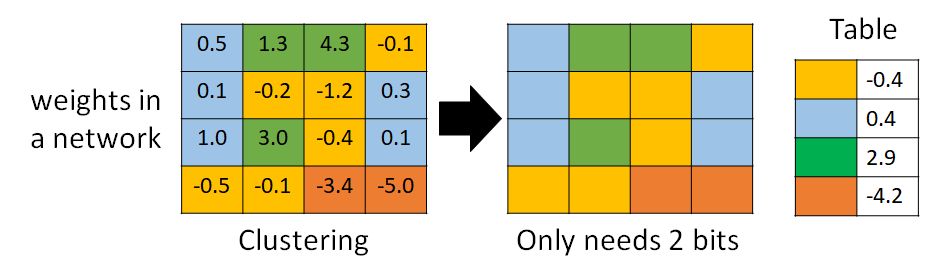

如上图所示，Weight clustering 就是将相近的参数聚簇，然后用一个映射表来存储，以降低参数占用的内存空间。一个cluster 中的参数可以取均值作为这个cluster 的值。这样做你也是会损失一些进度，但是换来了很好的模型压缩率。

3. Represent frequent clusters by less bits, represent rare clusters by more bits 

更进一步，你就可以把常见的clusters 用比较短的coding 表示，比较罕见的clusters 用比较长的coding 表示，以进一步提高模型压缩率。比如使用哈夫曼编码。

### Binary Weights

Parameter Quantization 这种思想和方法的极致就是你可不可以只用+-1来表示一个weight。其实文献上有一些尝试是可以直接train binary  weight 的network，最早的一篇paper 就是下面这个Binary Connect 。

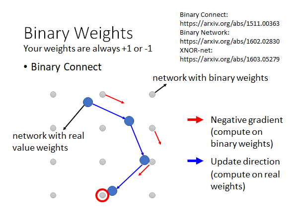

> Binary Connect: https://arxiv.org/abs/1511.00363 
>
> Binary Network:
>
> https://arxiv.org/abs/1602.02830
>
> XNOR-net: 
>
> https://arxiv.org/abs/1603.05279

Binary Weights 的精神就是你的参数是二元化的用+-1来表示。上图灰色的点代表参数空间，每一个点都可以看作是一个binary weight 的network，这个network 中所有参数都是二元化的都是+1或者-1。

然后你就初始一组参数，这组参数可以是real value 的，你就现根据当前network 的参数找一个最接近的binary weight 的network 去计算gradient ，根据这个gradient 更新当前network 的参数，然后再去根据更新后的network 找一个最接近的binary weight 的network 去计算gradient ，根据这个gradient 更新当前network 的参数，以此类推。

这个Binary Connect 根据文献上的结果看起来还不错：

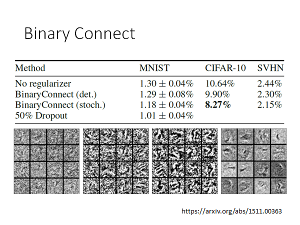

> https://arxiv.org/abs/1511.00363

从上面来看，Binary Connect 居然还比原来的network 的结果还要好，为什么呢？你可以这样想，Binary Connect 可以看作在做regularization ，它限制参数的值只能是+-1。只是这个方法还是没有做Dropout 更好就是了。

## Architecture Design

调整network 的架构设计让它变得只需要较少的参数，以实现network compression 。这也许是现在实作上最有效的做法。

先来看看fully connected network ：

### Fully Connected Network

#### Low rank approximation

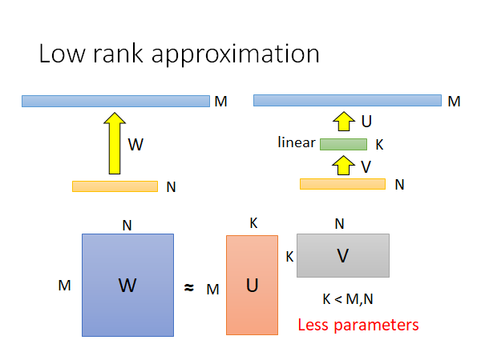

如上图左上角，我们有一个network ，其中M、N两层中间有参数W，这两层分别各有M、N个neuron，然后我们在这两层中间加一个neuron比较少的linear hidden layer K，你仔细想想看，这样做参数其实是变少了。

原先有$M\times N$那么多参数，然后变成$M\times K+K\times N$ 个参数。如果我们调控好K的值，就可以做到减少参数的效果。

但是这个trick 会对network 有一定的限制，这也是不可避免的。

### CNN-network compression

#### Review: Standard CNN

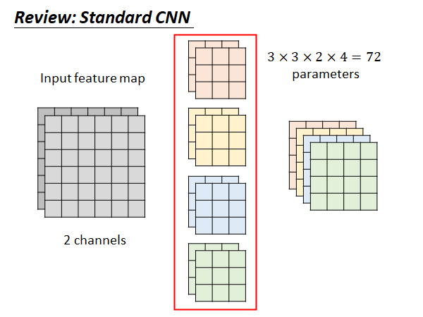

如果我们的input 有两个channel ，我们的filter 就要对应有两个，如上图中间所示，我们通常有多个filter 比如4个的话，这样我们得到的output 就是四个，如图右边所示。所以这个CNN 的filter 的参数个数是72个，后面我们要做network compression 看看能从72减少到多少。

#### Depthwise Separable Convolution

Depthwise Separable Convolution 是把convolution拆成两个步骤：

1. step1 **Depthwise Convolution**

- filter 数量=输出的channel
- 每个filter 都只处理一个channel
- filter 是k*k 的矩阵
- 不同的channel 之间互相没有影响的

这样每个filter 就不再考虑其他channel ，卷积得到输出是两层

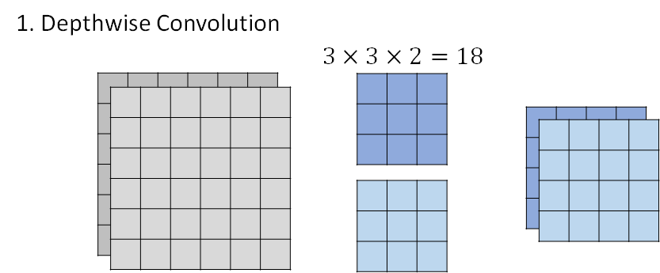

2. step2 **Pointwise Convolution** 

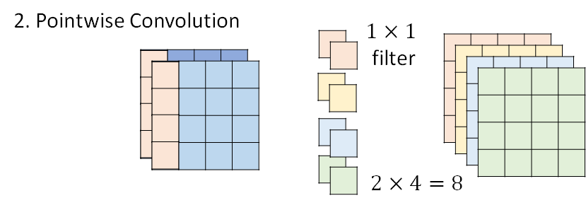

第二步骤，是说每个filter 都只用一个value ，用这样的filter 去处理第一步得到的两层输出，这一步的输出就和经典的CNN 的卷积输出相同了。

综合这两步，filter 的参数总量是24。

下面来解释一下，这个拆解的步骤和原来的CNN 有什么样的关系。

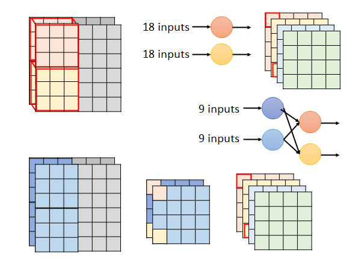

上图上侧是一般的CNN 的卷积过程。

下侧是Depthwise Separable Convolution ，观察卷积过程，第一步将得到中间产物两层的输出，然后经过第二步的每个filter 得到最终输出的每一层。这个过程你可以这样考虑，第一步使用的filter 处理了9个input ，然后把输出结果丢给第二步的filter 处理这两个output，产生一个output。这个过程和经典CNN 中的卷积做的事情类似，经典CNN 中使用一个节点处理18个input 产生一个输出，而我们现在通过叠加两层处理过程，用更少的参数做到了经典CNN 一层处理过程做到的事。

接下来算一下这个方法理论上的模型压缩程度：

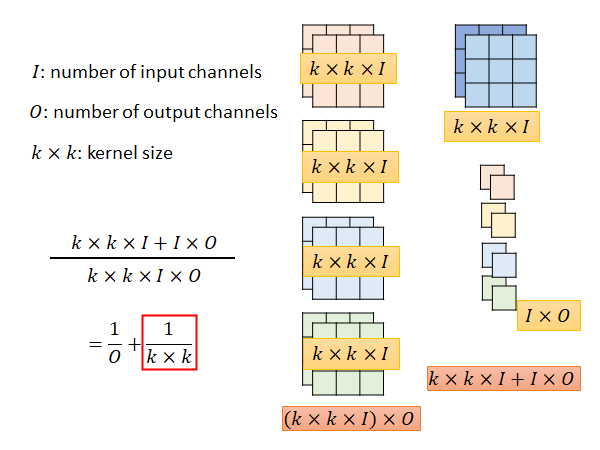

计算过程如上图所示，最后结果就是从$(k\times k\times I)\times O$ ==>$k\times k\times I + I\times O$

### To learn more ……

> - SqueezeNet
>   - https://arxiv.org/abs/1602.07360
>
> - MobileNet
>   - https://arxiv.org/abs/1704.04861
>
> - ShuffleNet
>   - https://arxiv.org/abs/1707.01083
>
> - Xception
>   - https://arxiv.org/abs/1610.02357

## Dynamic Computation

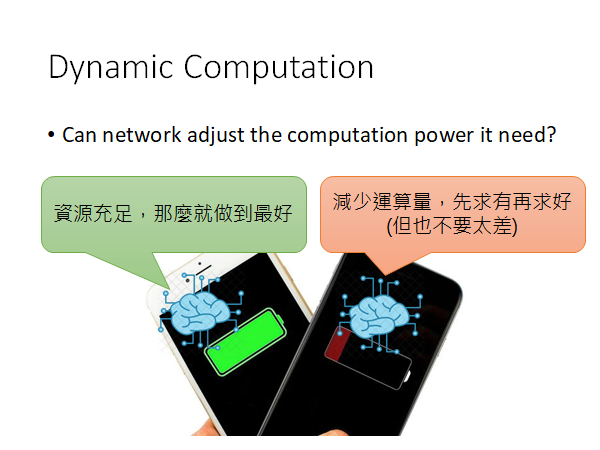

我们希望模型能调整它所的计算能力，再资源充足的时候努力做到最好，在资源紧张的时候降低计算精度以提高持续服务的时间。比如在手机快没电的时候语音助手的运行功耗的调整。

这边来介绍一些可能的解决方法：

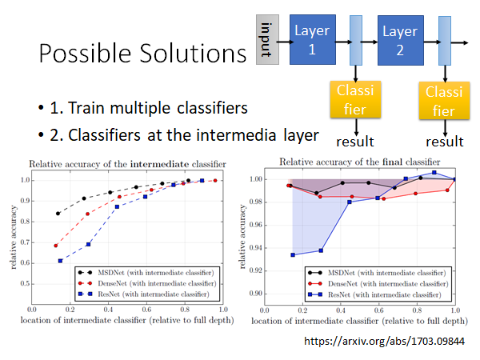

1. 训练多个模型，根据设备的情况选择适当的网络

但是这样的方法比较吃存储空间，所以不太好。

2. 训练中间层也可以做分类器的网络

这个做法是说，正常情况下通过整个模型的计算输出结果，但是在资源紧张的情况下把模型的中间某些层的结果直接拿出来通过一个简单的计算就可以得到结果，以此自由调整network的运算量。

如果你直接这么做结果往往是不太好的，因为你在train 整个network 的时候前面的layer 往往是学习识别很简单的信息，后面的layer 才能综合这些信息做判断。

上图左下角是中有一个实验结果，纵轴就是准确率，横轴从左到右就是从模型的前到后抽出中间结果。显而易见，越深的地方抽出的中间结果才越能准确的做好任务。

还有一个问题是，如果你在中间加一些classifier ，这些分类器是和整个network 一起train 的，这些classifier 的训练会伤害到整个network 的功能布局。原来network 的前几层要抽出一些基础信息，但是你现在强加的classifier 要求前几层同时能够综合这些信息，就导致前几层不能把所有的注意力都用在抽基础信息上。实验结果如上图右下角，你在比较浅的地方加classifier 整个network 的表现就会暴跌，在靠后的位置加classifier 对network 的影响就会小一些。

> https://arxiv.org/abs/1703.09844

有没有方法能解决这些问题呢？有的：

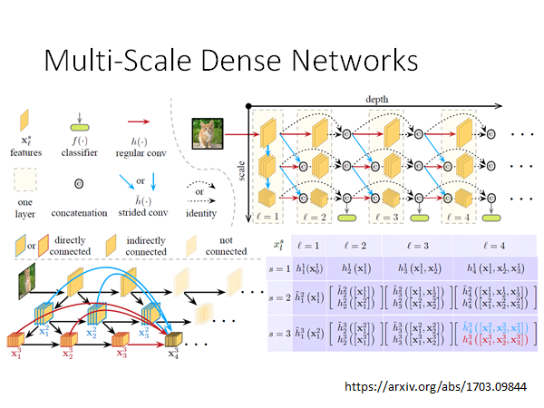

> https://arxiv.org/abs/1703.09844

你可以自行查阅这篇paper 。

