# The Next Step for Machine Learning

现在我们要将一些新的技术，这些技术目前（2019年）被看作是机器学习的下一步，也即是说要让机器学习的技术真正落地到现实生活还需要那些技术是我们需要做的，还有那些难题和障碍是需要我们解决的。

## 0x1 机器能不能知道“我不知道” Anomaly Detection

这个问题听起来有点哲学哦，为什么要研究这个问题呢，举个栗子：你可能训练一个识别动物的model放到网络上供大家使用，但是你以为网友只会给你上传动物的图片吗，搞不好他就给你传个凉宫春日的图片😂：

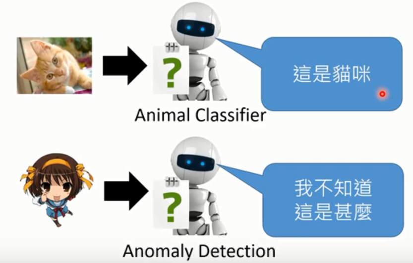

这种情况下，机器需要有能力说出：这个是我不知道的东西。机器会回答这是我不知道的，这样的技术就是Anomaly Detection。

## 0x2 说出为什么“我知道” Explanation ML

今天我们看到各式各样机器学习非常强大的力量，感觉机器好像非常的聪明。但这有可能是这样一个故事，过去有一只马叫做汉斯，它非常的聪明，聪明到甚至可以做数学。举例来说：你跟它讲 $\sqrt{9}$ 是多少，它就会敲它的马蹄三次，大家欢呼道，这是一只会算数学的马。可以解决根号的问题，大家都觉得非常的惊叹。后面就有人怀疑说：难道汉斯真的这么聪明吗？在没有任何的观众的情况下，让汉斯自己去解决一个数学都是题目，这时候它就会一直踏它的马蹄，一直的不停。这是为什么呢？因为它之前学会了观察旁观人的反应，它知道什么时候该停下来。它可能不知道自己在干什么，它也不知道数学是什么，但是踏对了正确的题目就有萝卜吃，它只是看了旁边人的反应得到了正确的答案。

今天我们看到种种机器学习的成果，难道机器真的有那么的聪明吗？会不会它会汉斯一样用了奇怪的方法来得到答案的。

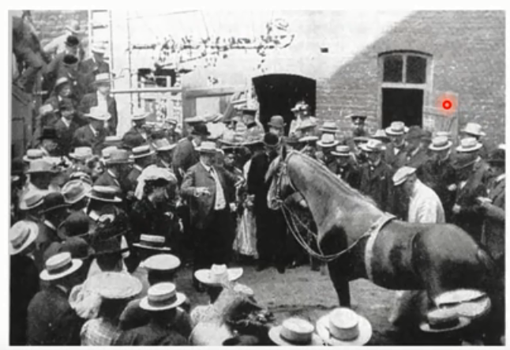

这件事其实是有可能发生的，举例来说，有人做了一个马的辨识器，两个model的辨识率都很高。然后分析，机器是根据什么来标识马的。

> http://iphome.hhi.de/samek/pdf/MonDSP18.pdf

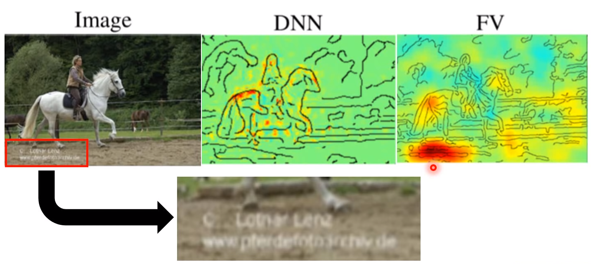

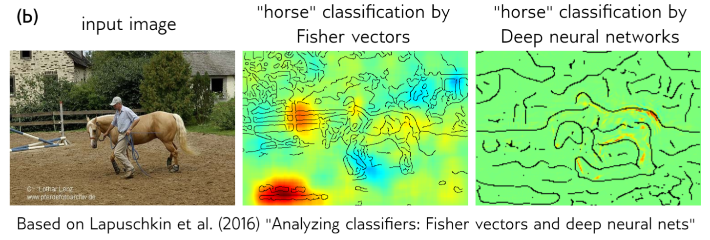

第一个DNN模型是看到图上黄红部分正常分析出有马，看上去挺正常的；第二个FV模型是看到下面红色部分，辨识出有马，它只是看到左下角的英文，标识出马，并没有学到马真正的样子，其实这些图片都是来自一个网站都有相同的水印。

我们不知道AI有没有那么聪明，我们需要一些技术，让AI不只是做出决定，还要让它告诉我们说它为什么做出这样的决定。

## 0x3 机器的错觉 

我们知道说，人是有错觉的，比如下面两个圈圈，你觉得哪个圈圈颜色比较深？

你可能会觉得左边比较深，但你大概猜到我在搞你，会说右边更深。

但是其实：

确实左边的圈圈颜色比较深，这是一个计中计🤣

机器跟人一样，也很容易被骗，我们可以加一些噪声，让机器本来以为是的后来判断为不是。如本来判断出来是熊喵，加了噪声，就判断错误了。这种就叫做 Adversarial Attack。你甚至可以想象相同的技术应用在自动驾驶领域，有人在交通标识牌上贴一个贴纸，你的自动驾驶汽车就加速撞车，这显然是不可接受的，所以我们要想办法防御这种攻击，具体的后面Attack and Defense一节中会讲到。

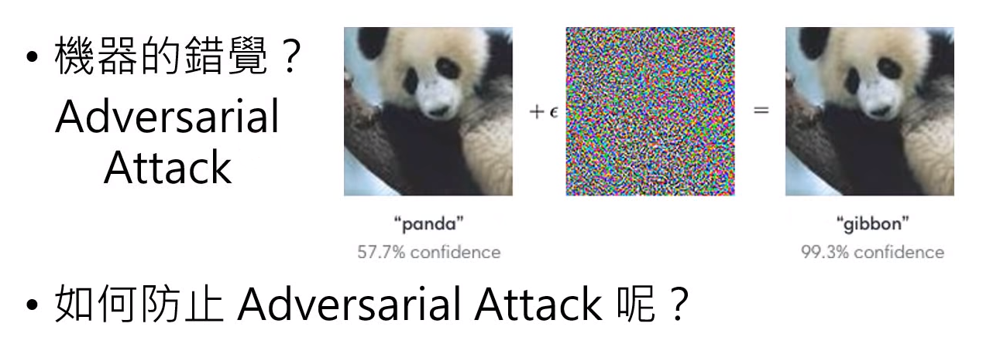

## 0x4 终身学习 Life-long Learning

我们希望机器能终生学习。人就是终生学习的，上学期修了线性代数，这学期学机器学习，学好线性代数，机器学习学得更容易。机器能不能跟人一样也做终生学习呢？现在我们一般只让一个模型学习一个任务，比如Alpha Go就只学习下围棋，Alpha star就是玩星际2，它们并不是同一个模型。

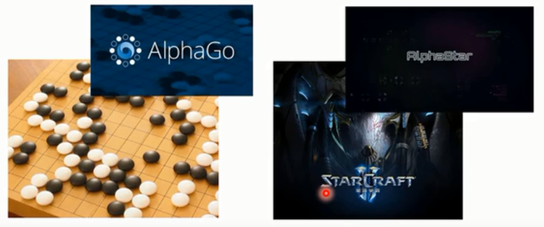

今天我们只让一个模型学习一个人任务，显然会存在如下问题

- 模型的数量无限增长
- 之前学到的技能对之后的学习没有帮助

为什么我们今天不让机器去终生学习呢？比如我们先让机器学下围棋，然后再让它学玩星际2，实际上，当机器学完星际2之后它就不会下围棋了。这个现象叫做Catastrophic Forgetting（灾难性忘记？）。如果想让机器做终身学习，还尚在解决的问题。

## 0x5 学习如何学习 Meta-learning (Learn to Learn)

以前我们设计一个机器学习算法，让机器能够学习；现在，我们能不能写出一个算法实现一个模型，让它能自己设计算法编写模型程序实现具有学习能力的模型。

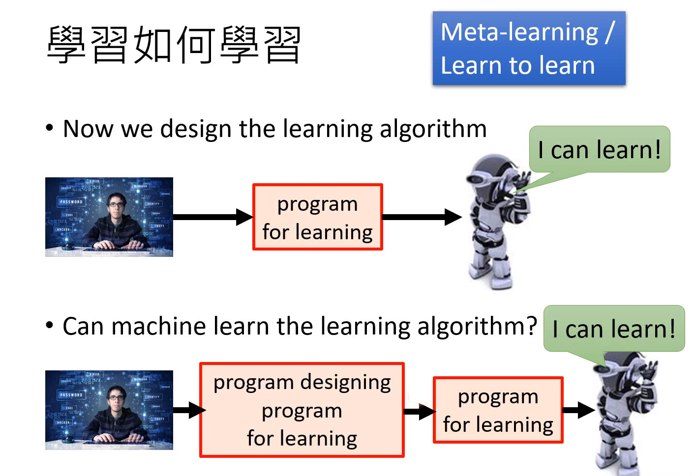

## 0x6 一定要有很多训练数据吗

在现实生活中有一些任务或者某些情境下只能获取少量的样本，甚至没有样本，比如受限于资金限制等情况，这时候我们要么把机器学习厚重的教科书砸到boss脸上辞职，要么试试下面的方法：

- Few-shot learning 让机器看少量的资料
- Zero-shot learning 不给机器任何资料，只告诉机器物品的特征描述，然后机器根据描述进行判断

## 0x7 增强学习 Reinforcement Learning 

Reinforcement Learning 真的有这么强吗？当你用Reinforcement Learning 去玩一些的游戏，Reinforcement Learning也许确实可以跟人做到差不多，但是需要很长时间才能达到，如下图机器需要900多个小时才能达到人类2个小时能达到的效果。机器感觉就是一个天资不佳却勤奋不解的笨小孩，他需要非常久的时间非常多的练习才能和人达到相同的水平，那Reinforcement Learning为什么学得这么慢，有没有办法让它快一点，就是我们要考虑的问题。

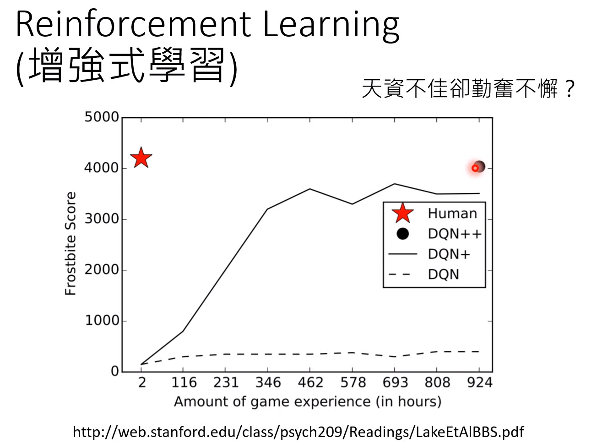

> 图片来自：http://web.stanford.edu/class/psych209/Readings/LakeEtAlBBS.pdf

## 0x8 神经网络压缩 Network Compression

如果我们要把机器学习的模型应用到现实生活中，由于设备的运算和存储能力有限，带来的问题就是我们能不能把Network 的架构缩小，但让它维持同样的能力。

- 把一个大的神经网络缩小，减掉多余的神经元

  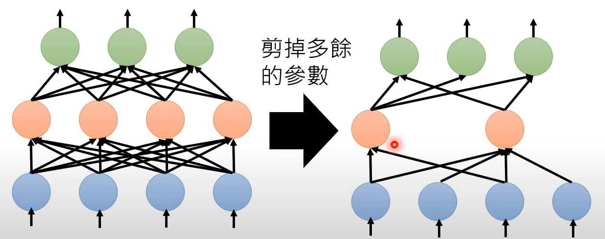

- 参数二值化

  都变成“+1”和“-1”。如果是连续数值，就需要大量的运算和内存，如果把所有参数进行二值化，那么运算起来就快，内存也占用少。

## 0x9 机器学习的谎言

今天我们在训练的时候，假设训练和测试的数据分布是一样的或者至少非常相似，但是实际上在真实应用里面，这就是一个谎言。

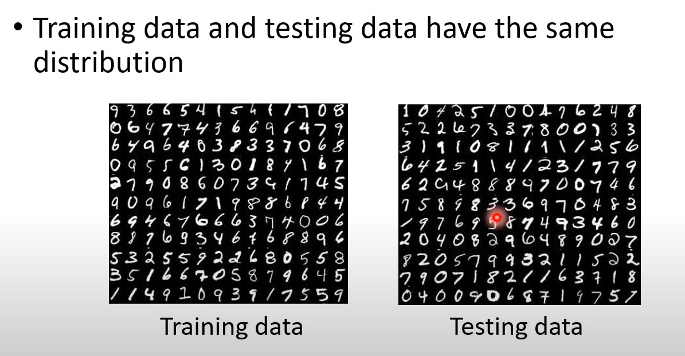

如果我们做手写数字辨识，在实验室情况下，训练资料和测试资料非常相似，可能会很容易达到99.5%。但是实际中，可能图片有背景，正确率变成57.5%，直接烂掉了。

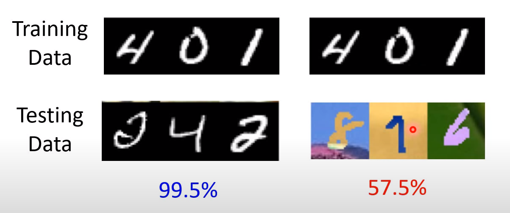

那么怎么解决机器在训练资料和测试资料不同的场景呢？现有可以参考的技术有Unsupervised Domain Adaptation，不在展开。

