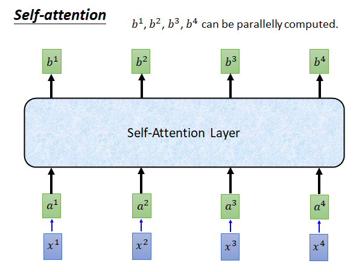
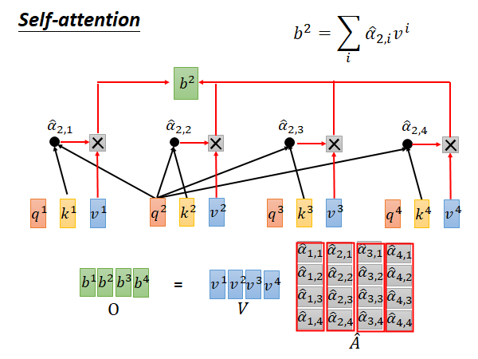
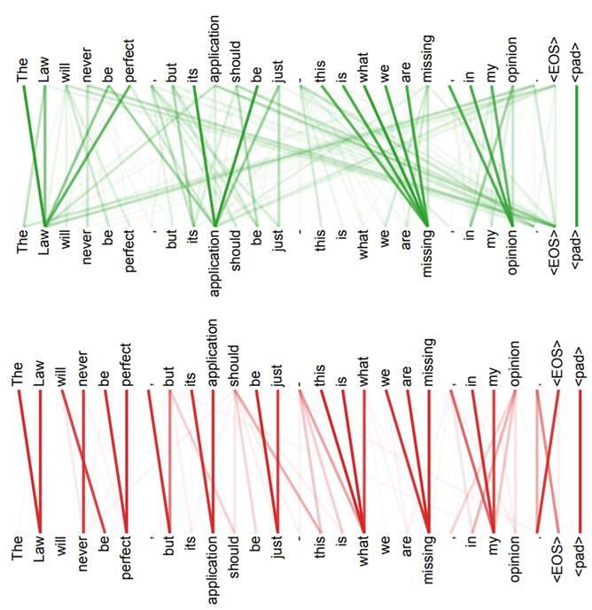

# Transformer

Transformer 现在有一个非常有名的应用就是BERT，这一节还不会讲到BERT，我们先讲Transformer。BERT就是无监督train 的Transformer。Transformer是一个seq2seq model，之前讲的课程中教过seq2seq model 所以这里就假设大家都懂这个东西。Transformer它特别的地方就是在seq2seq model中大量使用了"self attention"这种layer。接下来我们要讲的就是"self attention"这种layer 它具体是在做什么。

## Sequence

一般遇到处理sequence 的问题最常想到的model 就是RNN，无论是单向还是双向总之RNN就是比较适合处理输入是sequence 的问题。

RNN的架构就如上图左侧所示（BiDirectional），它的输入和输出都是一个vector 。在单向RNN中在输出b4的时候a1-a4它都看过了，在输出b3的时候a1-a3它都看过了，在双向RNN中，在输出任意一个b的时候，所有输入它都要看过，所以它的问题是不好做平行运算的，因为他计算后一个输入的时候要依赖前一个输入。

为了解决这个问题，有人提出了用CNN替代RNN的想法，如上图右侧所示。每个三角形代表一个filter，它就吃输入的一小段，输出一个数值，filter扫过输入产生一排输出，即上图一排红色的点，还会有其他的filter 扫过输出产生一排输出，即上图黄色的点...**这些filter 可以平行计算**。那你就会说了，CNN它没有考虑所有输入，RNN是看过所有输入才计算出输出，而CNN只看了一部分呀。只看一层的话确实是这样，但是我们可以叠很多层CNN（如蓝色三角示例），这样上层的CNN就会看到更多的输入。

总而言之，CNN确实可以平行计算了，但是它需要叠很多层才能看到全部输入的信息，那有没有更好的办法呢，接下来就介绍**Self Attention** 。

## Self Attention

Self Attention 就是想要取代RNN 做的事情，并且能克服RNN不能平行计算的缺点。下面的内容如果你看不下去，你就只要记得Self Attention 能做到和RNN 一摸一样的事情，它也是吃一个sequence 吐出一个sequence ，输出sequence 的每个元素都是看过所有输出计算出来的，而且是平行计算出来的。

**关键就是你可以在你要做的事情上用Self Attention 取代RNN 。**

> 最早提出self-attention 替换RNN 的paper（by google）：Attention Is All You Need
>
> https://arxiv.org/abs/1706.03762

输入是 $x_1$ 到 $x_4$ 的sequence ，输入x通过一个matrix W 做embedding 得到sequence a 。（**注意 $x_i$ 和 $a^i$ 应该都是vector，列向量**） 然后每个 $a^i$ 都乘上三个不同的matrix 得到三个输出向量q k v （列向量）。

q代表query 它是要去match 别人的

k代表key 它是要被match的

v代表information 就是要被抽取出来的信息

接下来我们就拿每个q对每个k做attention ：

attention 怎么做呢？（根据google论文中所述这里讲解的attention function是类似于dot-proudct attention）self-attention layer 它要做的就是拿 $q^1$ 和 $k^1$ 做attention，得到 $\alpha_{1,1}$ ，如上图所示同样的做法得到 $\alpha_{1,2}$ ，$\alpha_{1,3}$ ，$\alpha_{1,4}$ 。**attention 的具体公式就是上图所示的，对于 $\alpha_{1,i}$ attention就是指把 $q^1$ 点积 $k^i$ 然后除以根号d，d是q和k的维度**。（$\alpha$ 是数值）

为什么除以根号d，而不是除以其他东西呢？在google 的Self-attention 的paper 中3.2.1节attention公式下有解释，你可以自己去看看，大意好像就是为了避免dot-product attention将softmax函数推入梯度极小的区域，我也解释不太好😥。老师也没有实践这个除以根号d对结果有多大影响。

另外，你还需要知道attention function显然不止一种，paper中另外有提到addictive attention，不过没有实践替换attention function 会对结果有多大影响。

然后，你要把上述得到的 $\alpha$ 通过一个softmax layer 得到 $\hat\alpha$ ，softmax layer做的事情就是上图公式所示，相当于做一个normalization 。

得到 $\hat\alpha$ 以后要把每个 $\hat\alpha$ 和对应的v 相乘，再求和就得到 $b^1$ 。我们上面说self-attention 也是输入一个sequence 输出一个sequence，这个 $b^1$ 就是输出的第一个element 。之后我们只要用同样的办法求出 $b^2$ ， $b^3$ ， $b^4$  就结束了。这个过程中每个output element 的计算都是独立的，都不依赖其他的output element 所以可以并行计算。

我们再看一下上图中self-attention layer 的结构，对于 $b^1$ 来说它看过了整个input sequence ，而且我们也可以让它看部分的input sequence，只要把不希望它看的部分产生的 $\alpha$ 的值设为0就可以了。所以使用self-attention layer 对于output sequence 中的element 来说它可以看任意多个任意位置的input sequence 中的element 。

 $b^2$ 的计算也是一样的，如上图所示，$q^2$ 和 $k^i$ 做attention 得到对应的 $\alpha_{2,i}$ 然后做softmax 得到 $\hat\alpha_{2,i}$ 再乘 $v^i$ 做summation 就得到 $b^2$ 。以此类推平行计算所有b：

如果你觉得上面的讲解比较乱，看不懂，你可以只记住self-attention layer 的输入输出就好。

接下来我们要具体讲解一下attention 中的一连串矩阵运算，为什么是容易被平行计算，为什么是容易被加速的。

### Why Could Speed Up

首先来看列向量q、k、v的计算方法，根据上面说过的，如上图右上角所示，我们可以把列向量 $a^i$ 排在一起，形成一个矩阵 $I$ 。将四个q、k、v的计算转换成矩阵运算。

再来看数值 $\alpha$ 的计算，以 $\alpha_{1,i}$ 为例，我们可以把k和q的内积转换为 $k^T$ 与 $q$ 的积，进一步可以把四个 $\alpha_{1,i}$ 的运算转换为上图右下角的矩阵乘向量。更进一步，对于 $\alpha_{2,i}$ 也是一样的，所以得到了下述公式：

matrix A 中每个元素都是我们要求的值，A可以转换为matrix 乘积 $K^T Q$ 。再把A中每一列元素做一下softmax 就能得到 $\hat A$ 。

接着，把列向量 $v^1,v^2,v^3,v^4$ 分别乘以 $\hat{\alpha_{1,1}},\hat{\alpha_{1,2}},\hat{\alpha_{1,3}},\hat{\alpha_{1,4}}$ 再加起来就得到 $b^1$ ，对于其他的b也是一样的，就这样结束。

我们再来总的看一下从input $I$ 到output $O$ 经历了哪些步骤：

## Multi-head Self-attention

接下来讲一个Self-attention 的变形 (2 heads as example)

在这种方法中q、k、v都会有多个，生乘的输出也会有多组，这里以2 head 举例所以画了两个，具体的做法可以是你把 $q^i$ 乘一个matrix $W^{q,1}$ 得到 $q^{i,1}$ ，乘一个matrix $W^{q,2}$ 得到 $q^{i,2}$ 。然后你在做attention 的时候就是每个head 生乘的q、k、v只在本组内做运算，举例来说如上图所示，如果你要计算head 1组的 $b^{i,1}$ 你就用  $a^i$ 生成的 $q^{i,1},k^{i,1},v^{i,1}$ 和 $a^j$ 生成的同head组的 $q^{j,1},k^{j,1},v^{j,1}$ 做计算。对于head 2组的 $b^{i,2}$：

输出的两组b会concatenate 起来，如果你不希望b的维度增加，你可以用下图所示的方法做一下降维：

multi-head的好处是，不同的head 可以考虑不同的事情。比如说有的head 只需要近期的信息，所以只看local 的信息，有的head 需要长时间以前的信息，看global 的信息。

## Positional Encoding

self-attention layer 它没有考虑input sequence 的顺序，上面我们说了，对于self-attention 的输出可以看任意数量任意位置的input，所以对它来说没有顺序的概念，也就是说你今天输入"我吃饭了"和"饭吃我了"对它来说可能是完全一样的，我们显然不希望是这样。

Positional Encoding就是要解决这个问题，做法就是在列向量 $a^i$ 上加上一个标识位置的列向量 $e^i$ 这个 $e^i$ 在原始paper 中是人设定的，位置1就是 $e^1$ 位置2就是 $e^2$... 你可能会问为什么是加，为什么不concatenate起来，你把一个向量加上去那原来的信息不就变了吗，concatenate不是会更好吗。

为了让你理解这个做法，这里老师用另一种方式来讲解，假如说我们在x都后面concatenate 一个表示位置的one-hot向量p，然后再做本来做的那个乘矩阵W转换为a的步骤，如果我们把W拆分成 $W^I,W^P$ 来看待，根据线性代数的知识，这个公式就可以拆分成上图所示的两两相乘再相加样子， $W^I x^i$ 就是 $a^i$ ， $W^P p^i$ 就是 $e^i$ 。这样是不是就好理解了。

让人难以理解的是你当然可以learn $W^P$ ，在self-attention 的paper 中有提到以前用CNN做seq2seq model 的时候就有人试过learn $W^P$ 了，结果没有更好，他们的 $W^P$ 是用一个奇怪的公式产生出来的，它就长这个样子：

## Seq2seq with Attention

上面讲的是在Seq2seq model 中我们可以用self-attention 取代RNN ，接下来我们就来讲在Seq2seq model 中self-attention 是怎么应用的。

> Review: https://www.youtube.com/watch?v=ZjfjPzXw6og&feature=youtu.be

> source:https://ai.googleblog.com/2017/08/transformer-novel-neural-network.html

这是google 用self-attention 做的翻译模型的gif演示。首先每个step 会把input sequence 两两之间做attention，然后弹出一排一排的小点是告诉你这些step 是平行运算的，每一层都做self-attention，接着做Decoding ，会对input 的encoder做attention，在decode 第二个word 的时候它就不只对input 做attention 还会对之前产生的东西做attention 。

## Transformer

上图是一个seq2seq model ，做的任务是中英互译，左半部是encoder 右半部是decoder，我们以中翻英为例，输入"机器学习"，encoder 进行encoding 然后输入给deocder ，decoder 吃进去产生输出，machine 然后把machine 当作输入再吃进去，在产生learning ，如此运行知道输出句末标志结束。

下面来介绍一下self-attention 在这个模型中的具体运作方式：

> Layer Norm: https://arxiv.org/abs/1607.06450
>
> Batch Norm: https://www.youtube.com/watch?v=BZh1ltr5Rkg

先看encoder，input 经过embedding 和 positional encoding 以后进入灰色的block，这部分会重复N次。在这个灰色的block中，先是一个multi-head attention layer；下一个layer是Add&Norm，意思是说把multi-head attention layer的input和output加起来，再把得到的$b'$做Layer Normalization；（如果要进一步了解Layer Norm可以参考上述文献）

我们之前讲过Batch Norm，Batch Norm是说我们希望一个Batch的data中每个维度的mean=0，variance=1；Layer Norm是不需要考虑Batch 的，举例来说给一笔Data 我们希望它所有维度的mean=0，variance=1。Layer Norm一般会搭配RNN使用，transformer 很像RNN，这可能就是Layer Norm用在这里的原因。

回到decoder，再往后，就如图说是，进入一个前馈神经网络，然后在跟一个Add&Norm。

再看Deocder，Deocder的输入是前一个step 产生的output，前面的处理都是一样的，灰色的block会重复N次，其中上来就是一个Masked Multi-head Attention，这个Masked意思是在做self-attention的时候decoder 只会attend已经产生的sequence，这也是很合理嘛，毕竟还没有产生出来的东西你怎么做self-attention。接着是一个Multi-head Attention 这个layer attend之前encoder 的输出，接着还有一个Add&Norm，再后面的东西也是和encoder 一样的不再赘述。

## Attention Visualization

> https://arxiv.org/abs/1706.03762

这是google的paper中最终版本得到的结果，所有单词两两之间都会有attention，颜色越深表示attention的weight越大。

> The encoder self-attention distribution for the word “it” from the 5th to the 6th layer of a Transformer trained on English to French translation (one of eight attention heads).
>
> https://ai.googleblog.com/2017/08/transformer-novel-neural-network.html

上图是这个意思，左边输入的句子是这只动物没走过街道，因为它太累了，机器学到了it指代的是animal，这两个词之间的attention很深，而当我们把之后的tired换成wide，句子变成这只动物没走过街道，因为它太宽了，机器就学到it是指代街道。amazing

### Multi-head Attention

上如图所示是两组q、k、v，也就是两个head 做出的结果，显然上面就偏向于attend全局信息，下面就偏向于attend局部信息。

## Example Appplication

Transformer 可以用在哪里呢？基本上原来用seq2seq model 做的任务都可以换成transformer，现在这些任务基本上已经被洗过一轮了，都被做干了。

> https://arxiv.org/abs/1801.10198

比较惊人的是做Summarizer，这篇文章是google 做的，他们的input是一堆文章，然后写出这堆文章的总结和摘要，要求有wiki的风格，所以输出也是一篇文章。比如说你搜索台湾大学，把google出来的文章都作为input，机器就会写一个台湾大学的wiki。这个任务的训练资料是很多的，出现transformer之前，大概是做不起来的。

### Universal Transformer

> https://ai.googleblog.com/2018/08/moving-beyond-translation-with.html

出现Transformer后提出的，时间上换成transformer，纵向深度上仍然用RNN，具体细节可以参考上述链接。

### Self-Attention GAN

> https://arxiv.org/abs/1805.08318

transformer 最早提出来是用在文字上，现在它也可以被用在影像上，举例来说，有一个Self-attention GAN ，你在处理影像的时候可以让每个pixel 都去attention 其他的pixel ，所以你在处理影像的时候可以考虑到比较global 的信息。

